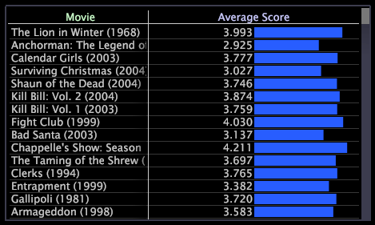

# Tables

A table can display one or more metrics across one or more dimensions of data.

 The following example shows you a table in which the Average Score for each Movie is displayed as a value but also is depicted by the length of its bar.

