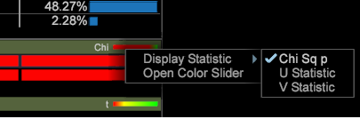
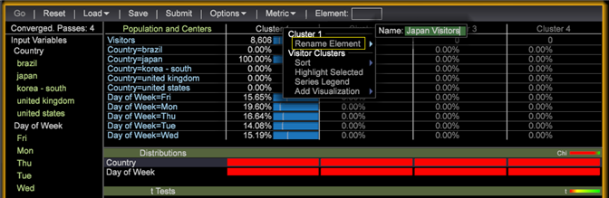

# Build a cluster

Select input variables, the number of clusters, and a target population (if desired) to define clusters in your dataset.

1. Open the **[!UICONTROL Cluster Builder]**.

   Click **Visualization** > **Predictive Analytics** > **Clustering** > **Cluster Builder**.

   

1. Select input variables.

    * Add metrics to the **[!UICONTROL Input Variables]** list by selecting from the **[!UICONTROL Metric]** menu in the toolbar.

      

    * Add dimension elements to the **[!UICONTROL Input Variables]** list by dragging them from a Dimension's table.

      Press **[!UICONTROL Ctrl + Alt]** and drag selected dimension elements to the **[!UICONTROL Input Variables]** list or to the **[!UICONTROL Element]** box in the toolbar.

      

      By default, clustering is performed on the entire dataset. You can see all input variables in the left **[!UICONTROL Preprocessing]** pane.

1. Use the **[!UICONTROL Options]** menu to select the desired number of clusters.

   

1. If you want to cluster a subset of the Visitors in your dataset, you can define a Population Filter.

   

   Start by defining the desired subset using selections in your Workspace or by using the **[!UICONTROL Filter Editor]**. Once you have the desired subset selected, set the Target Population in the **[!UICONTROL Options]** menu. It is recommended that you give the targeted group an identifying name.

   The **[!UICONTROL Options]** menu also has settings to control the maximum number of passes and the acceptable threshold for center convergence. 

1. After inputs and options have been configured, click the **Go** button to run the clustering locally or press **[!UICONTROL Submit]** to send the task to the Predictive Analytics Server. Submissions to the server will save the resulting dimension to the dataset when convergence is complete.

   When running locally, you will see the Cluster Builder move through four canopy clustering stages as it defines intelligent centers based on the inputs.

   Once the centers of the clusters stop changing more than the specified convergence threshold, the Cluster Dimension is converged and the Cluster Builder displays additional information about how relevant an input was to each cluster. 

1. Customize the clusters.

   Right-clicking on the statistics' color bar opens a context menu allowing you to customize the relevance thresholds, and in the case of the dimension element distributions, to choose which test is displayed.

   

   Metric inputs provide a t-test for each cluster, while dimension element inputs provide three distribution tests (Chi squared, an entropy U statistic, and Cramer's V statistic) for each cluster.

   >[!NOTE]
   >
   >If you add or remove inputs during convergence, the process will pause until you press **Go** again.

   After building clusters, you can open the color picker to assign colors for different distribution results.

   

1. With the Cluster Dimension converged, you can add metrics to the table and make selections as normal. You can also right click on the element names (Cluster 1, Cluster 2, etc) to open the context menu to rename them to something more meaningful.

   

1. If you wish to use this cluster dimension in other visualizations, you can **[!UICONTROL Save]** it locally or **[!UICONTROL Submit]** it to the server.

If you wish to run convergence again or see the relevance of inputs, Cluster Builder can also load existing cluster dimensions.

>[!TIP]
>
>When selected, **[!UICONTROL Reset]** will completely release all the input variables and give you a blank cluster builder visualization to define new clusters.

