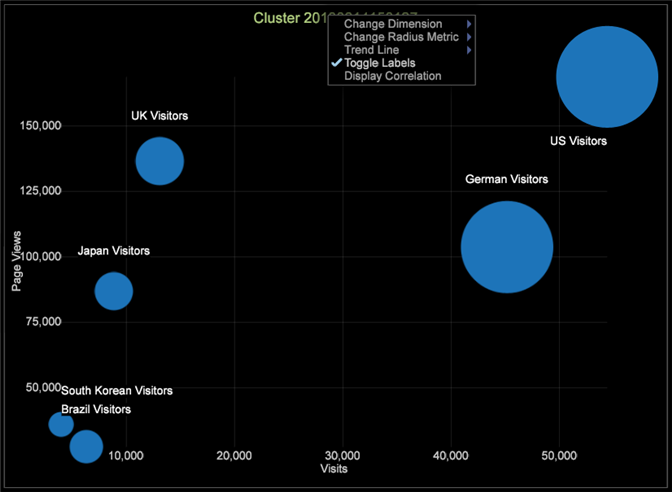
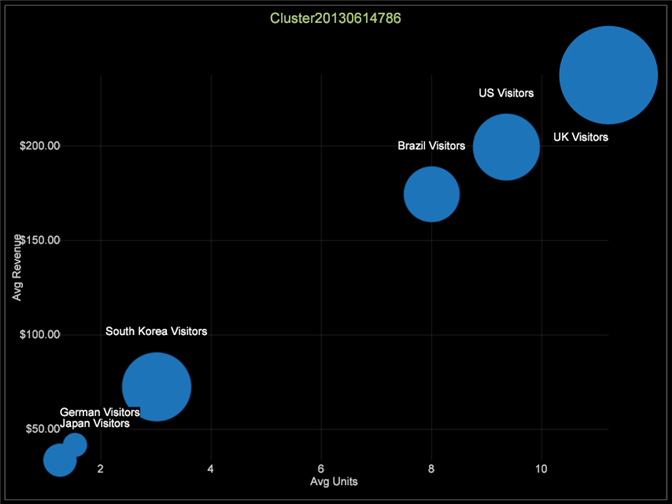

# Explore clusters

After a Cluster Dimension is built, you can save it and examine it using the Cluster Explorer.

1. Select **[!UICONTROL Visualization]** > **[!UICONTROL Predictive Analytics]** > **[!UICONTROL Clustering]** > **[!UICONTROL Cluster Explorer]** > **[!UICONTROL Clusters]**.

   

   Choose the saved cluster dimension that you want to explore. 

1. Right-click the visualization title and click **[!UICONTROL Toggle Labels]** to turn them on.

   

   You can use this menu to change the cluster dimension you are exploring, change the radius metric, add trend lines, and display correlation. 

1. To modify the Cluster Dimension you are exploring, change the radius metric, add trend lines, and display the correlation using this menu.

   

   The Cluster Explorer displays the centers of the clusters along any two input axes at a time. This allows you to examine their separation in multidimensional space. 

1. Right-click the cluster to display the menu and choose from callout types: Image or Text Annotation, Metric Legend, Table, Line Graph or Scatter Plot.

   

