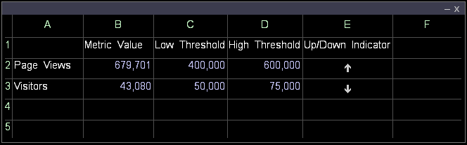
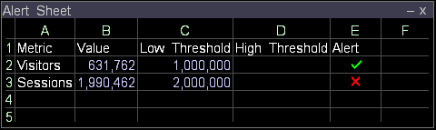

# Create a metric indicator

You can use worksheets to indicate that a metric has reached a defined threshold.

In addition, you can use [!DNL Report] to automatically generate and distribute a report when a metric reaches a defined threshold within a specified time frame.

For more information about [!DNL Report], see the * [!DNL Data Workbench] Report Guide*.

* [Up or Down Indicator](../../c-analysis-vis/c-wksts/c-metric-ind.md#section_40D7A2C3DF0D40D4A7BB1A7E856ABCBA) 
* [Check Indicator](../../c-analysis-vis/c-wksts/c-metric-ind.md#section_98C5298A74F34DCBAAF151549FCC7090)

**To create a metric indicator using a worksheet**

1. Define the contents of the cells of the worksheet.

    1. In Column A, enter the name of the desired metric (for example, [!UICONTROL Visitors]). 
    1. In Column B, enter the value of the desired metric (for example, [!DNL =Visitors]). 
    1. In Column C, enter the low threshold of the metric. 
    1. In Column D, enter the high threshold of the metric. 
    1. In Column E, enter an appropriate formula. For examples, see [Up or Down Indicator](../../c-analysis-vis/c-wksts/c-metric-ind.md#section_40D7A2C3DF0D40D4A7BB1A7E856ABCBA) or [Check Indicator](../../c-analysis-vis/c-wksts/c-metric-ind.md#section_98C5298A74F34DCBAAF151549FCC7090). 
    1. In the formula cell (Column E), right-click and click **[!UICONTROL Format]** > **[!UICONTROL Indicator]**, then click one of the following:

        * **[!UICONTROL None]**: Lists the exact calculation instead of an indicator. 
        * **[!UICONTROL Check]**: Uses a check mark or an X to indicate that the value is either above or below the threshold you set, depending on your formula. See [Check Indicator](../../c-analysis-vis/c-wksts/c-metric-ind.md#section_98C5298A74F34DCBAAF151549FCC7090). 
        * **[!UICONTROL Up or Down]**: Uses an up or down arrow to indicate whether the value is below the low threshold (down arrow), above the high threshold (up arrow), or between the low and high thresholds (blank). See [Up or Down Indicator](../../c-analysis-vis/c-wksts/c-metric-ind.md#section_40D7A2C3DF0D40D4A7BB1A7E856ABCBA).

1. Repeat Step 1 for other metrics for which you want to create indicators.

The resulting worksheet would look something like the following example:

## Up or down indicator {#section_40D7A2C3DF0D40D4A7BB1A7E856ABCBA}

For the [!UICONTROL Up] or [!UICONTROL Down indicator], use the following formula:

[!DNL (metric value - low threshold)/(high threshold - low threshold)*2 - 1]

For example: [!DNL =(b2-c2)/(d2-c2)*2-1]

Three outcomes are possible for each metric when using this formula with the [!UICONTROL Up] or [!UICONTROL Down indicator]:

* If the metric value is between the low and high thresholds, the formula evaluates to a number between -1 and 1 (exclusively). The up or down arrow does not display in the worksheet. 
* If the metric value is less than or equal to the low threshold, the formula evaluates to a value less than or equal to -1. The metric indicator changes to a down arrow. 
* If the metric value is greater than or equal to the high threshold, the formula evaluates to a number greater than or equal to 1. The metric indicator changes to an up arrow.

The following worksheet illustrates what the example formula [!DNL =(b2-c2)/(d2-c2)*2-1] would display:

## Check indicator {#section_98C5298A74F34DCBAAF151549FCC7090}

For the [!UICONTROL Check indicator], you use a formula that indicates whether you want to be notified when the metric value is above or below the threshold you specify. For example:

* If you want to be notified when the value is below the threshold you set, you could use the following format:

    * [!DNL threshold - metric]

      For example: [!DNL =(c2-b2)]

* If you want to be notified when the value is above the threshold you set, you could use the following formula:

    * [!DNL metric - threshold]

      For example: [!DNL =(b3-c3)]

When a check mark displays, the formula evaluated to a positive number. When an X displays, the formula evaluated to a negative number.

There are two possible outcomes for each metric when using the [!UICONTROL Check indicator]:

* If the formula indicates that keeping the metric value above the threshold is desirable, a check mark displays when the metric value is greater than or equal to the threshold, and an X displays when the value is less than the threshold. 
* If the formula indicates that keeping the metric value below the threshold is desirable, a check mark displays when the metric value is less than or equal to the threshold, and an X displays when the value is greater than the threshold.

The following worksheet illustrates what the example formulas [!DNL =(c2-b2)] and [!DNL =(b3-c3)] would display:

