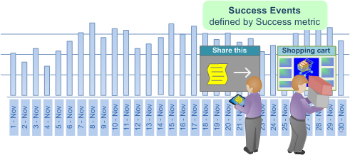
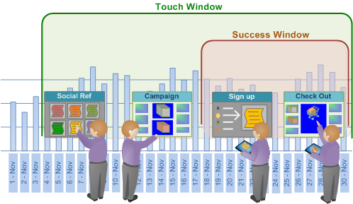
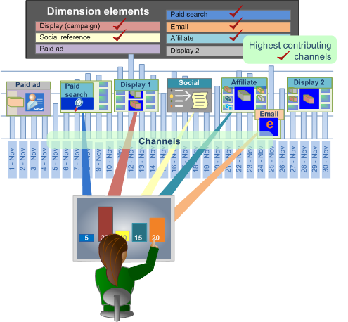

# Best-fit attribution

Best-fit attribution is a machine-learning approach to assigning attribution values across the different channels of a successful conversion event. Data Workbench automatically evaluates contributions to success across a window of time per channel, and then builds an attribution model based on your customers' actual interaction patterns.

**[!UICONTROL Best Fit Attribution]** lets you compare the interactions, or touches, that contributed to a successful sale, email sign-up, or other performance indicator. The attribution analysis automatically assigns weight to the most important touches and provides an attribution model per channel based on your data and responsive to your market and internal protocols.

For example, if a customer visits your site through an organic search, then engages with a campaign, and then signs up for an email, [rules-based Attribution](http://marketing.adobe.com/resources/help/en_US/insight/client/?f=c_rules_attrib) would identify the first touch or last touch, or evenly distribute success attribution across all touch points using preset attribution models. Where rules-based attribution is defined by the user, the Best Fit attributes sets value through an algorithm by calculating the probability of a conversion as a function of the observed touch points.

>[!NOTE]
>
>To run **Best Fit Attribution** in Data Workbench, you need to update your server certificate ( [!DNL .pem file]) to support Adobe Analytics Premium. You also need to add **Premium** to your custom [!DNL Profile.cfg] for the client and receive new certificates from Adobe ClientCare for Server and Report Server. See [upgrade instructions](c_6_3.md#section_8704A9AC358246CD81233DD0982D534F) for Data Workbench 6.3.

## Basic setup {#section_DB597EAEE462412EA7280D1426366C61}

See [Build a Best Fit Attribution](../../../c-get-started/c-attribution-profiles/c-attrib-algorithmic/c-attrib-building.md#concept_FEDE6FC4F592475FA8B351B1765A522D) for step-by-step instructions.

**Set the success metric**

Define a metric representing a success event.

The success metric is often *Orders*, although you can leverage Data Workbench to define a very complicated success metric in conjunction with the Success Window.

**Set the Touch metric**

Identify interactions to track that led to a successful conversion, then set the Touch metric over which attribution will be calculated.

>[!NOTE]
>
>Setting a Touch metric is only required if you are trying to build success metrics automatically by dragging dimension elements onto the visualization.

If you do not have a metric defined for campaigns or channels, but do have dimensions representing channels, the Best Fit Attribution can build them for you automatically based on the Touch metric.

For example, with the Touch Metric set as *Hits*, and given a dimension called *Media Type* with elements that include *Email*, *Press Release*, *Print Ad*, and *Social Media*, the visualization will generate Channel metrics of the form [!DNL Hits where Media Type = Email] when you drag and drop the element(s) onto the visualization. 

The Touch metric then determines the allocation of attribution scores to identify marketing interactions considered influential for success, allowing you to qualify marketing touches for the population identified in the Success window. You can set metric such as *Page Views* or *Hits*, or use customized touch metrics specific to your needs.

In many cases, the Touch window should include the Success window to evaluate a long lead time in the sales cycle.

**Set the Revenue metric**

(optional) Identify revenue across touch points by setting an appropriate revenue metric. You have the option to specify a Revenue Metric as well. If specified, the model will display the distribution of revenue over the input channels.

You can set a revenue metric with currency data types to allocate success across all top touch points defined and analyzed. This metric breaks down the final sales revenue and allocates based on the weighting allocated by the algorithm.

**Set the success and touch windows**

The Success window defines the population to examine and the period for successful events, allowing you to indicate the windows of time and breadth of population to consider for the analysis through a workspace selection. The **Success** window defines the period and population to examine for success events. The **Touch** window specifies the time period to examine for channel interactions leading up to the success events.

>[!NOTE]
>
>Setting a Touch Metric is only required if you are trying to build Success metrics automatically by dragging dimension elements onto the visualization.

You can set a day, month, year, or any available time frame to constrain your evaluation of success and touch events across the sales cycle or for specific audiences entering your site. Creating windows to limit attribution allows you to focus your analysis on the relevant periods of time for your specific needs.

In many cases, you will want the Touch window to include the Success window to let you extend your analysis over a long lead time based on your sales window. Or you can track and analyze touches separate from the success event.

**Select the channels**

You can specify a metric or dimension element (in conjunction with the Touch metric) to represent a Channel input. The highest contributing channels are identified and ranked as significant touch points across the conversion based on real data.

In many cases, you will want to break down the top touch points by elements of a dimension to define specific channels. Based on the element values, Best Fit Attribution will automatically select the top performers and rank them according to percentage and display them in a chart visualization.

An attribution model will be built by drawing on the visitors who interacted during your Success window and examining the channel Touches during the Touch window that did or did not result in a successful event. 
