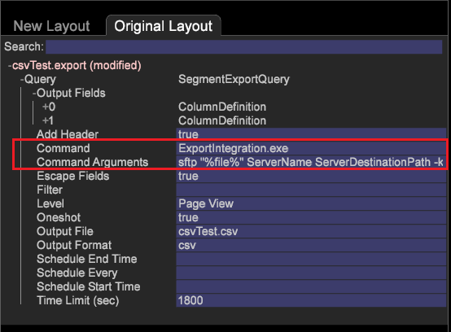

# Export a segment using S/FTP delivery

You can now use CSV, TSV, Segment Export, and Segment Export with Header using FTP and SFTP protocols to export segment files from the client (workstation) to the server.

**Setting up S/FTP Export configuration files**

To set the export configuration, two new export configuration files were added to set up an FTP or SFTP connection, allowing the Server details to be picked from the *FTPServerInfo.cfg* file and the credentials will be picked from *FTPUserCredentials* folder (corresponding to the Server Name given in the command arguments).

* Set the **FTPServerInfo.cfg** file.

  Enter the FTP server information and set connection retries allowed from the workstation. Edit from the workstation or the server at [!DNL Server\Addresses\Export\]** [!DNL FTPServerInfo.cfg]** file. 

  ```
  FTP Servers = vector: 1 items 
    0 = ftpServerInfo:  
      Address = string:  
      Name = string:  
      Port = int: 21 
  Connect Retries = vector: 1 items 
    0 = connectServerRetries:  
      Retries = int: 0 
      Server Name = string:
  ```

* Set the **FTPUserCredentials.cfg** file.

  Enter user credentials to connect to servers using the [!DNL Server\Admin\Export\]** [!DNL FTPUserCredentials.cfg]** file. This file contains user credentials needed to connect to servers and can only be edited from server and not from workstation (client). 

  ```
  FTP User Credentials = vector: 1 items 
    0 = ftpUserCredInfo: 
      User Name = string:  
      User Password = EncryptedString:  
      Server Name = string:  
      Public Key Path = string:  
      Private Key Path = string:  
      Passphrase = EncryptedString:
  ```

  >[!NOTE]
  >
  >Ensure that SSH keys you generate for authentication are in the format identical to those that are generated when you use SSH Keygen command. 
  >
  >
  >Example for generating SSH keys using keygen: 
  >
  >
  >
  >
  >```  >
  >ssh-keygen -t rsa -b 4096 -C "<label>"
  >```  >
  >

  There are six parameters in the **FTPUserCredentials.cfg** file required for various FTP or SFTP transfers.

    1. *User Name* 
    1. *User Password* 
    1. *Server Name * 
    1. *Public Key Path * 
    1. *Private Key Path * 
    1. *Passphrase*

<table id="table_4EB416DC770D4D1AA4FAD9676C0D680C"> 
 <thead> 
  <tr> 
   <th colname="col1" class="entry"> Protocol </th> 
   <th colname="col2" class="entry"> Parameters </th> 
  </tr> 
 </thead>
 <tbody> 
  <tr> 
   <td colname="col1"> <p>FTP </p> </td> 
   <td colname="col2"> <p>Set parameters 1, 2, 3. </p> </td> 
  </tr> 
  <tr> 
   <td colname="col1"> <p>SFTP using password authentication </p> </td> 
   <td colname="col2"> <p>Set parameters 1, 2, 3 when transfer uses password authentication (-p in the command arguments). </p> </td> 
  </tr> 
  <tr> 
   <td colname="col1"> <p>SFTP using key authentication </p> </td> 
   <td colname="col2"> <p>Set parameters 1, 2, 3, 4, 5, 6 when transfer uses key authentication (-k in the command arguments). </p> </td> 
  </tr> 
 </tbody> 
</table>

**Setting the FTP and SFTP Export Commands**

1. Open an export table.

   From the Workstation, right-click a *Detail Table* and choose one of the export types—CSV , TSV, Segment Export, or Segment Export with Header. Or open the [!DNL .export] file from a command-prompt and edit (see [Configuring Segments for Export](../../c-get-started/c-exp-data-seg-exp/t-config-sgts-expt.md#task_8857F221FA66463990EC9B60DB6DB372)). 

1. In the *Command* field, set it to point to the export executable: 

   ```
   ExportIntegration.exe
   ```

1. Set the *Command Arguments* fields as shown below for the protocol and authentication required:

   ** FTP**

   ```
   <i>Command Arguments</i> set to  
<i>ftp "%file%" ServerName ServerDestinationPath</i>
   ```

   

   **SFTP** (if using password for authentication)

   ```
   <i>Command Arguments</i> set to  
<i>sftp "%file%" ServerName ServerDestinationPath -p</i> 
   ```

   **SFTP** (if using keys for authentication)

   ```
   <i>Command Arguments</i> set to  
<i>sftp "%file%" ServerName ServerDestinationPath -k</i>
   ```

   

All Command Arguments are mandatory and need to be entered as shown.

## S/FTP export using private/public keys {#section_0534424D79A54A47B82594CFA7B3C17F}

To implement the FTP and SFTP Export using private and public keys, place the configuration files in these folders:

* Place **FTPServerInfo.cfg** in the [!DNL Server/Addresses/Export/] folder. 
* Place **FTPUserCredentials.cfg** in the [!DNL Server/Admin/Export/]folder.

Six parameters are included in the **FTPServerInfo.cfg** file:

1. *User Name* 
1. *User Password* 
1. *Server Name* 
1. *Public Key Path* 
1. *Private Key Path --* Place the private key path in the configuration file without the extension, for example:

[!DNL Private Key Path = string: E:\\Server\\campaign\\campaignprivatekey] 

1. *Passphrase*

FTP uses parameters 1,2, and 3.

SFTP uses parameters 1,2, and 3 when the transfer uses password authentication.

SFTP uses all six parameters when the transfer is done using key authentication. For example, if you are using keys for authentication:

[!DNL 'Command Arguments' = sftp "%file%" ServerName ServerDestinationPath -k]

The configuration files need to be in the correct location.

>[!NOTE]
>
>The public keys need to point to a **.pem** file and not to a folder location. You can create keys using an SSH key generation function from applications like Cygwin. (Putty generates keys in a .ppk format that is not supported.)

