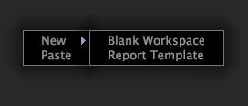

# Create a workspace

You can customize existing workspaces by adding or modifying existing visualizations or creating new workspaces.

You can then save these workspaces for later use. See [Creating Workspaces](../../c-get-started/c-work-worksp/c-create-worksp.md#concept_D8BC99D7739E4EAEAB2A02B022394A31).

You can create new workspaces by creating a blank workspace, copying and pasting an existing workspace, or saving a workspace to another location or using another name.

This section describes the following tasks:

* [Adding New Workspaces](../../c-get-started/c-work-worksp/c-create-worksp.md#section_4236AE30E2884EA08F0885BF329F0778) 
* [Copying and Pasting Existing Workspaces](../../c-get-started/c-work-worksp/c-create-worksp.md#section_F91AE89B845640C9A4A52820A6110E65) 
* [Changing a Workspace Name](../../c-get-started/c-work-worksp/c-create-worksp.md#section_CA7EDB913E4E4630A856F45A2536FFAD)

## Adding New Workspaces {#section_4236AE30E2884EA08F0885BF329F0778}

On the desired [!UICONTROL Worktop] tab, right-click a blank area within the tab and click one of the following options:

* **[!UICONTROL New]** > **[!UICONTROL Blank Workspace]**. This option displays a standard size, blank workspace. 

* **[!UICONTROL New]** > **[!UICONTROL Report Template]**. This option displays a standard size template that you can use to create reports.

The thumbnail for the new type of workspace appears on the tab.

>[!NOTE]
>
>After opening a new workspace, you may need to click **Add** > **Temporarily Unlock**.

## Copying and Pasting Existing Workspaces {#section_F91AE89B845640C9A4A52820A6110E65}

You can copy and paste an existing workspace onto to any other workspace. If you paste the workspace on a tab that contains a server version of a workspace with the same name, the workspace is pasted as a local version of that workspace. If you paste the workspace on a tab that contains server and local versions of a workspace with the same name, the workspace is pasted as a user version of that workspace with the same name followed by (Copy). If you paste the workspace on a tab that does not contain a workspace with the same name, the workspace is pasted as a new user workspace.

**To copy and paste an existing workspace**

1. On the desired [!UICONTROL Worktop] tab, right-click the workspace that you want to copy and click **[!UICONTROL Copy]**.

   

1. Go to the tab in which you want to paste the workspace, right-click a blank area within the tab, then click **[!UICONTROL Paste]**.

   The following example is a workspace pasted on a workspace tab that contains a server version:

   

The following example is a workspace pasted on a workspace tab that already contains a server and local version. The workspace is pasted as a user version of that workspace with the same name followed by (Copy):

## Changing a Workspace Name {#section_CA7EDB913E4E4630A856F45A2536FFAD}

**To change the name of a workspace**

1. On the desired [!UICONTROL Worktop] tab, click the thumbnail of the workspace you want to display. 
1. In the workspace, click the title text in the title bar and type the new title, as shown in the following example:

   

## Deleting a Workspace {#section_FB04CC195E1A4A5491FF634F5F3CA972}

**To change the name of a workspace** 
