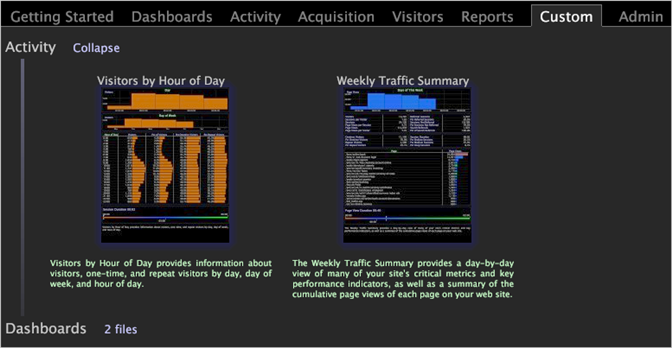
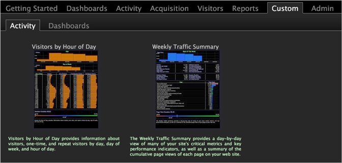

# Display subfolders as subtabs

By default, newly created tabs display the subfolders within the associated directory as hierarchical, drop-down subdirectories instead of as subtabs.

You can display subfolders as subtabs (as shown in the following example) by placing an [!DNL empty folder.useTabs] file in the *working profile name*\Workspaces\*tab name folder* within the Data Workbench installation directory.

The following example shows the [!UICONTROL Custom] tab with drop-down subdirectories.

If you place an [!DNL empty folder.useTabs] file in the Workspaces\Custom folder, all of the subfolders within the Custom folder display in the [!UICONTROL Worktop] as subtabs, as shown in the following example:

**To display subfolders as subtabs in the [!UICONTROL Worktop]**

>[!NOTE]
>
>Each directory level must have a [!DNL Tab Name.useTabs] file for the contents of the subfolder to appear as subtabs instead of hierarchical, drop-down subdirectories.

1. In the [!UICONTROL Profile Manager], click **[!UICONTROL Workspaces]** to view its contents. 
1. In the *working profile name* column, right-click the check mark for one of the [!DNL folder.useTabs] files and click **[!UICONTROL Copy]**. 
1. Right-click in the [!UICONTROL User] column for the Workspaces\*tab name* folder and click **[!UICONTROL Paste]**. The subfolders within that tab now display as subtabs. 
1. (Optional) To make this change available to all users of the working profile, right-click the white check mark for the [!DNL new folder.useTabs] file in the [!UICONTROL User] column and click **[!UICONTROL Save to]** > < **[!UICONTROL working profile name]**>.

