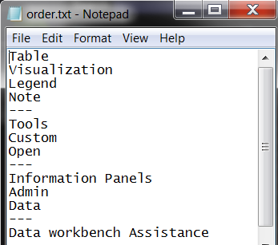

# Customize a menu using order.txt files

You can customize the appearance of any menu by editing the order.txt file associated with that menu.

The steps in this section apply to all types of menus.

**To edit the order.txt file to customize a menu** 

1. In the [!UICONTROL Profile Manager], in the *profile name* column, right-click the check mark for the [!DNL order.txt] file and click **[!UICONTROL Make Local]**.
1. Right-click the check mark for the [!DNL order.txt] file in the [!UICONTROL User] column and click **[!UICONTROL Open]** > **[!UICONTROL in Notepad]**. The [!DNL order.txt] file displays.

   

1. (Optional) Add or change the [Inclusive] or [Exclusive] setting at the top of the file if desired. This setting controls whether items not listed in the [!DNL order.txt] file but present in the [!UICONTROL Profile Manager] is listed on the menu. The options include:

    * **[Inclusive]:** This is the default setting. This setting results in menu items that are not specified in the [!DNL order.txt]file being listed at the bottom of the menu in alphabetical order. For example, if the [!UICONTROL Profile Manager] contained a Profile item in addition the those listed in the [!DNL order.txt] above, Profile would display below Data. 
    
    * **[Exclusive]:** This setting results in menu items that are not specified in the [!DNL order.txt] file being excluded from the menu. For example, if the [!UICONTROL Profile Manager] contained a Profile item in addition the those listed in the [!DNL order.txt] above, Profile would not be displayed anywhere on the menu. 
    
    * **blank:** If neither [Inclusive] or [Exclusive] appears at the top of the file, Data Workbench displays the menu items as if the setting were [Inclusive].

1. Complete one or more of the following steps:

    <table id="table_C5D5313DF5E4470499B0B285BA2690F0"> 
 <thead> 
  <tr valign="top"> 
   <th colname="col1" class="entry"> To perform this task... </th> 
   <th colname="col2" class="entry"> Do the following... </th> 
  </tr> 
 </thead>
 <tbody> 
  <tr valign="top"> 
   <td colname="col1"> 
Reorder menu items 
 </td> 
   <td colname="col2"> 
Type the item names in the order that you want them to appear in Data Workbench. 
 
For example, as long as each menu item name matches its corresponding file or folder name, the following would result in<b> Add Table</b> appearing first, then <b>Add Visualization</b>, <b>Add Legend</b>, and <b>Add Note</b> appearing last. 
 
<b>Add Table </b> 
 
<b>Add Visualization </b> 
 
<b>Add Legend </b> 
 
<b>Add Note </b> 
 </td> 
  </tr> 
  <tr valign="top"> 
   <td colname="col1"> 
Rename a menu item 
 </td> 
   <td colname="col2"> 
Rename the corresponding file or folder in the  Profile Manager, then change the name of the item in the  order.txt file. 
 
For example, to rename Add Annotation to New Annotation, rename the Add Annotation folder in the  Profile Manager to New Annotation, then change the name of the Add Annotation item in the  order.txt file to New Annotation. 
 </td> 
  </tr> 
  <tr valign="top"> 
   <td colname="col1"> 
Hide a menu item 
 </td> 
   <td colname="col2"> 
To hide the menu item but not delete the item itself, type a minus sign (-) at the beginning of its name. 
 
For example, the following results in  Add Annotation not appearing in the menu. 
 
Add Legend 
 
-Add Annotation 
 
To again show the hidden menu item, simply remove the minus sign (-) or use the Unhide All parameter in the  Insight.cfg file, see <a href="../../c-insght-config-param.md#concept_14DA97D0756348E885C08CA9E866074B" format="dita" scope="local"> Insight Configuration Parameters</a>. 
 
You can also hide menu items using the following methods: 
     <ul id="ul_CC9A82AFCE784CA49CC912C9256BAC1A"> 
      <li id="li_28C28CA0DE4B4A8F9C2C2C2B3BDD0557"> 
The Show parameter in a  .filter,  .metric, or  .dim file hides filters, derived metrics and dimensions, and extended dimensions from their respective menus. When using this option, the item is not listed in the menu, but it is still in the profile and available to be used. 
 
To use this parameter to hide filters and derived metrics and dimensions, add the following line to the end of the  .metric,  .dim, or  .filter file: 
 
 show = bool: false 
 
To use this parameter to hide extended dimensions, see Chapter 10 of the <i>Dataset Configuration Guide</i> for instructions. 
 
You can temporarily unhide items hidden using this method by setting the Unhide All parameter in the  Insight.cfg file. For more information about this parameter, see <a href="../../c-insght-config-param.md#concept_14DA97D0756348E885C08CA9E866074B" format="dita" scope="local"> Insight Configuration Parameters</a>. 
 </li> 
      <li id="li_2CB65D594DD04C59A8D27A17DBF278FA">The Hidden parameter in the  Transformation.cfg file or any dataset include file hides extended dimensions from the dimension menu. When using this option, the item is not listed in the menu, but it is still in the profile and available to be used. 
 
Note:  When hiding extended dimensions using this method, you must retransform your dataset for the dimensions to be hidden. 
 
 
You can temporarily unhide items hidden using this method by setting the Unhide All parameter in the  Insight.cfg file. For more information about this parameter, see <a href="../../c-insght-config-param.md#concept_14DA97D0756348E885C08CA9E866074B" format="dita" scope="local"> Insight Configuration Parameters</a>. 
 </li> 
      <li id="li_6E161953FEA44EC18237D88D7173DC60"> 
Zero-byte files hide any type of item on any menu. When using this option, an empty (zero-byte) file hides the presence of a file with the same name that contains data.  Data workbench treats zero-byte files as if they do not exist. For more information, see <a href="../../c-admin-intrf/c-prof-mgr/c-empty-files.md#concept_E776FAC9E5904BED8C13B9D5EB17C491" format="dita" scope="local"> Hiding Files Using Empty (Zero-byte) Files</a>. 
 </li> 
     </ul> 
 </td> 
  </tr> 
  <tr valign="top"> 
   <td colname="col1"> 
Delete a menu item 
 </td> 
   <td colname="col2"> 
If this file is set to use the [Exclusive] option, you can simply delete the menu item from this file. The item itself is still in the profile, but it is not listed in the menu. 
 
If this file is set to use the [Inclusive] option, you must remove the menu item name from this file and either delete or zero-byte the corresponding file to remove the item from the menu. 
 
For information about deleting files, see <a href="../../c-admin-intrf/c-prof-mgr/t-del-files-wkg-prof.md#task_1E29C25E6C824CC9B51CB651E835856B" format="dita" scope="local"> Deleting Files from Your Working Profile</a>. For information about zero-byte files, see <a href="../../c-admin-intrf/c-prof-mgr/c-empty-files.md#concept_E776FAC9E5904BED8C13B9D5EB17C491" format="dita" scope="local"> Hiding Files Using Empty (Zero-byte) Files</a>. 
 </td> 
  </tr> 
  <tr valign="top"> 
   <td colname="col1"> 
Add a group header 
 </td> 
   <td colname="col2"> 
Type three hyphens before and after the heading text that you want to appear. 
 
For example, the following would result in a Manage group header for a set of related menu items. 
 
---Manage--- 
 
Profile 
 
Dataset 
 
  </img> 
 </td> 
  </tr> 
  <tr valign="top"> 
   <td colname="col1"> 
Add a line to separate sections of a menu 
 </td> 
   <td colname="col2"> 
Type three hyphens where you want a line to appear. 
 
For example, the following results in a line separating Add Annotation and Add Custom. 
 
Add Annotation 
 
--- 
 
Add Custom 
 </td> 
  </tr> 
 </tbody> 
</table>

1. Save and close the file.
1. (Optional) To make the changes available to all users of the working profile, right-click the white check mark for the [!DNL order.txt] file in the [!UICONTROL User] column and click **[!UICONTROL Save to]** > *< **[!UICONTROL working profile name]**>*.
