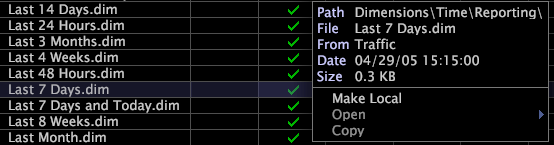

# Work with derived dimensions

The new dimensions that you create using Data Workbench (referred to as derived dimensions) are client-side dimensions.

 Instead of defining these dimensions during the dataset construction and update process (in the [!DNL Transformation.cfg] file) on your Data Workbench server computers, derived dimensions are created and stored individually as [!DNL .dim] files in a profile. As a result, you can change existing and create new derived dimensions without reprocessing your dataset.

>[!NOTE]
>
>For more information about dimensions than is provided in this section, see the appropriate Data Workbench application guide.

For more information about the dataset configuration and update process, see the *Dataset Configuration Guide*.

## Create a derived dimensions {#section_FD9B6CA13A8F4AA9BBC2FFF3EF15CB76}

To create a derived dimension, you can either copy and modify an existing dimension or save a dimension from a visualization.

## Create a derived dimensions from an existing dimension {#section_F46C2D3AB0A5416C98D6E79D18D99FA1}

Users most often want to create new time dimensions from existing ones. For example, you can create a new “Last 5 Days” dimension from the existing “Last 7 Days” dimension.

1. In the [!UICONTROL Profile Manager], in the *profile name* column, right-click the check mark for a dimension that is similar to the dimension that you want to create and click **[!UICONTROL Copy]**.

   For example, to copy the [!DNL Last 7 Days.dim] from the Reporting folder of the [!UICONTROL Traffic] profile, you right-click the check mark for the file name in the [!UICONTROL Traffic] column and click **[!UICONTROL Copy]**.

   

1. Right-click in the [!UICONTROL User] column for the folder in which you want to store the copied dimension and click **[!UICONTROL Paste]**.

   The dimension appears in the selected Dimensions folder with a check mark in the [!UICONTROL User] column. 

1. To rename the new dimension, right-click its check mark in the [!UICONTROL User] column and type the new name in the [!UICONTROL File] field. 
1. From the right-click menu, click **[!UICONTROL Open]** > **[!UICONTROL from the workbench]**. The defining parameters for the dimension appear. 
1. Modify the parameters as needed to define the new dimension.

   For time dimensions, you most likely need to modify only the Count and Range parameters. 

1. To save the file, right-click **[!UICONTROL (modified)]** at the top of the window and click **[!UICONTROL Save]**.

   If you would like all users of a profile to use the dimension that you created, you must upload it to the profile using the [!UICONTROL Profile Manager]. For more information, see [Publishing Files to Your Working Profile](../../c_admin_intrf/c_prof_mgr/t_pub_files_wkg_prof.md#task_A0106E010C834D16BD60EEF4721B6AF9).

You now can use the new dimension throughout the current profile by selecting it as you would any built-in dimension.

## Save a dimension from a visualization {#section_84CFE5E9CCB640AFA2EE4E2DA2682757}

You can save extended dimensions from process maps and segments. For steps to save a dimension from a process map, see [Saving Dimensions from Process Maps](../../c_analysis_vis/c_proc_maps/t_dim_proc_maps.md#task_44D9E555D4A944E6AA81993EEF703051). For steps to save a segment dimension, see [Creating Segment Dimensions](../../c_analysis_vis/c_seg/c_create_seg_dim.md#concept_70B363EDCAD14185BA8051646AD3D44E) on page 82.

## Saving a segment as a dimension {#section_7C443CF1AC5A44659623CABB9E0C1AB8}

You also can save defined segments as a dimension. For steps, see [Reusing a Segment Visualization](../../c_analysis_vis/c_seg/c_reuse_seg_vis.md#concept_A8A607BD415D404A83C32A26B804CBDC).

## Edit an existing derived dimension {#section_3A82C604BF1C4D369770556D268808B2}

1. I

   n the [!UICONTROL Profile Manager], in the *profile name* column, right-click the check mark for the dimension file that you want to edit and click **[!UICONTROL Make Local]**. 
1. Right-click the check mark for the dimension file in the [!UICONTROL User] column and click **[!UICONTROL Open]** > **[!UICONTROL from the workbench]**. 
1. Complete the parameters as needed. For more information, contact Adobe Consulting Services. 
1. To save the file, right-click **[!UICONTROL (modified)]** at the top of the window and click **[!UICONTROL Save]**.

   If you would like all users of a profile to use the modified dimension, you must upload it to the profile using the [!UICONTROL Profile Manager]. For more information, see [Publishing Files to Your Working Profile](../../c_admin_intrf/c_prof_mgr/t_pub_files_wkg_prof.md#task_A0106E010C834D16BD60EEF4721B6AF9).

