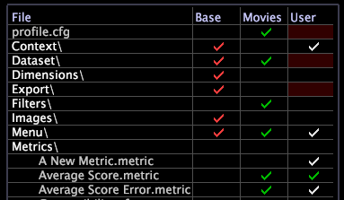

# Profile Manager

The folder and file names included in your implementation are displayed on the left side of the Profile Manager.

 The profiles that make up your application are displayed as the individual columns in the [!UICONTROL Profile Manager]. These profiles include multiple inherited profiles and a single working profile.

>[!NOTE]
>
>Your working profile (either a dataset profile or a role-specific profile) is the profile that you load when you open Data Workbench.

The check marks (and their colors) indicate the profile folder(s) on the Data Workbench server and Data Workbench computers in which each file resides, whether multiple copies of a file exist, and whether those multiple copies have the same Modified date and time. These files are synchronized between the Data Workbench server and Data Workbench computers during profile download.

Following is a sample [!UICONTROL Profile Manager] for a HBX implementation:

From the [!UICONTROL Profile Manager] menu, you can open any of the other managers (for example, the [!UICONTROL Dimensions Manager] or [!UICONTROL Reports Manager]), which display only particular portions of [!UICONTROL Profile Manager]. You also can create new profile managers. See [Creating New Profile Managers](../../c_intf_anlys_ftrs/c_cstm_prof_files_mgrs/c_new_prof_mgrs.md#concept_0021E006523E4D538AAA16322731D9D3).

A check mark next to a file name in a particular column indicates that a file by that name resides in the folder named in that column (profile). As you move to the right in the [!UICONTROL Profile Manager], the files take precedence over those to the left, that is, each inherited profile builds on the profiles to its left in the [!UICONTROL Profile Manager]. For example, if you have a file of the same name and in the same location in the [!UICONTROL Base] profile (column) and in the [!UICONTROL User] profile (column), the file in the [!UICONTROL User] profile is used instead of the file in the [!UICONTROL Base] profile.

## Search for profiles {#section_91F873F1D7ED4FD6A5F3C3AC08CFA623}

With Data Workbench 5.5, a search field has been added to find required profiles in the [!UICONTROL Profile Manager].

The following types of columns appear in the [!UICONTROL Profile Manager]:

* The *inherited profile name* columns contain check marks for files that reside in each profile folder. Inherited profiles include internal profiles provided by Adobe as well as any company-specific or role-specific profiles that you create and maintain. In the example above, the internal profiles include Base, Traffic, Value, Marketing, and so on. The internal [!UICONTROL Base] profile, which contains the basic building blocks and configuration information needed to run your Adobe application, is provided with every implementation. The other internal profiles contain elements (workspaces, metrics, derived dimensions, and so on) related to particular types of information, such as web traffic or marketing. Adobe provides only those profiles that are appropriate for the type of data you are analyzing and for your industry.

  >[!NOTE]
  >
  >By default, internal profiles (those provided by Adobe) cannot be changed. All customization must occur in your dataset or role-specific profiles or other profiles that you create. If you are building a new application and need to change an internal profile, you must change the Modify Internal Profiles parameter in the [!DNL Insight.cfg] file. See [Insight Configuration Parameters](../../c_insght_config_param.md#concept_14DA97D0756348E885C08CA9E866074B) for more information. Before doing so, contact Adobe Consulting Services.

* The *working profile name* column, which is always the next-to-last column, contains check marks for files that reside in the current working profile’s folder. In the example above, the working profile is Dataset. Your working profile is either a dataset profile or a role-specific profile. The files in this folder take precedence over any files with the same names in any inherited profile folder. 
* The [!UICONTROL User] column, which is always the last column, contains check marks for files and folders that reside as local files in the User\*profile name* folder. The directory structure of the User folder mimics that of the working profile, and each User\*profile name* folder contains local copies of the workspaces, metrics, dimensions, and configuration files for that particular profile. These local copies take precedence over any files with the same names in any inherited or working profile folder. The files in the [!UICONTROL User] column were either created and saved to only the User\*profile name* folder, or they reside in an internal or working profile as well as in the User\*profile name* folder. The files in each folder may or may not be identical and may or may not have the same Modified date and time. 

  >[!NOTE]
  >
  >
  >    
  >    
  >    * To avoid changing your dataset only locally, the Data Workbench server ignores the local copies of the [!DNL profile.cfg] file and any files in the Dataset or Export folders in the User\*profile name* folder. Ignored files are identified by a red background in the [!UICONTROL User] column and an “Ignored in User directory” warning in the context menu. To implement the changes you make in your local copies of these files, you must save them to your working profile so that they can be synchronized with the Data Workbench server. For steps to save files to your working profile, see [Publishing Files to Your Working Profile](../../c_admin_intrf/c_prof_mgr/t_pub_files_wkg_prof.md#task_A0106E010C834D16BD60EEF4721B6AF9). 
  >    
  >    * A hyphen (-) instead of a check mark in a column identifies an empty (zero-byte) file. [!DNL Data workbench] treats zero-byte files as non-existent, which enables you to use them to hide files included in a profile to the left. See [Hiding Files Using Empty (Zero-byte) Files](../../c_admin_intrf/c_prof_mgr/c_empty_files.md#concept_E776FAC9E5904BED8C13B9D5EB17C491). 
  >    
  >    
  >

## Determine file versions {#section_225D732246B94CBE87ACDFA9C881D6AF}

As mentioned in the previous section, the check marks in the [!UICONTROL Profile Manager] are color-coded so that you can easily identify where a file resides and whether the multiple copies of a file were modified at different times.

If a file or a collapsed directory is exactly the same as the file or directory to its left, it has the same color check mark as the file or directory in that column (profile). If it is different from any file or directory to its left, or the file or directory exists only in the [!UICONTROL User] column, the check mark is white.

The [!UICONTROL Profile Manager] shown in the example above indicates the following:

* A white check mark for the [!DNL A New Metric.metric] file appears only in the [!UICONTROL User] column, which indicates that you have only a local copy of that file—it has not been published (or uploaded) to the Data Workbench server for other Data Workbench users to access. 

* Check marks for the [!DNL Average Score.metric] file name appear in the Movies and [!UICONTROL User] columns. The check mark in the [!UICONTROL User] column is the same color as the check mark in the Movies column, which indicates that the local copy of the file has the same Modified date and time as the file in the Movies folder. 

* Check marks for the [!DNL Average Score Error.metric] file name appear in the Movies and [!UICONTROL User] columns. The check mark in the [!UICONTROL User] column is white, which indicates that the local copy of the file has a different Modified date or time than the file in the Movies folder.

