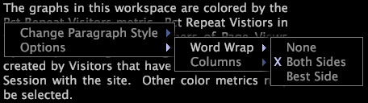

# Text annotations

Text annotations are windows into which you can enter arbitrary text to add descriptive information or comments to a workspace.

You move or manipulate text annotations within a workspace in the same manner as other types of visualizations. You also can format the appearance of the text as well as name, edit, or save any text annotation that you add to a workspace. Text annotations also can be exported to Microsoft Excel and generated and distributed by [!DNL Report].

For more information about [!DNL Reports], see the *Insight Report Guide*.

## Add or edit text {#section_8ECC44E0EEB24C5990050102013C0AED}

* Click within the body of the text to enter edit mode and begin typing.

  >[!NOTE]
  >
  >Text annotations support basic editing features, including cut (Ctrl+x), copy (Ctrl+c), paste (Ctrl+v), undo (Ctrl+z), redo (Ctrl+Shift+z), select section (click+drag), and select all (Ctrl+a). See [Working with Text in Windows](../../c_get_started/c_wk_win_wksp/c_work_text_win.md#concept_F1222434BF954767808E94B955945C8D).

## Apply formatting to paragraphs {#section_27744C1589134AA3918AA8787429C0DC}

1. Within the body of the text, right-click the paragraph that you want to format. 
1. Click **[!UICONTROL Change Paragraph Style]** > *< **[!UICONTROL text style]**>*.

## Apply formatting to selections {#section_4032ECBCC0064E5C96504C15B6F481BF}

1. Within the body of the text, click+drag to select the text that you want to format. 
1. Right-click the selection and click **[!UICONTROL Change Selection Style]** > *< **[!UICONTROL text style]**>*.

## Change word wrap settings {#section_56948687D47349FC8BA21E108FD13CC1}

This option controls whether and how the text within the annotation wraps around the visualizations in the workspace.

* Right-click within the body of the text, click **[!UICONTROL Options]** > **[!UICONTROL Word Wrap]**, then click the desired option:

    * **None:** This option removes word wrapping from this annotation. 
    * **Both Sides:** This option allows the text within the annotation to wrap around both sides of visualizations in the workspace. 
    * **Best Side:** This option allows the text within the annotation to wrap around only one side of visualizations in the workspace.

## Change column settings {#section_5CD3F3D63CF64119A2FCEC371E33B734}

This option controls the number of columns in which to display the text in the annotation.

* Right-click within the body of the text, click **[!UICONTROL Options]** > **[!UICONTROL Columns]**, then click the desired option:

    * **Auto:** This option selects the most appropriate column layout for the width and length of the text. 
    * **1-4:** These options enable you to display the text in one, two, three, or four columns.

## Export to Microsoft Excel {#section_B239057B822348849FD17A83C3A03C22}

For information about exporting windows, see [Exporting Window Data](../../c_get_started/c_wk_win_wksp/c_exp_win_data.md#concept_8DF61D64ED434CC5A499023C44197349). 
