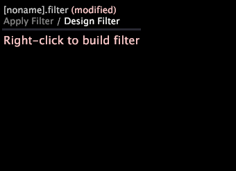

# Filter editors

A filter editor is a special visualization for building and editing filters.

While other visualizations in Data Workbench display data from your dataset, a filter editor enables you to specify which portion or subset of the data displayed in the visualizations.

 **Save Filter button.** When you select an item within a workspace—a detail table, visualization, filter, or other item—a **Save Filter** button opens on the toolbar allowing you to create a filter for the item selected. The option for entering a name is provided when the Save Filter icon is clicked. The filter can then be saved to the profile.

You create a filter by opening a filter editor window in your workspace and adding one or more conditions. To assist you in defining the conditions of your filter, editable fields in the filter editor window appear as text boxes or are highlighted when you roll your mouse over them. You simply click within the text box to add text or right-click the highlighted field to see what options are available. The filter that you create reads like a sentence, making it easy to understand what subset of the data is included or excluded. If you would like, you can create a description for each filter condition so that its label in the filter editor is more meaningful to you or your team.

In addition, you can use the filter editor to open and edit any [!DNL .filter] file.

>[!NOTE]
>
>When you open the filter for the first time, the filter editor updates the filter’s definition to match the filter editor format.

