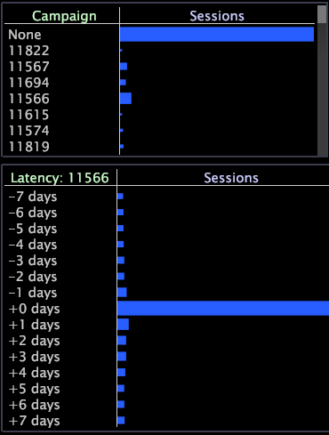
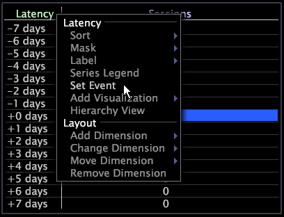

# Latency tables

Latency table visualizations are tables that include a latency dimension, which is a type of derived dimension that measures the time that has elapsed since a particular event occurred.

 You define the event by making selections within one or more visualizations and setting those selections as the event using the Set Event context menu option. Latency tables are especially useful for tracking activity related to a campaign or to a particular customer order in which you are looking for a time correlation.

In [!UICONTROL Site], latency tables provide information about the visitor sessions that occurred as many as seven days before or after the event, but you can configure latency tables to provide information about different countable and time dimensions. See [Configuring Latency Tables](../c_intf_anlys_ftrs/c_config_ltcy_tbls/c_config_ltcy_tbls.md#concept_7175C3DEFEC64556994F0DFCCCB7D15C).

Elements of the parent dimension, such as a session, which are part of the specific event that you selected, have a latency of zero. All other elements are assigned latencies that reflect the distance (in the appropriate time dimension) from the event.

The following example illustrates how you might use the latency table.

**Identify value events in relation to a campaign**

Let’s say you want to track the activity of customers during the seven days before and after they responded to a particular advertising campaign. To view the latency for a particular advertising campaign, you would set the campaign of interest as the event for the latency table.

Latency in the workspace below is based on selection of Campaign 11566 (the sessions in response to this campaign).

A latency of “+0 days” identifies the sessions in response to Campaign 11566, as well as all other sessions for those same customers that occurred on the same day.

A latency of “-2 days” identifies the sessions for those same customers that occurred two days before the customers responded to the campaign.

A latency of “+7 days” identifies the sessions for those same customers that occurred seven days after they responded to the campaign.

In addition to the procedures listed in the following sections, you can perform all of the same tasks that you can perform in a table, such as sort elements, mask elements, add a series legend, export data, and so on. For more information, see [Tables](../c_analysis_vis/c_tables/c_tables.md#concept_C632CB8AD9724F90AC5C294D52AE667F).

## Create a latency table {#section_31A03031D9854EF7ACC2462D4F37678D}

To create a latency table, you begin by making a selection, then setting that selection as the event for which you want to track latency.

1. Right-click within a workspace and open the desired visualization(s), which must be based on the countable dimension used to configure your latency table.

   For example, in [!UICONTROL Site] the visualization(s) would need to be sessions-based. 

1. Open a blank latency table. 
1. Make a selection in your workspace. 
1. Right-click within the latency table and click **[!UICONTROL Set Event]**.

>[!NOTE]
>
>Events that you select do not persist unless you save the selections as a latency dimension. For steps, see [Reusing a Latency Dimension](../c_analysis_vis/c_lat_tbls.md#section_29C6483BF9BA476FB1C24AD1DF253F46).

## Reuse a latency table {#section_05F741169D204213B6537DCE553E4F73}

If you want to use the same latency table again, you can save the latency table locally or if you have the proper permissions you can save it to the server for all users of a particular profile to access.

**To save the latency table for use in other workspaces**

1. Right-click the top border of the visualization and click **[!UICONTROL Save]**. The [!UICONTROL Save] window appears. The default save location is the User\*profile name*\Work folder. 
1. In the [!UICONTROL File name] field, type a descriptive name for the visualization and click **[!UICONTROL Save]**.

**To retrieve the saved latency table**

1. Right-click within the workspace and click **[!UICONTROL Open]** > **[!UICONTROL File]**. The [!UICONTROL Open Visualization] window appears. 
1. Navigate to the latency table that you saved. 
1. Select the latency table visualization file ( [!DNL *.vw]) and click **[!UICONTROL Open]**.

## Reuse a latency dimension {#section_29C6483BF9BA476FB1C24AD1DF253F46}

If you want to use the same latency dimension again, you can save the latency dimension locally or if you have the proper permissions you can save it to the server for all users of a particular profile to access.

Any latency dimensions that you create are saved in the profile’s Dimensions directory and are available in the [!UICONTROL Change Dimension] drop-down list within Data Workbench.

**To save the latency dimension for use in other workspaces**

1. Right-click the [!UICONTROL Latency] column label or one of its elements and click **[!UICONTROL Save Dimension]**. The [!UICONTROL Save Dimension As] window appears. 
1. Select or create the appropriate sub-directory within the Dimensions directory. 
1. In the [!UICONTROL File name] field, type a descriptive name for the dimension (for example, [!DNL Latency for Campaign 11565.dim]) and click **[!UICONTROL Save]**.

**To retrieve the saved latency dimension**

1. Right-click within the workspace and click **[!UICONTROL Open]** > **[!UICONTROL File]**. The [!UICONTROL Open Visualization] window appears. 
1. Navigate to the latency visualization that you saved in the User\*profile name*\Dimensions folder. 
1. Select the latency dimension file ( [!DNL *.dim]) and click **[!UICONTROL Open]**.

## Export to Microsoft Excel {#section_3DFFA5C3AAB14CDAA40C78B81B08FE53}

For information about exporting windows, see [Exporting Window Data](../c_get_started/c_wk_win_wksp/c_exp_win_data.md#concept_8DF61D64ED434CC5A499023C44197349).

## Export to a TSV file {#section_FD921F351C994ED0A94F63D3BD5B5A87}

For information about exporting windows, see [Exporting Window Data](../c_get_started/c_wk_win_wksp/c_exp_win_data.md#concept_8DF61D64ED434CC5A499023C44197349). 
