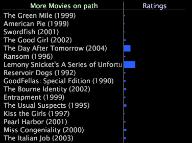

# View more elements in paths

You can choose to view more elements in the path.

In most cases, your path browser is not large enough to show all of the elements in the sequence.

* Click **[!UICONTROL More]** in the lower left portion of the visualization to view the previous elements in the path. 
* Click **[!UICONTROL More]** in the lower right portion of the visualization to view the next elements in the path.

By clicking More at the lower left or lower right portion of the visualization, you open a table that lists the previous or next elements in the path. The table also shows the value of the associated metric for each element.

