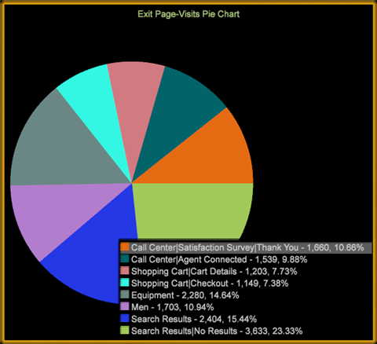

# Pie chart

The pie chart visualization displays elements as segments of a pie chart.

When you open a pie chart, the colors for data sets are set by default with each identified in the legend.

The legend can be toggled on and off by right-clicking the chart and selecting **Show Legend**. The result is a pie chart without color codes and elements identified in callouts for each section.

**Customizing your Pie Chart**

Right-click the pie chart to open a menu to modify your pie chart.

The menu allows you to change you dimension elements, metrics, and numeric display, as well as customize chart colors and labels. 
