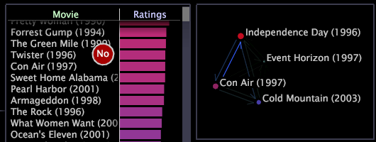

# Create a process map

You can create 2D and 3D process maps by dragging and dropping elements from bar graphs, tables, and hierarchy views onto a blank map.

 The elements that you can add must be elements of the process map’s base dimension. You also can drag and drop nodes from one process map to another as long as the maps are using the same base dimension. In addition, the entire map can be zoomed or moved to focus on a particular node, or it can be changed to other visualization types. See [Zooming in Visualizations](../../c_vis/c_zoom_vis.md#concept_7E33670BB5344F78A316F1A84CC20530).

**To add elements to a process map using a table or bar graph**

* From any table or bar graph with the same base dimension as the process map, press Ctrl+Alt while you click and drag individual elements to the process map. Your mouse cursor displays the word "No" until your mouse reaches the process map.

  >[!NOTE]
  >
  >The elements that you can add must be elements of the process map’s base dimension.

  

**To add elements to a process map using a hierarchy view**

>[!NOTE]
>
>Adobe recommends that you add nodes from the highest level of the hierarchy that you are analyzing.

1. From any table or bar graph with the same base dimension as the process map, right-click an element or the label of the base dimension and click **[!UICONTROL Hierarchy View]**. 
1. Press Ctrl+Alt while you click and drag elements to the process map. Your mouse cursor displays the word "No" until your mouse reaches the map.

   >[!NOTE]
   >
   >The elements that you can add must be elements of the process map’s base dimension.

   Dragging a single element onto a process map makes a map node for only that element, but if you select multiple elements (a group) or a folder containing multiple elements, dragging from the hierarchy creates a single node for that group or folder. For example, if you are working with website data, dragging a folder named [!DNL site.com/cgi-bin] onto a map makes a node called [!DNL site.com/cgi-bin/*], which represents all pages and directories that are children of that folder.

For more information about page hierarchy views, see [Applying Hierarchy Views](../../c_analysis_vis/c_tables/c_hier_vews.md#concept_B461183424A841EB94F8143A0EAF9BFF).

**To add nodes to a process map from another process map**

>[!NOTE]
>
>The process maps must have the same base dimension.

* Copy a node from the first to the second process map using the following methods:

    * To copy individual nodes, click and drag each node to the second process map. 
    * To copy multiple nodes, Ctrl+click and drag to create a box around the nodes you want to copy, then click and drag the highlighted nodes to the second process map. All of the highlighted nodes are copied to the second process map.

