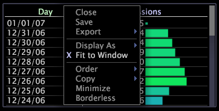
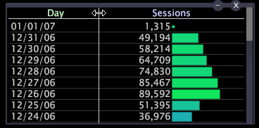

# Fit data to a window

The Fit to Window option allows the data columns in a table to automatically expand or shrink to fit the window each time you resize it.

 When [!UICONTROL Fit to Window] is disabled, the data columns must be sized manually.

**To enable or disable the fit to window option**

* Right-click the top border of the visualization and click **[!UICONTROL Fit to Window]**.

  

When enabled, an X appears to the left of [!UICONTROL Fit to Window].

**To resize data columns manually**

* Click the line dividing any two data columns (in the top-axis region) and drag to the desired width.

  

