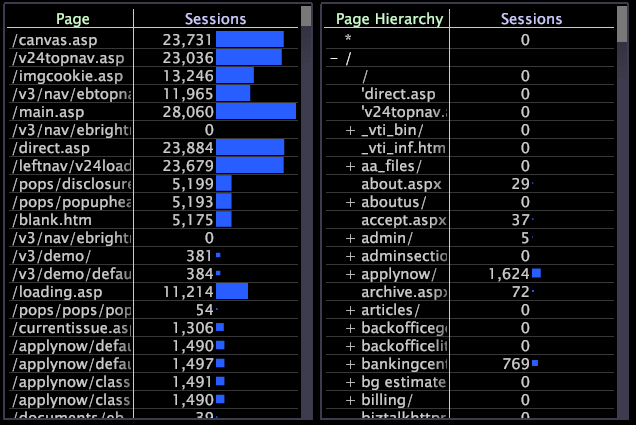
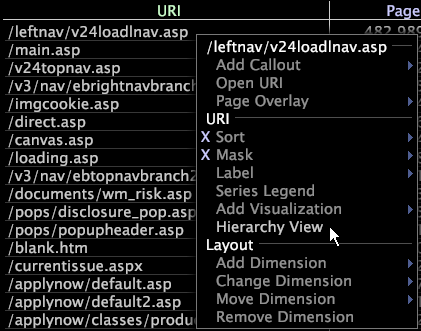
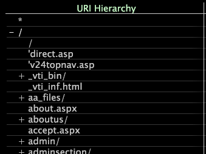

# Apply hierarchy views

Hierarchy views are available only when using the Site or HBX application.

The hierarchy view displays the pages in a website organized hierarchically by file name and sorted alphabetically. While useful for analysis itself, the hierarchy view also can be used to set up such advanced visualizations as process maps. For more information about process maps, see [Process Maps](../../c_analysis_vis/c_proc_maps/c_proc_maps.md#concept_880AEE224404429785B733A4E80D275E).

>[!NOTE]
>
>If your dataset has been configured to run on multiple servers in a cluster, for this feature to work properly, your system administrator must designate which machine functions as your Central Normalization Server. For steps to do so, see the Log Processing Configuration File chapter of the *Dataset Configuration Guide*.

**To enable or disable the hierarchy view**

* From any page or URI visualization, right-click an element or the label of the page dimension and click **[!UICONTROL Hierarchy View]**.

  

  An X is shown next to the option when the [!UICONTROL hierarchy view] is active.

  The hierarchy is organized into website sections and pages using a tree structure. Sections (nodes) can be expanded or condensed using the + or - symbol next to the section name. Individual pages do not have a + or - symbol next to them.

  

## Masking Dimension Elements in a Hierarchy View {#section_E477C469934846DA8D807F92FC2F3ED1}

Masking refers to selecting a subset of your data or a subset of the elements in a dimension. You mask or hide those elements that you do not want included in the analysis. Using the [!UICONTROL Mask] menu options for hierarchy views, you select the minimum percentage of a metric that an element must have to be displayed in the visualization.

**To mask data using the [!UICONTROL Mask] menu option**

1. Right-click an element or the label of the dimension and click **[!UICONTROL Mask]**.

   

1. Under More than, click the appropriate percentage, then click the metric that you want to mask.

For example, if you click 0.1%, and then click Page Views, you are masking (hiding) any element that has less than 0.1% of the total number of pages views and displaying any element that has more than 0.1% of the total number of pages views. If you click 0%, you are masking all elements with a value of 0 (zero) for the selected metric. 
