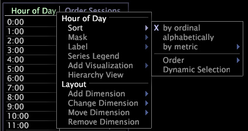

# Sort data in a table

Steps to sort data.

If the table has only one dimension, you can simply click the label of the metric on which you want the data sorted.

1. Right-click an element or the label of the dimension that you want to sort and click **[!UICONTROL Sort]**.

   

1. Click one of the following options:

    * **[!UICONTROL By ordinal]** to sort the elements according to the natural order of the elements. For example, the elements of the Hour dimension displays in chronological order. If the dimension has no natural order, such as with referrer or URI, the sort order is not useful, so you should select to sort either alphabetically or by metric. 
    * **[!UICONTROL Alphabetically]** to sort the dimension alphabetically by element name. 
    * **[!UICONTROL By metric]** to select a metric by which you want the data sorted. For example, you can sort the Referrer dimension by the Sessions metric to see which referrers contribute the most sessions on your site.

      When you sort by a metric, by default the order in the table corresponds to the values of the metric as affected by the selection at that time. If you later change the selection, the sorted order does not change from the original order unless the dimension is resorted or you enable Dynamic Selection. When you click **[!UICONTROL Sort]** > **[!UICONTROL Dynamic Selection]**, the table is resorted each time you change the selection.

   To sort by an existing metric in the table, click the metric label. 

1. (Optional) To choose whether to sort in ascending or descending order, right-click an element or the label of the dimension that you want to sort and click **[!UICONTROL Sort]** > **[!UICONTROL Order]** > **[!UICONTROL Ascending]** or **[!UICONTROL Sort]** > **[!UICONTROL Order]** > **[!UICONTROL Descending]**.

   If the table has only one dimension, you can simply click the label of the metric to reverse the sort order. Clicking the label again reverses the sort order.

