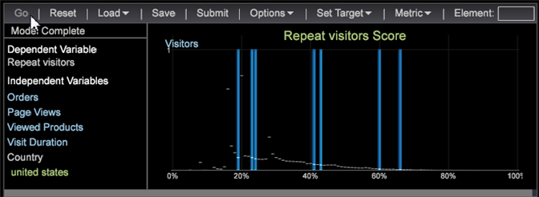

# Propensity scoring

Propensity scoring lets you define customers based on their possibility of a successful conversion or completion of a specified event. It allows you to maximize the potential impact of efforts before executing a process or directing a campaign.

## The value of propensity scoring {#section_C51ECE66EFFC42DE9B754F0F46027C1B}

Propensity scoring lets you perform data discovery to identify hidden behaviors or patterns that exists across your data. Specifically, propensity scoring helps you identify clusters of similar customers using more focused and objective means rather than simple segmentation or filtering. In addition, propensity scoring lets you set up predictive capabilities to identify behavior for your company's high-value customer.

Once you have identified the high-value audience, you can then engage them for the greatest effect. For example, if you are Business to Business company, you may have sales call leads that allow you to then score the leads and identify their likelihood to convert offline. Because every lead increases costs, creating an incentive to identify prospective customers with the highest likelihood of converting a sale is the most effective and the least expensive way to focus your resources.

Propensity scoring provides the ability to identify those factors that are most predictive of a particular score or to increase the likelihood of an event taking place, but it can also be applied to answer specific questions: Will the customer convert? Will the customer respond to an email? Will the customer repurchase? Propensity scoring lets you answer these questions and identify visitors with an inclination for action that can then be set up and scored.

In addition, you can use filters to define a subset of visitors to be scored using the optional **[!UICONTROL Training Filter]** feature. If no filter is applied, then all visitors are targeted for scoring.

## Features of the propensity scoring visualization {#section_28413BC7D33B42C59CECB427C1C5A3FA}

To open the Propensity Scoring Visualization, click **[!UICONTROL Add]** > **[!UICONTROL Visualization]** > **[!UICONTROL Predictive Analytics]** > **[!UICONTROL Scoring]** > **[!UICONTROL Propensity Score]**.

The Propensity Scoring Visualization includes these features accessible from its toolbar:  

<table id="table_449BF14506D24AC6B72192786364987D"> 
 <thead> 
  <tr valign="middle"> 
   <th colname="col1" align="center" class="entry"> Toolbar Feature </th> 
   <th colname="col2" align="center" class="entry"> Description </th> 
  </tr>
 </thead>
 <tbody> 
  <tr> 
   <td colname="col1" align="center"> 
Go 
 </td> 
   <td colname="col2"> 
Click to run the scoring process after setting up parameters. 
 </td> 
  </tr> 
  <tr> 
   <td colname="col1" align="center"> 
Reset 
 </td> 
   <td colname="col2"> 
<b>Reset Models</b>—Clears out the model but maintains the settings and inputs. Makes the <b>Go</b> button selectable. 
 
<b>Reset All</b>—Resets all settings as in previous design. 
 </td> 
  </tr> 
  <tr> 
   <td colname="col1" align="center"> 
Load 
 </td> 
   <td colname="col2"> Loads a previously created ScoreDim that allows you to change and/or rebuild the scoring model. </td> 
  </tr> 
  <tr> 
   <td colname="col1" align="center"> 
Save 
 </td> 
   <td colname="col2"> 
Save the Propensity scoring visualization as a Dim file to be accessed and opened as needed. 
 
Starting with v6.1, you now have an option to save two propensity scores based on dimensions or dimensions/metrics. 
 
    <ul id="ul_C7FD2984EE8A47A9A43CDF94AA2B887E"> 
     <li id="li_A88840C7A13C44E7B966C5F062A3BC29">If you submit the Propensity Score for processing you will get a dimension only. </li> 
     <li id="li_F3AFD19B6EB64CADBA56992AEE920385">If you submit the Propensity Score for processing you will get a dimension only. </li> 
     <li id="li_9BA40D6928BF4B6397FED8F3475DEA8A">You can end up with two saved files, both a dimension and a defined metric. </li> 
     <li id="li_65BFD8C7C4A649F4BACFCBD4FF928B94">The derived metric is the associated average score metric. </li> 
    </ul> </td> 
  </tr> 
  <tr> 
   <td colname="col1" align="center"> 
Submit 
 </td> 
   <td colname="col2"> 
Submit scoring task for server-side processing. 
 </td> 
  </tr> 
  <tr> 
   <td colname="col1" align="center"> 
Options 
 </td> 
   <td colname="col2"> 
Set the Training Filter to limit the subset of visitors. The default filter is  Train on Everyone, but you can change it by making workspace selections or building a filter using the  Filter Editor. 
 </td> 
  </tr> 
  <tr> 
   <td colname="col1" align="center"> 
Set Target 
 </td> 
   <td colname="col2"> 
Set the Dependent Variable. 
 </td> 
  </tr> 
  <tr> 
   <td colname="col1" align="center"> 
Metric 
 </td> 
   <td colname="col2"> 
Add Metrics as Independent Variables. 
 </td> 
  </tr> 
  <tr> 
   <td colname="col1" align="center"> 
Elements 
 </td> 
   <td colname="col2"> 
Drag Dimension elements using the &lt;Ctrl&gt; + &lt;Alt&gt; keys from Dimension tables. 
 </td> 
  </tr> 
 </tbody> 
</table>

## Using the Propensity Scoring visualization {#section_63CED03FA2EB44F2B8A98D61A6C88122}

* **Define one or more filters to define the visitor population for scoring**. This optional **[!UICONTROL Training Filter]** lets you target visitors based on selected criteria. If no training filter is applied, then all visitors are targeted for scoring. If the Training Filter is set, then the scoring result is meaningful to the defined visitor population, although each visitor will still be given a score. 

* **Identify the positive visitors**. To define the dependent variable to specify a target filter identifying the positive visitors that match the desired outcome. This can be as simple as Revenue > $10, or a much more complex filter. 
* **The Target filter is not allowed to be the same as the Training filter**. Logically, the Target Filter should be an addition to the Training Filter, resulting in a positive subset of the visitor population to be scored. 
* **Select variables of interest (independent variables) as inputs to the Propensity Scoring algorithm**. These can be Metrics or individual elements of a Dimension. Propensity Scoring will start preprocessing just as in [Visitor Clustering](../../c_analysis_vis/c_visitor_cluster/c_visitor_cluster.md#concept_1C2406EF7B284A56A02DAA38EAA2E73D). The system begins capturing a certain amount of samples that match the definition of the previously set training filter (if any). Currently, the sample size is set as 10% of scoring population (defined by training filter), with a minimum of 20,000 and maximum of 100,000, and is bound to the scoring population size. 

* A Score Dimension has elements ranging from 0% to 100% that determines the likelihood of the visitors matching the Target variable.

