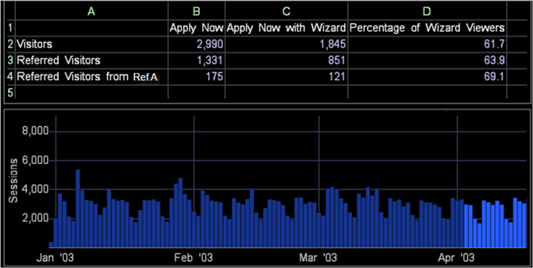

# Worksheet expressions

Conceptual information about worksheet expressions and using cell references.

The following worksheet provides details about the visitors who view the Application Wizard page provided on the online application form of a bank’s website.

* Column A shows a list of the categories of visitors being evaluated: visitors, referred visitors, and referred visitors from Referrer A. 
* Column B shows the number of visitors in each category who viewed the Apply Now page. 
* Column C shows those visitors that viewed both the Apply Now and the Application Wizard pages. 
* Column D contains the percentages of Apply Now viewers in the three categories who also viewed the Application Wizard page.

The worksheet shows that approximately 55 percent of the visitors referred from Referrer A that viewed the Apply Now page also viewed the Application Wizard page.

The following table provides sample formulas for the worksheet in the previous example:

<table id="table_0F5EFDB58040465AB599E6BE93324822"> 
 <thead> 
  <tr valign="top"> 
   <th colname="col1" class="entry"> Worksheet Cell </th> 
   <th colname="col2" class="entry"> Formula </th> 
  </tr> 
 </thead>
 <tbody> 
  <tr valign="top"> 
   <td colname="col1"> 
B2 
 
Visitors who viewed the Apply Now page 
 </td> 
   <td colname="col2"> 
 =Visitors[Page="/applynow/default.asp"] 
 </td> 
  </tr> 
  <tr valign="top"> 
   <td colname="col1"> 
B3 
 
Referred Visitors who viewed the Apply Now page 
 </td> 
   <td colname="col2"> 
 =Referred_Visitors[Page="/applynow/default.asp"] 
 </td> 
  </tr> 
  <tr valign="top"> 
   <td colname="col1"> 
B4 
 
Referred Visitors from Referrer A who viewed the Apply Now page 
 </td> 
   <td colname="col2"> 
  =Referred_Visitors[Page="/applynow/default.asp"  
 
 AND  Referrer="Ref A"] 
 </td> 
  </tr> 
  <tr valign="top"> 
   <td colname="col1"> 
C2 
 
Visitors who viewed the Apply Now page and the Application Wizard page 
 </td> 
   <td colname="col2"> 
  =Visitors[Page="/applynow/default.asp"  
 
 AND  Page="/applynow/appwizard.asp"] 
 </td> 
  </tr> 
  <tr valign="top"> 
   <td colname="col1"> 
C3 
 
Referred Visitors who viewed the Apply Now page and the Application Wizard page 
 </td> 
   <td colname="col2"> 
  =Referred_Visitors[Page="/applynow/default.asp"  
 
 AND  Page="/applynow/appwizard.asp"] 
 </td> 
  </tr> 
  <tr valign="top"> 
   <td colname="col1"> 
C4 
 
Referred Visitors from Referrer A who viewed the Apply Now page and the Application Wizard page 
 </td> 
   <td colname="col2"> 
  =Referred_Visitors[Page="/applynow/default.asp" 
 
 AND  Page="/applynow/appwizard.asp" 
 
 AND  Referrer="Ref A"] 
 </td> 
  </tr> 
  <tr valign="top"> 
   <td colname="col1"> 
D2 
 
Percentage of Visitors who viewed the Apply Now page and the Application Wizard page 
 </td> 
   <td colname="col2"> 
 =C2/B2*100 
 </td> 
  </tr> 
  <tr valign="top"> 
   <td colname="col1"> 
D3 
 
Percentage of Referred Visitors who viewed the Apply Now page and the Application Wizard page 
 </td> 
   <td colname="col2"> 
 =C3/B3*100 
 </td> 
  </tr> 
  <tr valign="top"> 
   <td colname="col1"> 
D4 
 
Percentage of Referred Visitors from Referrer A who viewed the Apply Now page and the Application Wizard page 
 </td> 
   <td colname="col2"> 
 =C4/B4*100 
 </td> 
  </tr> 
 </tbody> 
</table>

As with other visualizations, worksheets update automatically when you make a selection in another visualization in the workspace. For more information about making selections, see [Making Selections in Visualizations](../../c_vis/c_sel_vis/c_sel_vis.md#concept_012870EC22C7476E9AFBF3B8B2515746).

In the following web data example, several days of session data has been selected in the Sessions by Day visualization. The worksheet shows that during the selected timeframe, approximately 69 percent of the visitors from Referrer A who viewed the Apply Now page also viewed the Application Wizard page. Without this selection (as shown in the example above), approximately 55 percent of the visitors from Referrer A viewed the Apply Now page as well as the Application Wizard page.

## Using Cell References {#section_0004E315C9C94D359B1A8A39794BA555}

You can substitute any string, whether on its own or within another expression in the worksheet, with a cell reference.

* **Simple cell reference:** Cell A2 contains the text Visitors, which is used as a heading. Cell B2 contains [!DNL eval(A1)], which evaluates to [!DNL =Visitors]. 

* **Filter cell reference:** Cell A5 contains yesterday’s date. Cell B5 contains [!DNL Visitors[ Day=A5 ]], which evaluates to the number of Visitors yesterday. 

* **Concatenated cell reference:** Cell A5 contains today’s date and Cell A6 contains the 08:00 to 08:59 one-hour period of time. Cell B6 contains [!DNL Visitors[ Hour=A5+” ”+A6 ]], which evaluates to the number of Visitors today between 8:00 AM and 9:00 AM.

