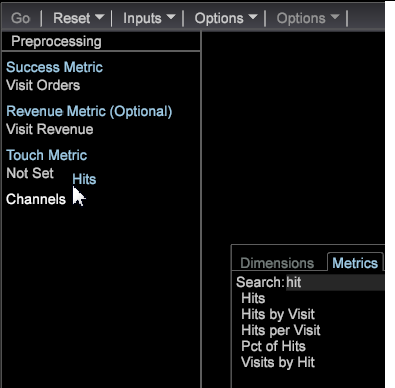

# Build a best-fit attribution model

Open Best Fit Attribution from the Premium menu and follow these steps to build a best fit attribution model.

See an overview of [Best Fit Attribution](../../../c_get_started/c_attribution_profiles/c_attrib_algorithmic/c_attrib_algorithmic.md#concept_237FEB6E9C4D49EFAF75399297DCB9D1).

1. Open **Best Fit Attribution**.

   Open a workspace and click **[!UICONTROL Premium]** > **[!UICONTROL Best Fit Attribution]**.

   

   As an **Adobe Analytics Premium** feature, Best Fit Attribution must be enabled as part of your workstation certificate. 

1. Set the **[!UICONTROL Success]** metric.

   >[!NOTE]
   >
   >You can either drag a metric from a Finder table to the left pane of the Attribution visualization, or select from the **Inputs** menu.

   Click **[!UICONTROL Inputs]** > **[!UICONTROL Set Success]**. The metric menu will open.

   

   Select a metric that identifies a successful conversion. 

1. (Optional) Set the **Revenue** metric.

   Set a metric to evaluate revenue across the conversion process. 

1. (Optional) Set the **Touch** metric.

   >[!NOTE]
   >
   >Setting a Touch Metric is only required if you are trying to build Success metrics automatically by dragging dimension elements onto the visualization.

   Click the **[!UICONTROL Inputs]** menu and select **Set Touch**, or drag a metric from the Finder.

   

   This will be used to derive channel metrics when dimension elements are used as inputs. 

1. Set a **Success** window.

   Click [!DNL Inputs > Success Window]. Select a date range from a table and then name the Success window. Click **[!UICONTROL Workspace Selection]** and the selected dates will be assigned as the range of time for the Success metric.

   

   >[!NOTE]
   >
   >Since the Success window is a workspace selection, you can include any dimension(s) to your Success window.

1. Set a **[!UICONTROL Touch Window]**.

   Click [!DNL Inputs > Touch Window]. Select a date range from a table and then name the Touch window. Click **[!UICONTROL Workspace Selection]** and the selected dates will be assigned as the range of time for the Success metric.

   

   By default, the **Touch** window will be set to the same time period as the **[!UICONTROL Success]** window. 

1. (Optional) Set a Training Filter.

   You can also specify a **Training Filter** in the workspace to filter visitor data.

   >[!NOTE]
   >
   >In setting both the Success and Touch windows, you can apply the Training filter to the current workspace selections to further limit your data.

   

   >[!NOTE]
   >
   >The training set is always drawn from visitors who satisfy the Success window. By filtering using the Filter Editor, you can create a subset of visitors reported in the Success window.

1. Specify metrics that represent touches of the **channels** to calculate attribution.

   Either drag metrics to the visualization, or choose them from the [!DNL Inputs] > [!DNL Add Channel] menu. If you do not already have Metrics defined for campaigns or channels, but do have dimensions representing channels, the visualization can build them for you automatically with the specification of a Touch metric.

   For example, with the Touch metric set to [!DNL Hits], and given a [!DNL dimension] called [!DNL Media Type] with elements that include things like [!DNL Email], [!DNL Press Release], [!DNL Print Ad], and [!DNL Social Media], the visualization will generate Channel metrics of the form [!DNL Hits where Media Type = Email] when you drag and drop the element(s) onto the visualization. 

1. Press **Go**.

   The Best Fit Analysis process will run, and a chart will display attributions per channel based on the selected inputs.

   >[!NOTE]
   >
   >Right-click **Model Complete** on the completed analysis to see statistics for the attribution model.

   

When complete, a graph will display an attribution model calculated per channel, and a distribution of the *Revenue* metric (if set). The model can be saved internally or exported to other systems.

>[!NOTE]
>
>**[!UICONTROL Streaming]**, **[!UICONTROL Online]** and **[!UICONTROL Offline]** modes produce different effects when building an attribution model based on the latency of the data being evaluated. In Streaming mode, the detail **[!UICONTROL Model Complete]** message will display. In Online and Offline modes, the detail **[!UICONTROL Local Model Complete]** will display.

## Options menu {#section_22288867F6C8483A8A38410F4B948346}

The **Options** menu provides advanced features to set up and display Best Fit Attribution analysis. 

<table id="table_8F6F517B7DBF4259814BEC6D07A72EAC"> 
 <thead> 
  <tr> 
   <th colname="col1" class="entry"> Options menu </th> 
   <th colname="col2" class="entry"> Description </th> 
  </tr>
 </thead>
 <tbody> 
  <tr> 
   <td colname="col1" align="left" valign="top"> Set Training Filter  </td> 
   <td colname="col2" align="left" valign="top"> The Training Filter is used with the Success Window to filter the population when building the attribution model. This will provide a subset of data that includes only the visitors that you want to analyze. 
Note: Experienced users can also leverage the flexibility of filters to focus beyond the time line of the Success and Touch Windows. For example, in addition to selecting a time range, you can select a set of <i>Referring Domains</i> to only examine the attribution for users from those domains. 
 </td> 
  </tr> 
  <tr> 
   <td colname="col1" align="left"> Show Complex Filter Description  </td> 
   <td colname="col2" align="left" valign="top"> Displays the filter code for the Training Filter, Success Window, and Touch Window. </td> 
  </tr> 
  <tr> 
   <td colname="col1" align="left"> Save Model  </td> 
   <td colname="col2" align="left" valign="top"> Saves the current attribution model for future use. </td> 
  </tr> 
  <tr> 
   <td colname="col1" align="left"> Load Model  </td> 
   <td colname="col2" align="left" valign="top"> Opens a previously saved attribution model. </td> 
  </tr> 
  <tr> 
   <td colname="col1" align="left"> Presentation View  </td> 
   <td colname="col2" align="left" valign="top"> Hides the top menu bar for presentation. </td> 
  </tr> 
  <tr> 
   <td align="left" colspan="2"> 
<b>Options &gt; Advanced</b> includes features to set the training set size and specify the approach to take in the case of a class imbalance. 
 </td> 
  </tr> 
  <tr> 
   <td colname="col1" align="left" valign="top"> Advanced &gt; Training Set Size  </td> 
   <td colname="col2" align="left"> 
Sets the training set size. 
 
Note:  The default training size is Large for 250,000 visitors. 
 
    <ul id="ul_5F17C60227C34A85A2C476A32F2B5DCD"> 
     <li id="li_A076FC2AD0214ADDBFCFD82AEA5F0880">Tiny = 50,000 </li> 
     <li id="li_17E77E01D5374068BEBC80B3AD4CCD41">Small = 75,000 </li> 
     <li id="li_7F6B4834742A4BFCBC3DB214425B88C3">Normal = 100,000 </li> 
     <li id="li_0BB7F791603745028CFC661EBC94D8B4">Large = 250,00 </li> 
     <li id="li_34B60233C84F48F1BCB8040C5195411A">Huge = 500,000 </li> 
    </ul> </td> 
  </tr> 
  <tr> 
   <td colname="col1" align="left" valign="top"><b>Advanced &gt; Class Balance </b> </td> 
   <td colname="col2" align="left"> 
Identifies and defines the number of input records to generate for a class imbalance issue based on dataset size. 
 </td> 
  </tr> 
 </tbody> 
</table>

