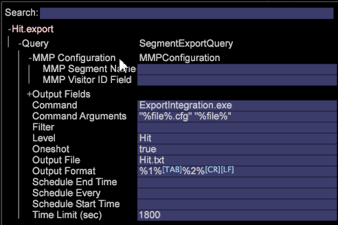

# Export to the People core service

Data Workbench lets you export files to integrate profiles and audiences as part of an integrated Adobe Experience Cloud.

<a id="section_731922BC8628479198A41EF3EA72F2FF"></a>

The Master Marketing Profile (MMP) is part of the [Visitor ID service](http://marketing.adobe.com/resources/help/en_US/mcvid/?f=mcvid_service), a core service of the [Adobe Experience Cloud](http://www.adobe.com/solutions/?f=digital-marketing). The MMP allows audiences to be shared across the Experience Cloud using a unique visitor ID (MCID) that is assigned to every visitor and then used by [Audience Manager](http://marketing.adobe.com/resources/help/en_US/em/). The [!DNL ExportIntegration.exe] application ( [!DNL E:\Server\Scripts]) is employed to generate the Profiles and Audiences Export.

>[!NOTE]
>
>See your Account Manager to configure the Master Marketing Profile on the Insight Server (configuration of the FSU server).

**Generating Profiles and Audiences Export from the client**

1. From the client, open a workspace and right-click **[!UICONTROL Tools]**> **[!UICONTROL Detail Table]**. 

1. Add **Level > Extended. **Select Clickthrough, Hit, Product, Tactic, Visit or Visitor. 
1. Right-click the header and select **Add Attributes**. 
1. Right-click the header and select **New Master Marketing Profile Export**. 
1. Expand **Query**.  

1. Expand **MMP Configuration**. 
1. (required) Enter the **MMP Segment Name** and **MMP Visitor ID Field**. These parameters cannot be left empty. 

1. The **MMP Segment Name** should match the Segment ID defined in the MMP. 
1. The **MMP Visitor ID** is the attribute column defined in step 4 that corresponds to the **Visitor ID**. 

1. Once these fields are entered, you can save the export by right-clicking the header for the export and choose **Save** as "User\.export". 
1. Open **Admin** > **Profile Manager **and save the export to the profile.

   If all data is entered correctly, this will generate an export file in the FSU ( [!DNL Server/Exports]) and it will also transfer the export to the AWS using the information in [!DNL MMPExport.cfg]. The log for this is provided in [!DNL Server/Trace/]. eg., [!DNL MMP-102014-133651- [Segment Export Name] .log]

```
Query = SegmentExportQuery:
Command = string: ExportIntegration.exe
Command Arguments = string: \"%file%.cfg\" \"%file%\"
Filter = string:
Level = string: Page View
MMP Configuration = MMPConfiguration:
MMP Segment Name = string: 12345
MMP Visitor ID Field = string: Tracking ID
Oneshot = bool: true
Output Fields = vector: 3 items
0 = ColumnDefinition:
Column Name = string:
Field Name = string: Tracking ID
1 = ColumnDefinition:
Column Name = string:
Field Name = string: PID
2 = ColumnDefinition:
Column Name = string:
Field Name = string: SID
Output File = string: MMPTest.txt
Output Format = string: %1%\t%2%\t%3%\r\n
Schedule End Time = string:
Schedule Every = string:
Schedule Start Time = string:
Time Limit (sec) = double: 1800 
```

|  Configuration Details  | Description  |
|---|---|
|  MMP Segment ID  | Required. This is an identifier you would define first in Audience Manager.  |
|  MMP Visitor ID Field  | Map the MCID.  |

>[!NOTE]
>
>When running exports, a new **[!DNL httpLoggingEI.cfg]** configuration file (located at **[!DNL server\Admin\Export\httpLoggingEI.cfg]**) lets you stop verbose logging to the **[!DNL HTTP.log]** file during Export Integration exports. (The CRS, Target, and MMP exports already capture verbose logging in individual export log files.) 
>
>A *true* setting starts verbose logging (for testing and detailed reporting) to the HTTP.log file, and a *false* setting stops verbose logging. For a *false* setting, a message will be sent identifying when an export starts and when it finishes.

>[!NOTE]
>

