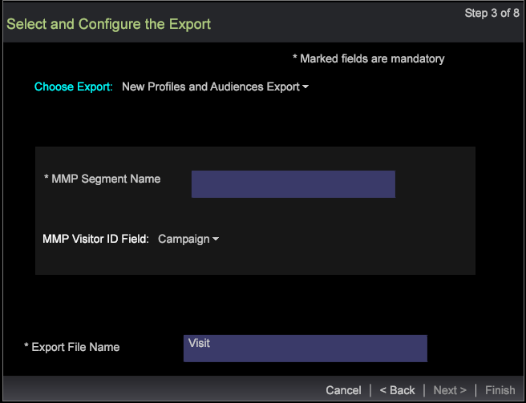
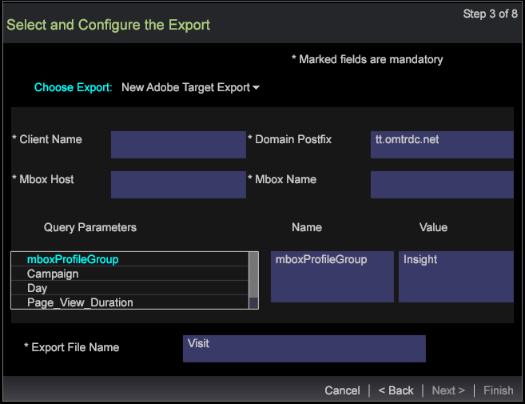
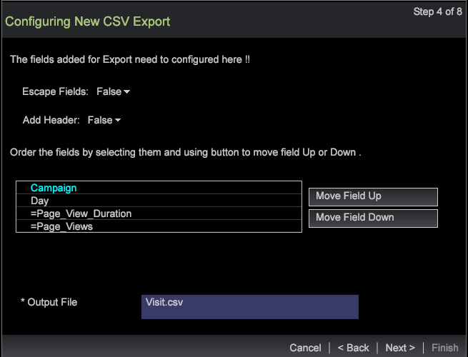
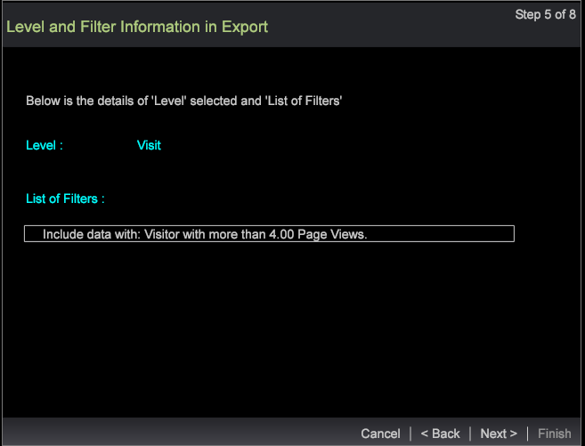
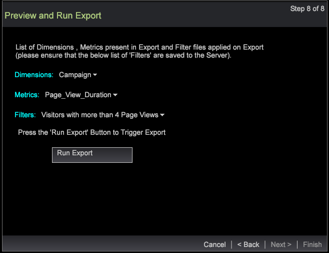
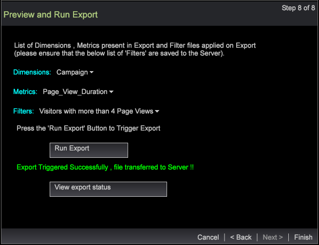

# Segment export wizard

Export segments using the segment export wizard

The segment export wizard provides a step-by-step process to configure and export segments rather than [exporting segments from a detail table](https://marketing.adobe.com/resources/help/en_US/insight/client/c_sgmt_expt.html).

## Export segments using the wizard {#section_B30F2699DBC7490BAD18512B91CB0CB3}

To open the wizard, right-click in a workspace and select **Admin** > **Wizards** >** Segment Export Wizard**. 

>[!NOTE]
>
>Only the segments applied before opening the wizard will be captured. Also, the segment exports created from the wizard cannot spawn external commands.

1. Select the various parent levels of the dimensions and metrics to be added to your export.

   The levels displayed depend on the profile selected. You can select multiple dimension levels based on the profile.

   

1. Click **Next**. 
1. Select the Dimension and Metrics for the selected levels.

   For example, after selecting Page View as the parent level, you can select the child dimensions and metrics available to be exported. 

1. Click **Next**.

   

   

1. Select the export format and enter a name for the export file.

   

   The CSV, TSV , Segment Export, and Segment Export With Header types need no extra configuration. However, the Profiles and Audience Export, Custom Record Service and Adobe Target Export need to be configured in Step 3. For example, see the configuration fields for the Profiles and Audience Export. Configure these export types and click **Next**.

   

   

   

1. Configure the selected export type.

   Header—If Header is True, then name the **Output File** field.

   Escape Field—Set as **True** or **False**.

   Order of Fields—Select a field and move up or down to set the order in the export file.

   

   Click **Next**. 

1. View the Level and applied filters in this dialog. Click **Next**.  

1. If **CSV** , **TSV** , **Segment Export** or **Segment Export with Header **is selected then there are three options:

   Generic Export - The output file will be generated by server in Server/Export folder.

   

   FTP Export - The output file will be transferred to the server selected. (The server's list will be picked from FTPServerInfo.cfg file.)

   

   SFTP Export - The output file will be securely transferred to the server selected. 

1. Click **Next**

   **Note:** If the export type selected is **Profiles and Audience Export**, **Custom Record Service**, and **Adobe Target Export**, then the text will be static based on the export selected. 

1. Configure scheduling parameters.

   **One Shot** can be set to True or False.

   **Advanced Scheduling** can be turned On or Off by clicking the Advanced Scheduling Configuration button.

   

   Like exporting from the Detail Table, One Shot will go away if Advanced Setting is On. Click **Next**. 

1. Preview the export file and then click** Run Export**.

   

   

The following exports types are available using the wizard:

**Segment Export types**

* Generic 
* FTP 
* SFTP

**Segment Export with Header**

* Generic 
* FTP 
* SFTP

**CSV Export**

* Generic 
* FTP 
* SFTP

**TSV Export**

* Generic 
* FTP 
* SFTP

