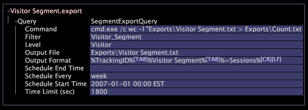

# Configure segments for export

You can create a segment of the elements of any countable dimension, then output data for that segment on a batch or ongoing real-time basis into a tab-delimited file.

 Each time that you export a segment, you output metric or dimension data for all of the dimension elements included in that segment. You can control how the output data is formatted so that other systems can easily load the data.

>[!NOTE]
>
>You cannot export reporting dimensions, because they use a [!DNL report time.metric] file for reference. As a workaround, if you place a hard-coded [!DNL report time.metric] in the profile, the segment export can use it as a reference point for reporting dimensions. However, the [!DNL report time.metric] does not automatically update based on the profile’s As Of Time, so when you want to change the reporting dimension reference, you must change the hard-coded [!DNL report time.metric] file.

To configure a segment for export, you must open and edit a [!DNL .export] file. 

1. In the [!UICONTROL Profile Manager], click the **[!UICONTROL Export]** directory in the [!UICONTROL File] column to show its contents.

       If the Export directory does not exist, create it as follows:

    1. Navigate to your Data Workbench installation directory. 
    1. Open the directory for the profile with which you are working. 
    1. Within the Profile directory, create a new directory named “Export.”

1. In the [!UICONTROL Profile Manager], right-click the empty cell in the [!UICONTROL User] column for the Export directory, then click **[!UICONTROL Create]** > **[!UICONTROL New Segment Export]**.

   A file named [!DNL New Segment Export.export] appears in the [!UICONTROL File] column for Export. 

1. Rename the new file by right-clicking in the [!UICONTROL User] column for the file and typing the new name in the File parameter.
1. Open the new file by right-clicking in the [!UICONTROL User] column for the file and clicking **[!UICONTROL Open]** > **[!UICONTROL from the workbench]**.

   The configuration window for the [!DNL .export] file appears. 

1. Click **[!UICONTROL Query]**, then modify the fields of the [!DNL .export] file as described in the following table:

<table id="table_C2EC8FCD3FA04DE78D2CADFA3F7FD8E3"> 
 <thead> 
  <tr valign="top"> 
   <th colname="col1" class="entry"> For this parameter... </th> 
   <th colname="col2" class="entry"> Provide this information... </th> 
  </tr> 
 </thead>
 <tbody> 
  <tr valign="top"> 
   <td colname="col1"> Command </td> 
   <td colname="col2"> 
Optional. A program to be executed after the Output File is created. This field must reference an executable (an  .exe  file), not a shell command. 
 
Note:  The segment export will fail if there is a space in the command parameter. 
 </td> 
  </tr> 
  <tr valign="top"> 
   <td colname="col1"> Filter </td> 
   <td colname="col2"> 
Optional. A named filter or a filter expression. You can either create a named filter using a filter editor, then type the name of that filter here, or you can type a filter expression itself. 
 
For more information about filter editors, see <a href="../../c_analysis_vis/c_filter_editors/c_filter_editors.md#concept_2F343ECBED8240F18B0C1F1ECCEF11E3" format="dita" scope="local"> Filter Editors </a>. For more information about filter expression syntax, see <a href="../../c_qry_lang_syntx/c_syntx_fltr_exp.md#concept_72F2563F809747A2A3CFF7EC72462A15" format="dita" scope="local"> Syntax for Filter Expressions </a>. 
 
Elements of Level that match the filter are exported, while all other elements are not. 
 </td> 
  </tr> 
  <tr valign="top"> 
   <td colname="col1"> Level </td> 
   <td colname="col2"> 
The countable dimension whose elements are to be exported. 
 
Example: A level of Visitor exports one row of data for each visitor. 
 </td> 
  </tr> 
  <tr valign="top"> 
   <td colname="col1"> Output File </td> 
   <td colname="col2"> 
Path and file name of the exported data. If the profile is running on a Data Workbench server cluster, each Data Workbench server writes an Output File containing a portion of the data. 
 
The Data Workbench server installation directory contains an Exports directory where you can save the output file. For example, you could enter  Exports\Visitor Segment.txt , where  Visitor Segment.txt  is the name of the file containing the exported data. 
 </td> 
  </tr> 
  <tr valign="top"> 
   <td colname="col1"> Output Format </td> 
   <td colname="col2"> The metric or dimension data to be exported for each Level element. If the output is a tab-delimited file, the fields should be separated by Tab characters, and the format should end with the appropriate new-line characters. For more information, see <a href="../../c_get_started/c_exp_data_seg_exp/c_abt_otpt_frmt.md#concept_AC7E24D1374A4B418365DB7CC98C361E" format="dita" scope="local"> About the Output Format </a>. </td> 
  </tr> 
  <tr valign="top"> 
   <td colname="col1"> Schedule End Time </td> 
   <td colname="col2"> 
Optional. The end date and time for the schedule, including the time zone. 
 
Format: YYYY-MM-DD hh:mm time zone 
 
Example: 2013-08-01 12:01 EDT 
 
Scheduled exports stop at this time; however, the Output File is still regenerated any time its definition is changed. This field is meaningless without defining Schedule Every. For more information about time zone settings, see the <i>Dataset Configuration Guide</i>. 
 </td> 
  </tr> 
  <tr valign="top"> 
   <td colname="col1"> Schedule Every </td> 
   <td colname="col2"> Optional. The frequency at which to regenerate the Output File. Supported values are hour, day, week, and month. The Output File is still regenerated any time its definition is changed. </td> 
  </tr> 
  <tr valign="top"> 
   <td colname="col1"> Schedule Start Time </td> 
   <td colname="col2"> 
Optional. The start date and time for the schedule, including the time zone. 
 
Format: YYYY-MM-DD hh:mm time zone 
 
Example: 2013-08-01 12:01 EDT 
 
Scheduled exports start at this time, and the schedule is relative to this time. This field is meaningless without defining  Schedule Every . For more information about time zone settings, see the <i>Dataset Configuration Guide</i>. 
 </td> 
  </tr> 
  <tr valign="top"> 
   <td colname="col1"> Time Limit (sec) </td> 
   <td colname="col2"> Optional. The maximum time permitted to elapse while a segment export is being generated. If the specified interval is exceeded, then the export starts over. Setting this value to 0 (zero) removes the limit. The default value is 600 seconds. </td> 
  </tr> 
 </tbody> 
</table>

1. Right-click **[!UICONTROL (New)]** at the top of the window, then click **[!UICONTROL Save]**.
1. To make this file available to all users of the working profile, right-click the check mark for the created [!DNL .export] file in the [!UICONTROL User] column, then click **[!UICONTROL Save to]** > *< **[!UICONTROL working profile name]**>*.

   >[!NOTE]
   >
   >Saving the [!DNL .export] file to the Data Workbench server causes the export to run once immediately, even if the Schedule Start Time is set to a future date and time.

   The following is a sample [!DNL .export] file.

   

   >[!NOTE]
   >
   >The [!DNL Visitor Segment.export] file shown in the sample refers to the Visitor Segment filter. Modifying the definition of this filter changes the definition of the export.

