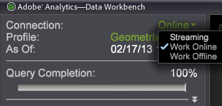

# Working offline and online

Information about working with the Data Workbench server either offline or online.

 [!DNL Data workbench] automatically downloads updates to the profile and its data from the Data Workbench server if you have a network connection to the [!DNL server] and are working online. If you have not specified to work online, Data Workbench loads the profile and its data from your computer’s cache. In this case, you are viewing the version of the profile and its data that was downloaded the last time that you worked online with the profile.

Working offline offers a processing speed advantage because you are working from the local cache and querying the data on your own computer. When working online, every query must go back to the Data Workbench server, which takes longer and forces you to compete with other online users for server resources. As long as you have a network connection to the Data Workbench server, working offline stops the Data Workbench server from updating the profiles or data on your Data Workbench, but it does not stop you from saving items to the Data Workbench server.

Because of the ability to work offline, the Data Workbench server is sized to handle some amount of real-time traffic input and some amount of data in the dataset, along with some number of Data Workbench users, but it does not have to be sized to support the maximum number of concurrent users (which in practice does not happen often). Because users are usually looking for trends and ratios, exploring the data as you go, in most cases you do not need exact counts. If there is a need to query and resolve to exact counts using current data, you can work online and get that, but the queries take longer to resolve to 100 percent.

**To toggle online, offline, or streaming**

In the side bar, click the **[!UICONTROL Connection]** setting and click **[!UICONTROL Work Online]**.



When you work online, Data Workbench connects to the Data Workbench server and synchronizes the information on your machine with the profile and its dataset information residing on the Data Workbench server.

The default configuration for Data Workbench is to work offline, but as described in the following section, each user can change their [!DNL Insight.cfg] file to make their instance of Data Workbench work online by default.

**To work online by default**

1. Navigate to your Insight installation directory. 
1. Open the [!DNL Insight.cfg] file in a text editor. 
1. Add the highlighted line to the file as shown in the following example:

```
...
Update Software = bool: true
Default to Online = bool: true
Color Set = int: 0
```

The next time that you open Data Workbench, it connects to the Data Workbench server and works online by default. 
