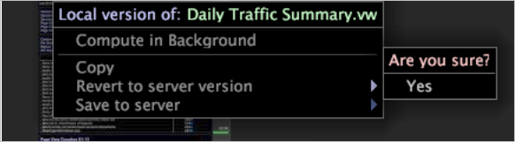

# Deleting a workspaces

Information about deleting workspaces from the Worktop.

A local workspace is a local version of a workspace that exists on the server. A user workspace exists only on the local machine.

**To delete local workspaces from the [!UICONTROL Worktop]**

Right-click the workspace that you want to delete and click **[!UICONTROL Revert to server version]** > **[!UICONTROL Yes]**. The local version is deleted, but the server version remains.

>[!NOTE]
>
>When you have a local version of a server workspace, you must lose your changes by reverting to the server version before you can download an updated version of the server workspace.

**To delete user workspaces from the [!UICONTROL Worktop]**

Right-click the workspace that you want to delete and click **[!UICONTROL Delete]**.

