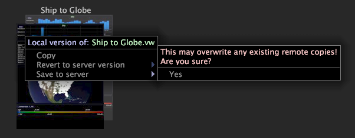

# Save a workspace

By default, closing an unlocked workspace saves any changes that have been made to the workspace.

 If the workspace is a server workspace, your changes are saved only locally unless you specifically save the updated workspace to the Data Workbench server. For more information about locked workspaces, see [Unlocking a Workspace](../../c_get_started/c_work_worksp/c_unlock_wksp.md#concept_18ADA952AECF45C79A806B31B294023E).

## Save a workspace locally {#section_3F331C880F1A490C96844103C2432D61}

The default save location is the User\*profile name*\Workspaces\*tab name* folder within the Data Workbench installation directory. For example, if you are working with the Movies profile and you save a workspace locally from the [!UICONTROL Custom] tab, the workspace is saved to the User\Movies\Workspaces\Custom folder in your Data Workbench installation directory.

**To save changes to a workspace**

* In the workspace, click **[!UICONTROL File]**, then **[!UICONTROL Save]**.

**To save an existing workspace as a new workspace**

1. On the desired [!UICONTROL Worktop] tab, click the thumbnail of the workspace you want to display. 
1. In the workspace, click **[!UICONTROL File]**, then click **[!UICONTROL Save Copy As]**. 
1. In the [!UICONTROL Save Workspace As] dialog box, specify the name and location where you want to save the copied workspace and click **[!UICONTROL Save]**.

## Save a workspace to the Data Workbench server {#section_65A23DA852EE4186880E002F7C87EA81}

>[!NOTE]
>
>Only users with the appropriate permissions can save workspaces to the Data Workbench server. For more information, contact your system administrator.

Saving workspaces to the connected Data Workbench server is also referred to as publishing a workspace because it makes the workspace available to other users. By default, workspaces are saved to the *working profile name*\Workspaces\*tab name* folder of the Data Workbench server. For example, if you are working with the Movies profile and you save a workspace to the connected Data Workbench server from the [!UICONTROL Custom] tab, the workspace is saved to the Movies\Workspaces\Custom folder of the Data Workbench server.

**To save a workspace to the Data Workbench server**

* On the desired [!UICONTROL Worktop] tab, right-click the thumbnail of the workspace that you want to save to the Data Workbench server and click **[!UICONTROL Save to server]**.

