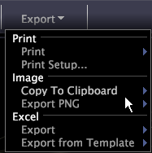

# Share a workspace

You can use the Export workspace menu to print and export workspaces to .png files or to Excel.

In a workspace, click **[!UICONTROL Export]**.

<table id="table_900D1AB7B08749469DA9544C5D37096F"> 
 <desc> 
  <b>  Workspace Export Menu </b> 
 </desc> 
 <thead> 
  <tr valign="top"> 
   <th colname="col1" class="entry"> Menu Option </th> 
   <th colname="col2" class="entry"> Description </th> 
  </tr> 
 </thead>
 <tbody> 
  <tr valign="top"> 
   <td colname="col1"> Print </td> 
   <td colname="col2"> Prints the workspace. When you print a workspace, the background prints as white. If you are printing to a color printer, the workspace prints in color on a white background. If you are printing to a black and white printer, the workspace prints in grayscale on a white background. Printed output is centered horizontally on the page by default. </td> 
  </tr> 
  <tr valign="top"> 
   <td colname="col1"> Print Setup </td> 
   <td colname="col2"> Sets the page orientation (portrait or landscape) and margins. </td> 
  </tr> 
  <tr valign="top"> 
   <td colname="col1"> Copy to Clipboard </td> 
   <td colname="col2"> 
Copies the workspace or sidebar to the clipboard. The following options are available when copying workspaces, sidebars, or both: 
     <ul id="ul_F7338E53385B4AE39FBCF1C3A80276CE"> 
      <li id="li_9A3147A64B1C443AAE2843A5260E3273">Dark Background option copies the workspace as displayed. </li> 
      <li id="li_516B6162FDA747CFBB2886E71DF49146">Light Background option copies the elements of the workspace in color and displays them on a white background. </li> 
      <li id="li_E0B5E9D31F5948238DEB0D75E235BAE3">Monochrome option copies the elements of the workspace in grayscale and displays them on a white background. </li> 
     </ul> 
 </td> 
  </tr> 
  <tr valign="top"> 
   <td colname="col1"> Export PNG </td> 
   <td colname="col2">Saves a snapshot of a workspace in Portable Network Graphic format ( .png file). See <a href="../../c_get_started/c_work_worksp/c_ex_wksp.md#section_F9FBE0F0A1C341E2B063CCE106CAC35E" format="dita" scope="local"> Exporting Workspaces as PNG Files</a>. </td> 
  </tr> 
  <tr valign="top"> 
   <td colname="col1"> Excel </td> 
   <td colname="col2">If Microsoft Excel is installed on the Data Workbench machine, automatically starts Microsoft Excel and exports the data from certain visualizations, certain legends, and text annotations to a new Excel file ( .xls or  .xlsx). See <a href="../../c_get_started/c_work_worksp/c_ex_wksp.md#section_FE214E3DBC364D2EBA3834D62D295ACB" format="dita" scope="local"> Exporting Workspace Data to Microsoft Excel</a>. </td> 
  </tr> 
  <tr valign="top"> 
   <td colname="col1"> Export (Excel) from Template </td> 
   <td colname="col2">If Microsoft Excel is installed on the Data Workbench machine, automatically starts Microsoft Excel and exports the data from certain visualizations, certain legends, and text annotations to the template Excel file ( .xls or  .xlsx) that you select. See <a href="../../c_get_started/c_work_worksp/c_ex_wksp.md#section_814772929CA64CF6B92B89D3FDD02302" format="dita" scope="local"> Exporting to a Template Excel File</a>. </td> 
  </tr> 
 </tbody> 
</table>

