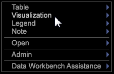

# Using the workspace Window menu

This menu enables you to add available visualizations to your workspace.

Right click in the workspace window (anywhere in the background of your workspace).

>[!NOTE]
>
>Because your implementation of Data Workbench can be fully customized, the menu items that appear may differ from what is documented in this section.

The following table contains descriptions of each menu item.

<table id="table_00C0D3E6098E473E8D3B66F48FB635B3"> 
 <desc> 
  <b>Workspace Window menu </b> 
 </desc> 
 <thead> 
  <tr valign="top"> 
   <th colname="col1" class="entry"> Menu Option </th> 
   <th colname="col2" class="entry"> Description </th> 
  </tr> 
 </thead>
 <tbody> 
  <tr valign="top"> 
   <td colname="col1"> Table </td> 
   <td colname="col2"> Adds a table to your workspace based on the selected dimension. See <a href="../../c_vis/c_vis.md#concept_F6C7728D5AAA4304BBF2E4DFAED48739" format="dita" scope="local"> Working with Visualizations </a> and <a href="../../c_analysis_vis/c_tables/c_tables.md#concept_C632CB8AD9724F90AC5C294D52AE667F" format="dita" scope="local"> Tables </a>. </td> 
  </tr> 
  <tr valign="top"> 
   <td colname="col1"> Visualization </td> 
   <td colname="col2"> Adds a visualization to your workspace based on the selected visualization type (for example, a graph or table) and the selected dimension(s). See <a href="../../c_vis/c_vis.md#concept_F6C7728D5AAA4304BBF2E4DFAED48739" format="dita" scope="local"> Working with Visualizations </a> and <a href="../../c_analysis_vis/c_analysis_vis.md#concept_CB5B9716D3404B2B888A55B3EFEC1FA5" format="dita" scope="local"> Analysis Visualizations </a>. </td> 
  </tr> 
  <tr valign="top"> 
   <td colname="col1"> Legend </td> 
   <td colname="col2"> Adds a legend to your workspace. See <a href="../../c_analysis_vis/c_legends/c_legends.md#concept_BA7A886967314EE5AA358F5949665494" format="dita" scope="local"> Legends </a>. </td> 
  </tr> 
  <tr valign="top"> 
   <td colname="col1"> Note </td> 
   <td colname="col2"> Adds an image, text, or dynamic title window to your workspace. See <a href="../../c_analysis_vis/c_annots/c_annots.md#concept_AB80EDCBC4204DD78C73630511F75AB0" format="dita" scope="local"> Annotations </a>. </td> 
  </tr> 
  <tr valign="top"> 
   <td colname="col1"> Open </td> 
   <td colname="col2"> 
 
     <ul id="ul_173273B72EE24A52927B59E63F0BF19B"> 
      <li id="li_1EF395A0425047A9981891A0D9D29F07">The  File  option enables you to navigate to and open an existing visualization. </li> 
      <li id="li_E02E8929B8E247B0A46F6D708C51B1E2">The  From Clipboard  option enables you to open a window that you have previously copied. The is equivalent to pasting a window that you have copied. </li> 
     </ul> 
 </td> 
  </tr> 
  <tr valign="top"> 
   <td colname="col1"> Admin </td> 
   <td colname="col2"> Heading for the administrative interfaces. See <a href="../../c_admin_intrf/c_admin_intrf.md#concept_855C1A91E1A948969FAB592ADCA15F74" format="dita" scope="local"> Administrative Interfaces </a>. </td> 
  </tr> 
  <tr valign="top"> 
   <td colname="col1"> Data </td> 
   <td colname="col2"> 
 
     <ul id="ul_CFAC2CBB10464079A78A9127C25482FF"> 
      <li id="li_78C64D2602674C2D85509422FF055D5C">(Available only with Site) The  Broken Session Filter  option enables you to filter out all visitors with only one page view. Because most of these tend to be robots, spiders, or users who have turned off cookies, more accurate analysis can be done by filtering these sessions out of the analysis. You can toggle the filter on and off by clicking  Data  &gt;  Broken Session Filter . When the  Broken Session Filter  is active, an X appears to the left of the  Broken Session Filter  menu option. The  Broken Session Filter  is on by default, but its state is maintained separately for each workspace that you load; therefore, you can turn it on or off for each workspace. </li> 
      <li id="li_DB69A4EAD6964CCEAE59E1B2E9CED394">The  Subset  option enables you to select the data subset that you want to view by clicking  Data  &gt;  Subset  &gt; <i>&lt;  subset name &gt;</i>. See <a href="../../c_vis/c_wk_subsets/c_wk_subsets.md#concept_43809322B6374D5CB2536630A13E943B" format="dita" scope="local"> Working with Subsets </a>. </li> 
      <li id="li_1B3C3835F1F94028AA45FC29D04F8CF8">The  Auto Generate Report Time  option keeps your Report Time metric in sync with the dataset. It is enabled by default. </li> 
     </ul> 
 </td> 
  </tr> 
 </tbody> 
</table>

