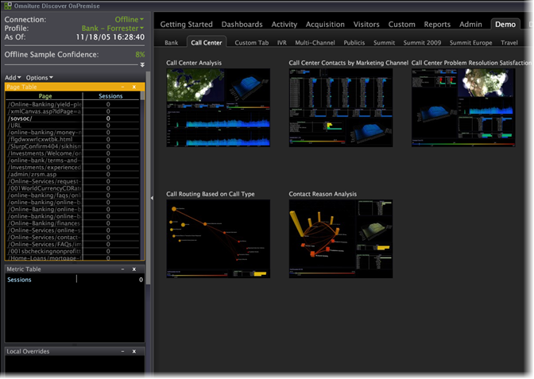

# Opening Data Workbench

After Data Workbench has been installed and is connected to the server, you can use it to analyze your processed data.

1. Navigate to the Data Workbench installation directory.
1. Double-click [!DNL insight.exe] to start the application.
1. Click **[!UICONTROL Login]**.

   

1. Enter your credentials.

   

   The first time you start, the system displays the [!UICONTROL Start] page and begins downloading profile data and the data cache. 

1. After the data cache begins to fill, click **[!UICONTROL Start]**.

   The system displays the [!UICONTROL Worktop].

   

   The next time you start Data Workbench, the system skips the [!UICONTROL Start] page and displays the [!UICONTROL Worktop], unless a new profile has been added to the server.

   Updates to the profile and its data are downloaded only if you are working online and have a network connection to the Data Workbench server. For more information about working online, see [Working Offline and Online](../c_get_started/c_off_on.md#concept_CEF8758EDE044B18B3558376C5EB9F54).

   >[!NOTE]
   >
   >It is not recommended for multiple users to share a single machine for using the Workstation.

