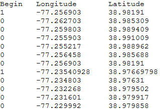

# Vector layers referencing tab separated values files

When creating a vector layer that references a tab separated values (.tsv) file, the vector data is obtained by retrieving drawing instructions as well as longitude and latitude data from the .tsv file.

To define a vector layer that references a [!DNL .tsv] files, you must have the following:

* **A [!DNL .tsv] file** that contains the data used to draw the vectors on the globe, including longitude and latitude data. For more information about the required format of the [!DNL .tsv] file, see [Vector TSV File Format](../../c_im_layers/c_vctr_layers/c_tab_sep_val_files.md#section_A29012C9FF4444AC8A6D41C68482828E). 

* **A layer file** that specifies the location of the [!DNL .tsv] file. For more information about the required format of the layer file, see [Vector Layer File Format](../../c_im_layers/c_vctr_layers/c_tab_sep_val_files.md#section_C430923F341F4C93852E9F24B61E82BF).

* [Vector TSV File Format](../../c_im_layers/c_vctr_layers/c_tab_sep_val_files.md#section_A29012C9FF4444AC8A6D41C68482828E) 
* [Vector Layer File Format](../../c_im_layers/c_vctr_layers/c_tab_sep_val_files.md#section_C430923F341F4C93852E9F24B61E82BF)

## Vector TSV file format {#section_A29012C9FF4444AC8A6D41C68482828E}

The [!DNL .tsv] file must contain the following three tab separated columns:

* **[!UICONTROL Begin]:** This column should indicate whether to begin a new line. Values in this column can be either 0 (do not begin a new line) or 1 (begin a new line). 
* **[!UICONTROL Longitude]:** This column should contain longitude values. 
* **[!UICONTROL Latitude]:** This column should contain latitude values.

>[!NOTE]
>
>Any additional columns are ignored.

Following is a sample [!DNL .tsv] file that contains data for a vector layer:



## Vector layer file format {#section_C430923F341F4C93852E9F24B61E82BF}

Each vector layer file referencing [!DNL .tsv] files must be formatted using the following template: 

```
Layer = VectorLayer:
  TSV Files = vector: n items
    0 = string: Maps\\File Name.tsv
    1 = string: Maps\\File Name.tsv
    . . .
    n-1 = string: Maps\\File Name.tsv
  Color = v3d: color vector
  Alpha = double: alpha
  Width = double: width
  Error Factor = double: error factor
```

<table id="table_152F73536AB9403AB43854B81D6A9A15"> 
 <desc> 
  <b>Vector layer parameters: .vec files </b> 
 </desc> 
 <thead> 
  <tr valign="top"> 
   <th colname="col1" class="entry"> Parameter </th> 
   <th colname="col2" class="entry"> Description </th> 
  </tr> 
 </thead>
 <tbody> 
  <tr valign="top"> 
   <td colname="col1"> TSV Files </td> 
   <td colname="col2"> <p>Path(s) to the <span class="filepath"> .tsv</span> file(s) containing the vector data. </p> <p>Example: <span class="filepath"> Maps\\USVectorData.tsv</span> </p> </td> 
  </tr> 
  <tr valign="top"> 
   <td colname="col1"> Color </td> 
   <td colname="col2"> The RGB color vector, which is expressed as (red,green,blue). For each color in the vector, you can enter a value from 0.0 to 1.0. For example, (1.0, 0.0, 0.0) is bright red, and (0.5, 0.5, 0.5) is gray. </td> 
  </tr> 
  <tr valign="top"> 
   <td colname="col1"> Alpha </td> 
   <td colname="col2"> Controls the transparency of the vectors shown on the globe. The range is 0 to 1, with 0 being the most transparent. </td> 
  </tr> 
  <tr valign="top"> 
   <td colname="col1"> Width </td> 
   <td colname="col2"> Optional. Sets the width of the data in pixels. The recommended range is 1 to 4. </td> 
  </tr> 
  <tr valign="top"> 
   <td colname="col1"> Error Factor </td> 
   <td colname="col2"> Controls how accurately the vectors are drawn. For larger values, the vectors are drawn less accurately but faster. The default value is 5. </td> 
  </tr> 
 </tbody> 
</table>

