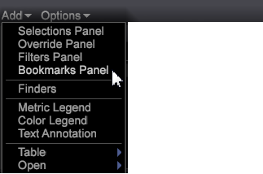

# Add a bookmarks

You can bookmark significant workspaces to quickly move between visualizations and reports employed in your workflow.

1. Bookmark a workspace by clicking the Bookmark icon  

   in the upper right corner of the toolbar.

   Before you have a workspace bookmarked, this icon appears as just a book. The bookmark icon changes to a book with a marked page once a workspace has been bookmarked. 

1. Click **[!UICONTROL Add]** > **[!UICONTROL Bookmarks Panel]** in the left pane to open a list of bookmarks.

   

1. To open a bookmarked workspace, click a workspace name in the **[!UICONTROL Bookmark Panel]**.

   

   The selected workspace will open. When you click another bookmarked workspace, the previous workspace will close and the newly selected workspace will open, allowing you to quickly navigate through your workflow.

**To delete a bookmark:**

* In the Bookmark Panel, right-click and select **[!UICONTROL Remove <bookmark title>]** to delete a selected bookmark, or select **[!UICONTROL Clear All Bookmarks]** to delete all bookmarks. 

* You can also right-click on the workspace in the thumbnail view within the worktop and select **[!UICONTROL Clear Bookmark]**.

>[!IMPORTANT]
>
>* 25 bookmarks can be saved. 
>* If you add a bookmark and then move the location of the workspace, the bookmark will be invalid and must be deleted from the Bookmark Panel and reset. 
>

