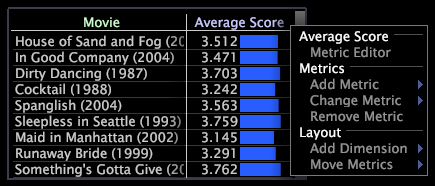

# Metric and dimension menus

The menus accessed by right-clicking the metric or dimension area within a visualization provide access to actions related to the metric or dimension in that visualization.

 For more information about using these menu options with a particular type of visualization, see the appropriate visualization section within [Analysis Visualizations](../c_analysis_vis/c_analysis_vis.md#concept_CB5B9716D3404B2B888A55B3EFEC1FA5). For information about the default menu options for all other menus in Data Workbench, see [Getting Started](../c_get_started/c_get_started.md#concept_CFA6B7A2AFB54A04809BFEFE169D2954).

## The Metric menu {#section_115DB63A26F04B57AC954A69972C6291}

You access the metric menu by right-clicking any metric-related area within a visualization.

This menu provides you with different options depending on the type of visualization in which you are working. The following example shows some of the available menu options, while the following table lists all of the available menu options.

<table id="table_81EFAC2D754843DD98C2DDF81A35A2B4"> 
 <desc> 
  <b>Metric menu </b> 
 </desc> 
 <thead> 
  <tr valign="top"> 
   <th colname="col1" class="entry"> Menu Option </th> 
   <th colname="col2" class="entry"> Description </th> 
  </tr> 
 </thead>
 <tbody> 
  <tr valign="top"> 
   <td colname="col1"> <i>metric name</i> </td> 
   <td colname="col2"> 
Heading for the following metric-related menu options. 
 </td> 
  </tr> 
  <tr valign="top"> 
   <td colname="col1" align="left"> 
Zoom to All 
 </td> 
   <td colname="col2"> 
Returns to a display of all of the data within the graph. See <a href="../c_vis/c_zoom_vis.md#concept_7E33670BB5344F78A316F1A84CC20530" format="dita" scope="local"> Zooming in Visualizations</a>. 
 </td> 
  </tr> 
  <tr valign="top"> 
   <td colname="col1"> 
Zoom to Selection 
 </td> 
   <td colname="col2"> 
Zooms in on a selected subset of data in a line graph. See <a href="../c_vis/c_zoom_vis.md#concept_7E33670BB5344F78A316F1A84CC20530" format="dita" scope="local"> Zooming in Visualizations</a>. For more information about selections, see <a href="../c_vis/c_sel_vis/c_sel_vis.md#concept_012870EC22C7476E9AFBF3B8B2515746" format="dita" scope="local"> Making Selections in Visualizations</a>. 
 </td> 
  </tr> 
  <tr valign="top"> 
   <td colname="col1"> 
Metric Editor 
 </td> 
   <td colname="col2"> 
Enables you to edit the definition of the metric identified by the metric name field. See <a href="../c_admin_intrf/c_prof_mgr/c_drvd_mtrcs.md#section_DB6D924CF4E14BCC8D57CFE1059FC797" format="dita" scope="local"> Editing Existing Derived Metrics</a>. 
 </td> 
  </tr> 
  <tr valign="top"> 
   <td colname="col1"> 
Metrics 
 </td> 
   <td colname="col2"> 
Heading for the following metric-related menu options. 
 </td> 
  </tr> 
  <tr valign="top"> 
   <td colname="col1"> 
Add Metric 
 </td> 
   <td colname="col2"> 
Adds a new metric to the visualization to the left of the selected metric. 
 </td> 
  </tr> 
  <tr valign="top"> 
   <td colname="col1"> 
Change Metric 
 </td> 
   <td colname="col2"> 
Changes the selected metric in the visualization. 
 </td> 
  </tr> 
  <tr valign="top"> 
   <td colname="col1"> 
Remove Metric 
 </td> 
   <td colname="col2"> 
Removes the selected metric from the visualization. 
 </td> 
  </tr> 
  <tr valign="top"> 
   <td colname="col1"> 
Layout 
 </td> 
   <td colname="col2"> 
Heading for the following layout-related menu options. 
 </td> 
  </tr> 
  <tr valign="top"> 
   <td colname="col1"> 
Add Dimension 
 </td> 
   <td colname="col2"> 
Adds another dimension to the visualization. 
 </td> 
  </tr> 
  <tr valign="top"> 
   <td colname="col1"> 
Move Metrics 
 </td> 
   <td colname="col2"> 
Moves the selected metric to another axis in the visualization. 
 </td> 
  </tr> 
 </tbody> 
</table>

## Use the dimension menu {#section_E09DE0AA6B74459A957B627FF7D07979}

You access the dimension menu by right-clicking any dimension-related area within a visualization.

This menu provides you with different options depending on the type of visualization in which you are working. The following example shows some of the available menu options, while the following table lists all of the available menu options.

<table id="table_D8BB675B710B48A783B1C9EB206033E9"> 
 <desc> 
  <b>Dimension menu </b> 
 </desc> 
 <thead> 
  <tr valign="top"> 
   <th colname="col1" class="entry"> Menu Option </th> 
   <th colname="col2" class="entry"> Description </th> 
  </tr> 
 </thead>
 <tbody> 
  <tr valign="top"> 
   <td colname="col1"> 
Add Callout 
 </td> 
   <td colname="col2"> 
Adds a callout for the selected element, which draws attention to that element. See <a href="../c_vis/c_call_wkspc.md#concept_212B09E763044D938987B4A9C658ADC0" format="dita" scope="local"> Adding Callouts to a Workspace</a>. 
 </td> 
  </tr> 
  <tr valign="top"> 
   <td colname="col1"> 
Rename Element 
 </td> 
   <td colname="col2"> 
Renames the element. Click  Revert to return to the original name. 
 </td> 
  </tr> 
  <tr valign="top"> 
   <td colname="col1"> 
<i>dimension name</i> 
 </td> 
   <td colname="col2"> 
Heading for the following dimension-related menu options. 
 </td> 
  </tr> 
  <tr valign="top"> 
   <td colname="col1"> 
Sort 
 </td> 
   <td colname="col2"> 
Sorts the elements of the selected dimension as desired. 
 </td> 
  </tr> 
  <tr valign="top"> 
   <td colname="col1"> 
Mask 
 </td> 
   <td colname="col2"> 
Selects a subset of the elements in the selected dimension. 
 </td> 
  </tr> 
  <tr valign="top"> 
   <td colname="col1"> 
Label 
 </td> 
   <td colname="col2"> 
Enables you to edit the label for the selected dimension. 
 </td> 
  </tr> 
  <tr valign="top"> 
   <td colname="col1"> 
Highlight Selected 
 </td> 
   <td colname="col2"> 
Highlights the selected element of the dimension. 
 </td> 
  </tr> 
  <tr valign="top"> 
   <td colname="col1"> 
Clear Highlighted 
 </td> 
   <td colname="col2"> 
Clears the highlighting from any element in the visualization. 
 </td> 
  </tr> 
  <tr valign="top"> 
   <td colname="col1"> 
Series Legend 
 </td> 
   <td colname="col2"> 
Color-codes the elements within the selected dimension as a series. See <a href="../c_analysis_vis/c_tables/c_srs_leg.md#concept_C48042A705524BC4B63CD6F24874CC12" format="dita" scope="local"> Using Series Legends</a>. 
 </td> 
  </tr> 
  <tr valign="top"> 
   <td colname="col1"> 
Add Visualization 
 </td> 
   <td colname="col2"> 
Adds a visualization that uses the selected dimension. 
 </td> 
  </tr> 
  <tr valign="top"> 
   <td colname="col1"> 
Save Dimension 
 </td> 
   <td colname="col2"> 
Saves the selected dimension from the visualization. 
 </td> 
  </tr> 
  <tr valign="top"> 
   <td colname="col1"> 
Hierarchy View 
 </td> 
   <td colname="col2"> 
Changes the current page visualization into a page hierarchy visualization, which displays the pages in a site organized hierarchically by file name and sorted alphabetically. See <a href="../c_analysis_vis/c_tables/c_hier_vews.md#concept_B461183424A841EB94F8143A0EAF9BFF" format="dita" scope="local"> Applying Hierarchy Views</a>. 
 </td> 
  </tr> 
  <tr valign="top"> 
   <td colname="col1"> 
Layout 
 </td> 
   <td colname="col2"> 
Heading for the following layout-related menu options. 
 </td> 
  </tr> 
  <tr valign="top"> 
   <td colname="col1"> 
Add Dimension 
 </td> 
   <td colname="col2"> 
Adds another dimension to the visualization. 
 </td> 
  </tr> 
  <tr valign="top"> 
   <td colname="col1"> 
Change Dimension 
 </td> 
   <td colname="col2"> 
Changes the dimension in the visualization. 
 </td> 
  </tr> 
  <tr valign="top"> 
   <td colname="col1"> 
Move Dimension 
 </td> 
   <td colname="col2"> 
Moves the selected dimension to another axis in the visualization. 
 </td> 
  </tr> 
  <tr valign="top"> 
   <td colname="col1"> 
Remove Dimension 
 </td> 
   <td colname="col2"> 
Removes the selected dimension from the visualization. 
 </td> 
  </tr> 
 </tbody> 
</table>

