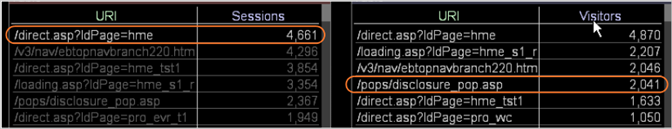

# Understanding How a Selection Affects Other Visualizations

Within a workspace, a visualization represents a set of query results.

 When you make a selection, Data Workbench filters the results of the queries that it uses to produce the visualizations in the workspace. The specific filter varies by visualization.

The following examples illustrate how Data Workbench applies a selection to three different types of visualizations. Reviewing these examples helps you understand the filtering effect that selections have on visualizations. They also help you understand how to interpret the results that you see in a filtered visualization.

* [Filtering a Visualization with a Sessions Metric](../../c_vis/c_sel_vis/c_sel_aff_vis.md#section_7CC06493ECB34CD4A696DBF0F0A7AAEF) 
* [Filtering a Visualization with a Visitors Metric](../../c_vis/c_sel_vis/c_sel_aff_vis.md#section_97D38C7F03E8457189A9C72D69514ED2) 
* [Filtering a Visualization with a Visitors-by-Session Metric](../../c_vis/c_sel_vis/c_sel_aff_vis.md#section_F746182311D648DCB98716B0FE846E25)

## Filtering a Visualization with a Sessions Metric {#section_7CC06493ECB34CD4A696DBF0F0A7AAEF}

In this example, the [!DNL /direct.asp/?ldPage=hme] URI in the visualization on the left is filtering the metric for Sessions displayed in the visualization on the right.


* **Effect of Selection on the Query:** Data Workbench filters the Sessions for the selected URI. In this example, the query that generates the value for the [!DNL /pops/disclosure_pop.asp] element is filtered as follows: 

  ```
  Sessions[ URI="/pops/disclosure_pop.asp" AND URI="/direct.asp
  /?ldPage=hme"] by Page View by Session
  ```

* **Interpreting the Visualization:** The filtered visualization represents the number of Sessions that include the URIs listed in the visualization and [!DNL /direct.asp/?ldPage=hme]. This example shows that there were 1,113 sessions during which visitors viewed both [!DNL /pops/disclosure_pop.asp] page and [!DNL /direct.asp/?ldPage=hme] in the same session.

## Filtering a Visualization with a Visitors Metric {#section_97D38C7F03E8457189A9C72D69514ED2}

In this example, the [!DNL /direct.asp/?ldPage=home] URI in the visualization on the left is filtering the metric for Visitors in the visualization on the right.



* **Effect of Selection on the Query:** Data Workbench filters the Visitors for the selected URI. In this example, the query that generates the value for the [!DNL /pops/disclosure_pop.asp] URI is filtered as follows: 

  ```
  Visitors[ URI="/pops/disclosure_pop.asp" by Page View by Visitor 
    AND URI="/direct.asp/?ldPage=hme" by Page View by Visitor ]
  ```

* **Interpreting the Visualization:** The filtered visualization depicts the Visitors who have viewed the URIs listed in the visualization and [!DNL /direct.asp/?ldPage=hme] (although not necessarily during the same session). The example above shows that 2,041 visitors have viewed both [!DNL /pops/disclosure_pop.asp] and [!DNL /direct.asp/?ldPage=hme].

## Filtering a Visualization with a Visitors-by-Session Metric {#section_F746182311D648DCB98716B0FE846E25}

In this example, the [!DNL /direct.asp/?ldPage=hme] URI in the visualization on the left is filtering the metric for visitor-by-session in the visualization on the right.


* **Effect of Selection on the Query:** Data Workbench filters the Visitors by Session for the selected URI. For example, the query that generates the value for the [!DNL /pops/disclosure_pop.asp] URI is filtered as follows: 

  ```
  Visitors[ ( URI="/pops/disclosure_pop.asp" by Page View 
    AND URI="/direct.asp/?ldPage=hme" by Page View ) by Session ]
  ```

* **Interpreting the Visualization:** The filtered visualization depicts the Visitors who have viewed both URIs listed in the visualization and [!DNL /direct.asp/?ldPage=hme] during the same session. This example shows that 1,069 visitors saw both [!DNL /pops/disclosure_pop.asp] and [!DNL /direct.asp/?ldPage=hme] during a single session.

