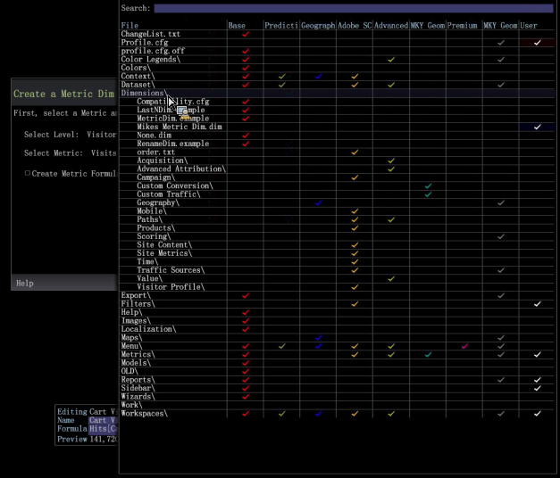

# Edit the metric dim

Edit a metric dim in the Profiles Manager.

To edit an existing Metric Dim:

1. In a workspace, right-click **Admin** > **Profile Manager**. Open **Dimension** and select the metric dim.

   

1. Right-click the checkmark in the user column, select **Open** and then select metric dim.

   

1. In the Edit Metric Dim box, make changes as required. 

