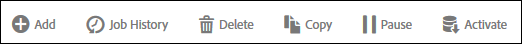

# Data Feed panel

You can perform a variety of actions on a data feed.

In the Data Feed interface, when you select the check box next to one or more feeds, the available actions display as a collections of buttons above the list.

To edit a feed, click the feed name in the list. 
