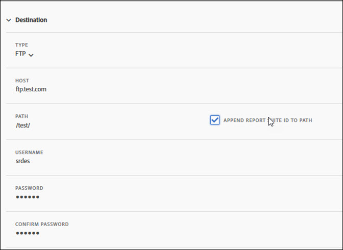

# Feed Destination

The Feed Destination section defines how the feed is distributed.

There are four distribution channels:

* FTP 
* SFTP 
* Amazon S3 
* Azure Blob

## FTP {#section_D2B521C49BDE4F91A1999FE222CF306F}

Data feed data can be delivered to an Adobe or customer hosted FTP location.

If you select to have data uploaded to your FTP server, you must provide Adobe with the appropriate username, password, and upload path. You must implement your own process to manage disk space on the server, as Adobe does not delete any data from the server.

## SFTP {#section_8D9215E441474D2BBC56228C2BC926E5}

Data feed data can be delivered to an Adobe or customer hosted sFTP location.

If you select to have data uploaded to your FTP server, you must provide Adobe with the appropriate username and upload path.

<!-- 

Adobe Customer Care will provide you with a Public key. Verify in recording.

 -->

You must implement your own process to manage disk space on the server, as Adobe does not delete any data from the server.

## Amazon S3 {#section_4191CD7B8D3F419EB850B286B542C14A}

You can upload your files to an Amazon S3 bucket. Amazon automatically encrypts the data at rest (on the Amazon servers). When you download the data, it gets decrypted automatically.

If you select to have data uploaded via Amazon S3, you must provide a Bucket name, an Access Key ID, a Secret Key and a folder name.

Data Feeds communicates to the following 11 standard AWS regions (using the appropriate signature algorithm where necessary):

* us-east-1 
* us-west-1 
* us-west-2 
* ap-south-1 
* ap-northeast-2 
* ap-southeast-1 
* ap-southeast-2 
* ap-northeast-1 
* eu-central-1 
* eu-west-1 
* sa-east-1

We currently do not support the Beijing, China AWS region (cn-north-1).

## Azure Blob {#section_1E9F1D0E7EAB4189A5D748FCA57D63D1}

You can upload your files to an Azure Blob.

## Fields {#section_AD54B41BC7C945DC85F5FB8FCD4A4792}

The following table shows all options for all distribution channels. The available options depend on the selected distribution channel.

<table id="table_F743C620C82349D9943A13B99EA312BA"> 
 <thead> 
  <tr> 
   <th colname="col1" class="entry"> Field </th> 
   <th colname="col2" class="entry"> Description </th> 
  </tr> 
 </thead>
 <tbody> 
  <tr> 
   <td colname="col1"> 
Access Key 
 </td> 
   <td colname="col2"> 
Enter the Amazon S3 access key. 
 </td> 
  </tr> 
  <tr> 
   <td colname="col1"> 
Bucket 
 </td> 
   <td colname="col2"> 
Enter the Amazon S3 Bucket location. 
 
This value should match the proper S3 bucket format. (See <a href="https://docs.aws.amazon.com/awscloudtrail/latest/userguide/cloudtrail-s3-bucket-naming-requirements.html" format="html" scope="external"> https://docs.aws.amazon.com/awscloudtrail/latest/userguide/cloudtrail-s3-bucket-naming-requirements.html</a>.) 
 
 
Note: See <a href="../../../export/analytics-data-feed/feed-troubleshooting.md#section_6797EBBB7E6D44D4B00C7AEDF4C2EE1D" format="dita" scope="local"> BucketOwnerFullControl setting for Amazon S3 data feeds</a>, below, for details about the Amazon S3 settings. 
 
 </td> 
  </tr> 
  <tr> 
   <td colname="col1"> 
Container 
 </td> 
   <td colname="col2"> 
Enter the Azure Blob container name. 
 </td> 
  </tr> 
  <tr> 
   <td colname="col1"> 
 Host 
 </td> 
   <td colname="col2"> 
Specify the FTP or SFTP host location. 
 
This value must comply to the proper ftp/sftp format, <code> ftp.domain.com/subdomain</code> or <code> sftp.domain.com/subdomain</code>. 
 
 The standard ports 21 and 22 for FTP and sFTP are required. 
 </td> 
  </tr> 
  <tr> 
   <td colname="col1"> 
Password 
 
Confirm Password 
 </td> 
   <td colname="col2"> 
Enter the FTP password. Reenter to confirm 
 </td> 
  </tr> 
  <tr> 
   <td colname="col1"> 
Path 
 </td> 
   <td colname="col2"> 
Select the path to the host or bucket. This path must exist prior to feed creation. 
 
 
Note: See <a href="../../../export/analytics-data-feed/feed-troubleshooting.md#section_6797EBBB7E6D44D4B00C7AEDF4C2EE1D" format="dita" scope="local"> BucketOwnerFullControl setting for Amazon S3 data feeds</a>, below, for details about the Amazon S3 settings. 
 
 </td> 
  </tr> 
  <tr> 
   <td colname="col1"> 
Account 
 </td> 
   <td colname="col2"> 
 Enter the Azure storage account. 
 </td> 
  </tr> 
  <tr> 
   <td colname="col1"> 
Public Key 
 </td> 
   <td colname="col2"> 
Provide the SFTP public key. 
 
You must download the public key to set up the SFTP repository. 
 
 
Note:  Downloading the public key is not required to create the feed. 
 
 
You can use a public key that has already been downloaded when creating a previous feed. 
 
For more information, see <a href="https://marketing.adobe.com/resources/help/en_US/whitepapers/ftp/ftp_sftp_dw.html" format="html" scope="external"> https://marketing.adobe.com/resources/help/en_US/whitepapers/ftp/ftp_sftp_dw.html</a>. 
 </td> 
  </tr> 
  <tr> 
   <td colname="col1"> 
Key 
 
Confirm Key 
 </td> 
   <td colname="col2"> 
 Enter your storage access key. Re-enter to confirm. 
 
 
Note: See <a href="https://docs.microsoft.com/en-us/azure/storage/common/storage-create-storage-account#view-and-copy-storage-access-keys" format="https" scope="external"> https://docs.microsoft.com/en-us/azure/storage/common/storage-create-storage-account#view-and-copy-storage-access-keys</a> for accessing access keys. 
 
 </td> 
  </tr> 
  <tr> 
   <td colname="col1"> 
Secret Key 
 
Confirm Secret Key 
 </td> 
   <td colname="col2"> 
Enter the Amazon S3 secret key. Reenter to confirm. 
 </td> 
  </tr> 
  <tr> 
   <td colname="col1"> 
Type 
 </td> 
   <td colname="col2"> 
Select the destination type. 
 
 
     <ul id="ul_B893EEDA73A34DE0AEB8570BE9027F21"> 
      <li id="li_325546FCEB404C50AA6829573CCA340B">FTP (default) </li> 
      <li id="li_6A2C03115903484797485D073A610607">AmazonS3 </li> 
      <li id="li_C24540F6FCD24702B7693A515CEBE977">SFTP </li> 
      <li id="li_8E03CA78E7FE427C9F6F8B112BC76266">Azure Blob </li> 
     </ul> 
 
After you select the destination type, the list of fields changes to reflect the available options for the selected destination. 
 </td> 
  </tr> 
  <tr> 
   <td colname="col1"> 
Username 
 </td> 
   <td colname="col2"> 
Enter the FTP username. 
 </td> 
  </tr> 
 </tbody> 
</table>

