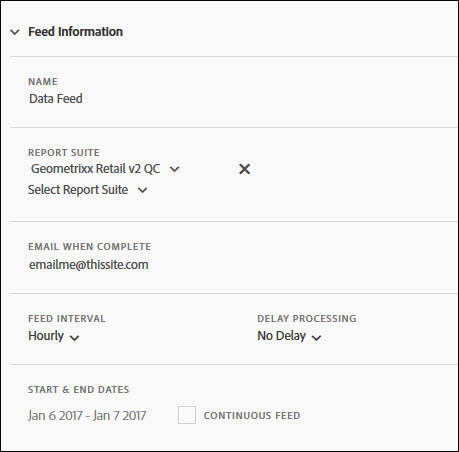

# Feed Information

Use the Feed Information section to name the feed, specify the report suite to run the feed against, determine the feed recurrence, and specify when the feed starts and ends.

 

<table id="table_C98C7C3CE4194BEF819E792793EBC517"> 
 <thead> 
  <tr> 
   <th colname="col1" class="entry"> Field </th> 
   <th colname="col2" class="entry"> Description </th> 
  </tr> 
 </thead>
 <tbody> 
  <tr> 
   <td colname="col1"> 
Name (Required) 
 </td> 
   <td colname="col2"> 
Enter a feed name. 
 
The name must be unique within the selected report suite, and can be up to 255 characters in length. 
 </td> 
  </tr> 
  <tr> 
   <td colname="col1"> 
Report Suite (Required) 
 </td> 
   <td colname="col2"> 
Specify the report suites for the feed query. 
 
At least one report suite needs to be selected. You cannot list the same report suite twice. 
 
All report suites available to the logged in user are available. 
 
The virtual report suite is excluded, but the ASI report suite can be included. 
 </td> 
  </tr> 
  <tr> 
   <td colname="col1"> 
Email When Complete (Required) 
 </td> 
   <td colname="col2"> 
Specify the email recipient who will receive feed delivery updates. 
 
This field cannot be empty. It must contain a properly formatted email address. 
 </td> 
  </tr> 
  <tr> 
   <td colname="col1"> 
Feed Interval (Required) 
 </td> 
   <td colname="col2"> 
Specify the scheduling recurrence. 
 
Note:  Due to the potential size of data feed zip files, make sure your ETL process uses a 64-bit zip utility. 
 </td> 
  </tr> 
  <tr> 
   <td colname="col1"> 
Delay Processing (Optional) 
 </td> 
   <td colname="col2"> 
Specify the delay to apply to each scheduling instance. 
 </td> 
  </tr> 
  <tr> 
   <td colname="col1"> 
Start and End Date (Required) 
 
Continuous Feed (Optional) 
 </td> 
   <td colname="col2"> 
Schedule the dates when the feed will start and end. 
 
 
     <ul id="ul_509977336CD34032924B48E043E8CBC7"> 
      <li id="li_BFB5B6ADCB184D839C9BA42DB3DCAF32">Start Date: defaults to today's date </li> 
      <li id="li_34F8DB45D9B54076840D1A0B782812D3">End Date: defaults to tomorrow's date </li> 
     </ul> 
 
 
     <ul id="ul_741E7A11F067417E8BB58BFE3F994CDD"> 
      <li id="li_46FB9C218F3C4C56985DE33033BDE4EE">If Continues Feed is selected, the start date can be up to 32 days in the past. </li> 
      <li id="li_625035EACB1A41CC8E5A45D1006D0FE0">If the start and end dates are specified, the date period can be up to 32 days (difference between start and end date) but the start date cannot be further than 90 days in the past. </li> 
     </ul> 
 </td> 
  </tr> 
 </tbody> 
</table>

