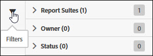

# Search and filter

Searching and filtering help you locate a feed in the list.

1. Click or hover over the Filter icon to view the filtering options.

   

   There are three available filtering options:

* Report suite 
* Owner 
* Status

1. Enter a search term to search the feeds list.

   

You can combine filtering and searching to help you find your feeds. Combined filters are joined by an AND operator. 
