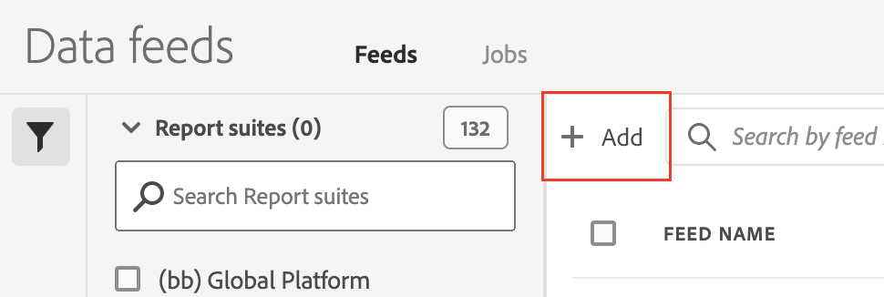
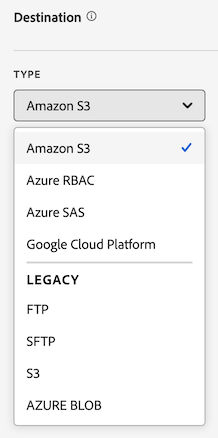
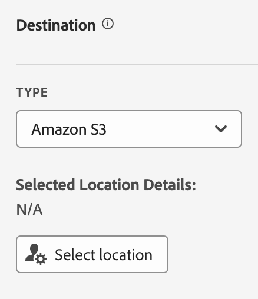
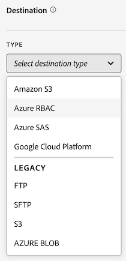
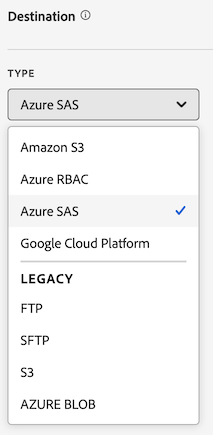
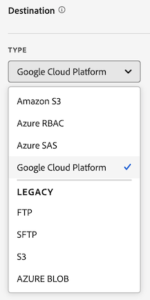

# Create a data feed

When creating a data feed, you provide Adobe with:

* The information about the destination where you want raw data files to be sent

* The data you want to include in each file

>[!NOTE]
>
>Before you create a data feed, it's important to have a basic understanding of data feeds and and that you meet all necessary prerequisites. For more information, see [Data feeds overview](data-feed-overview.md).

## Create and configure a data feed

1. Log in to [experiencecloud.adobe.com](https://experiencecloud.adobe.com) using your Adobe ID credentials.
1. Select the 9-square icon in the upper-right, then select [!UICONTROL **Analytics**].
1. In the top navigation bar, go to [!UICONTROL **Admin**] > [!UICONTROL **Data feeds**].
1. Select [!UICONTROL **Add**]. 

    

    A page displays with three main categories: [!UICONTROL **Feed information**], [!UICONTROL **Destination**], and [!UICONTROL **Data column definitions**].
1. In the [!UICONTROL **Feed Information**] section, complete the following fields:
   
   | Field | Function | 
   |---------|----------|
   | [!UICONTROL **Name**] | The name of the data feed. Must be unique within the selected report suite, and can be up to 255 characters in length. | 
   | [!UICONTROL **Report suite**] | The report suite the data feed is based on. If multiple data feeds are created for the same report suite, they must have different column definitions. Only source report suites support data feeds; virtual report suites are not supported. |
   | [!UICONTROL **Email when complete**] | The email address to be notified when a feed finishes processing. The email address must be properly formatted. |
   | [!UICONTROL **Feed interval**] | Select **Daily** for backfill or historical data. Daily feeds contain a full day's worth of data, from midnight to midnight in the report suite's time zone.  Select **Hourly** for continuing data (Daily is also available for continuing feeds if you prefer). Hourly feeds contain a single hour's worth of data. |
   | [!UICONTROL **Delay processing**] | Wait a given amount of time before processing a data feed file. A delay can be useful to give mobile implementations an opportunity for offline devices to come online and send data. It can also be used to accommodate your organization's server-side processes in managing previously processed files. In most cases, no delay is needed. A feed can be delayed by up to 120 minutes. |
   | [!UICONTROL **Start & end dates**] | The start date indicates the first date you want a data feed. Set this date in the past to immediately begin processing data feeds for historical data. Feeds continue processing until they reach the end date. The start and end dates are based on the report suite's time zone. |
   | [!UICONTROL **Continuous feed**] | This checkbox removes the end date, allowing a feed to run indefinitely. When a feed finishes processing historical data, a feed waits for data to finish collecting for a given hour or day. Once the current hour or day concludes, processing begins after the specified delay. |
   
1. In the [!UICONTROL **Destination**] section, in the [!UICONTROL **Type**] drop-down menu, select the destination where you want the data to be sent. 

   

   Use any of the following destination types when creating a data feed. For configuration instructions, expand the destination type. (Additional [legacy destinations](#legacy-destinations) are also available, but are not recommended.)

   +++Amazon S3

   You can send feeds directly to Amazon S3 buckets. This destination type requires only your Amazon S3 account and the location (bucket). 

   Adobe Analytics uses cross-account authentication to upload files from Adobe Analytics to the specified location in your Amazon S3 instance.

   To configure an Amazon S3 bucket as the destination for a data feed:

   1. In the Adobe Analytics admin console, in the [!UICONTROL **Destination**] section, select [!UICONTROL **Amazon S3**].

      

   1. Select [!UICONTROL **Select location**].

      The Amazon S3 Export Locations page is displayed.

   1. (Conditional) If you previously added an Amazon S3 account and location:

      1. Select the account from the [!UICONTROL **Select account**] drop-down menu.
      
      1. Select the location from the [!UICONTROL **Select location**] drop-down menu.

      1. Select [!UICONTROL **Save**] > [!UICONTROL **Save**].

         The destination is now configured to send data to the Amazon S3 location that you specified.

   1. (Conditional) If you have not previously added an Amazon S3 account:

      1. Select [!UICONTROL **Add account**], then specify the following information:
   
         |Field | Function |
         |---------|----------|
         | [!UICONTROL **Account name**] | A name for the account. This can be any name you choose. | 
         | [!UICONTROL **Account description**] | A description for the account. | 
         | [!UICONTROL **Role ARN**] | You must provide a Role ARN (Amazon Resource Name) that Adobe can use to gain access to the Amazon S3 account. To do this, you create an IAM permission policy for the source account, attach the policy to a user, and then create a role for the destination account. For specific information, see [this AWS documentation](https://aws.amazon.com/premiumsupport/knowledge-center/cross-account-access-iam/). | 
         | [!UICONTROL **User ARN**] | The User ARN (Amazon Resource Name) is provided by Adobe. You must attach this user to the policy you created. | 

         {style="table-layout:auto"}

         1. Select [!UICONTROL **Add location**], then specify the following information:
   
         |Field | Function |
         |---------|----------|
         | [!UICONTROL **Name**] | A name for the account.  | 
         | [!UICONTROL **Description**] | A description for the account. | 
         | [!UICONTROL **Bucket**] | The bucket within your Amazon S3 account where you want Adobe Analytics data to be sent. | 
         | [!UICONTROL **Prefix**] | The folder within the bucket where you want to put the data. Specify a folder name, then add a backslash after the name to create the folder. For example, `folder_name/` |

         {style="table-layout:auto"}

      1. Select [!UICONTROL **Create**] > [!UICONTROL **Save**].

         The destination is now configured to send data to the Amazon S3 location that you specified.
   
   +++

   +++Azure RBAC

   You can send feeds directly to Azure RBAC buckets. This destination type requires a Bucket name, an Application ID, Tenant ID, and a Secret Key. 

   To configure an Azure RBAC bucket as the destination for a data feed:

   1. If you haven't already, create an Azure application where Adobe Analytics can send the raw data files, then grant access permissions in access control (IAM). 
   
      For information, refer to the [Microsoft Azure documentation about how to create an Azure Active Directory application](https://learn.microsoft.com/en-us/azure/active-directory/develop/howto-create-service-principal-portal). 
   
   1. In the Adobe Analytics admin console, in the [!UICONTROL **Destination**] section, select [!UICONTROL **Azure RBAC**].

      

   1. Select [!UICONTROL **Select location**].

      The Azure RBAC Export Locations page is displayed.

   1. (Conditional) If you previously added an Azure RBAC account and location:

      1. Select the account from the [!UICONTROL **Select account**] drop-down menu.
      
      1. Select the location from the [!UICONTROL **Select location**] drop-down menu.

      1. Select [!UICONTROL **Save**] > [!UICONTROL **Save**].

         The destination is now configured to send data to the Azure RBAC location that you specified.

   1. (Conditional) If you have not previously added an Azure RBAC account:

      1. Select [!UICONTROL **Add account**], then specify the following information:
   
         |Field | Function |
         |---------|----------|
         | [!UICONTROL **Account name**] | A name for the Azure RBAC account. This name displays in the [!UICONTROL **Select account**] drop-down field and can be any name you choose. | 
         | [!UICONTROL **Account description**] | A description for the Azure RBAC account. This description displays in the [!UICONTROL **Select account**] drop-down field and can be any name you choose.  | 
         | [!UICONTROL **Application ID**] | Copy this ID from the Azure RBAC application that you created. In Microsoft Azure, this information is located on the **Overview** tab within your application. For more information, see the [Microsoft Azure documentation about how to register an application with the Microsoft identity platform](https://learn.microsoft.com/en-us/azure/active-directory/develop/quickstart-register-app). | 
         | [!UICONTROL **Tenant ID**] | Copy this ID from the Azure RBAC application that you created. In Microsoft Azure, this information is located on the **Overview** tab within your application. For more information, see the [Microsoft Azure documentation about how to register an application with the Microsoft identity platform](https://learn.microsoft.com/en-us/azure/active-directory/develop/quickstart-register-app). | 
         | [!UICONTROL **Secret**] | Copy the secret from the Azure RBAC application that you created. In Microsoft Azure, this information is located on the **Certificates & secrets** tab within your application. For more information, see the [Microsoft Azure documentation about how to register an application with the Microsoft identity platform](https://learn.microsoft.com/en-us/azure/active-directory/develop/quickstart-register-app). |

         {style="table-layout:auto"}

      1. Select [!UICONTROL **Add location**], then specify the following information: 
   
         |Field | Function |
         |---------|----------|
         | [!UICONTROL **Name**] | A name for the location. This name displays in the [!UICONTROL **Select location**] drop-down field and can be any name you choose. | 
         | [!UICONTROL **Description**] | A description for the location. This description displays in the [!UICONTROL **Select location**] drop-down field and can be any name you choose. | 
         | [!UICONTROL **Account**] | <!-- What should this say? --> | 
         | [!UICONTROL **Container**] | The container within the account you specified where you want Adobe Analytics data to be sent. | 
         | [!UICONTROL **Prefix**] | The folder within the container where you want to put the data. Specify a folder name, then add a backslash after the name to create the folder. For example, `folder_name/` |

         {style="table-layout:auto"}

      1. Select [!UICONTROL **Create**] > [!UICONTROL **Save**].

         The destination is now configured to send data to the Azure RBAC location that you specified.
   
   +++

   +++Azure SAS

   You can send feeds directly to Azure SAS buckets. This destination type requires a Bucket name, an Application ID, Tenant ID, Key vault URI, Key vault secret name, and a Secret Key. 

   To configure an Azure SAS bucket as the destination for a data feed:

   1. If you haven't already, create an Azure application where Adobe Analytics can send the raw data files. 
   
      For information, refer to the [Microsoft Azure documentation about how to create an Azure Active Directory application](https://learn.microsoft.com/en-us/azure/active-directory/develop/howto-create-service-principal-portal). 
   
   1. In the Adobe Analytics admin console, in the [!UICONTROL **Destination**] section, select [!UICONTROL **Azure SAS**].

      

   1. Select [!UICONTROL **Select location**].

      The Azure SAS Export Locations page is displayed.

   1. (Conditional) If you previously added an Azure SAS account and location:

      1. Select the account from the [!UICONTROL **Select account**] drop-down menu.
      
      1. Select the location from the [!UICONTROL **Select location**] drop-down menu.

      1. Select [!UICONTROL **Save**] > [!UICONTROL **Save**].

         The destination is now configured to send data to the Azure SAS location that you specified.

   1. (Conditional) If you have not previously added an Azure SAS account:

      1. Select [!UICONTROL **Add account**], then specify the following information:
   
         |Field | Function |
         |---------|----------|
         | [!UICONTROL **Account name**] | A name for the Azure SAS account. This name displays in the [!UICONTROL **Select account**] drop-down field and can be any name you choose. | 
         | [!UICONTROL **Account destription**] | A description for the Azure SAS account. This description displays in the [!UICONTROL **Select account**] drop-down field and can be any name you choose. | 
         | [!UICONTROL **Application ID**] | Copy this ID from the Azure RBAC application that you created. In Microsoft Azure, this information is located on the **Overview** tab within your application. For more information, see the [Microsoft Azure documentation about how to register an application with the Microsoft identity platform](https://learn.microsoft.com/en-us/azure/active-directory/develop/quickstart-register-app). | 
         | [!UICONTROL **Tenant ID**] | Copy this ID from the Azure RBAC application that you created. In Microsoft Azure, this information is located on the **Overview** tab within your application. For more information, see the [Microsoft Azure documentation about how to register an application with the Microsoft identity platform](https://learn.microsoft.com/en-us/azure/active-directory/develop/quickstart-register-app). |
         | [!UICONTROL **Key vault URI**] | The path to the SAS token in Azure Key Vault.  To configure Azure SAS, you need to store an SAS token as a secret using Azure Key Vault. For information, see the [Microsoft Azure documentation about how to set and retrieve a secret from Azure Key Vault](https://learn.microsoft.com/en-us/azure/key-vault/secrets/quick-create-portal?source=recommendations). | 
         | [!UICONTROL **Key vault secret name**] | The secret name you created when adding the secret to Azure Key Vault. In Microsoft Azure, this information is located in the Key Vault you created, on the **Key Vault** settings pages. For information, see the [Microsoft Azure documentation about how to set and retrieve a secret from Azure Key Vault](https://learn.microsoft.com/en-us/azure/key-vault/secrets/quick-create-portal?source=recommendations). |
         | [!UICONTROL **Secret**] | Copy the secret value from the SAS token in Azure Key Vault. In Microsoft Azure, this information is located on the **Certificates & secrets** tab within your application. For information about how to retrieve a secret key, see the [Microsoft Azure documentation about how to set and retrieve a secret from Azure Key Vault](https://learn.microsoft.com/en-us/azure/key-vault/secrets/quick-create-portal?source=recommendations). |

         {style="table-layout:auto"}

      1. Select [!UICONTROL **Add location**], then specify the following information: 
   
         |Field | Function |
         |---------|----------|
         | [!UICONTROL **Name**] | A name for the location. This name displays in the [!UICONTROL **Select location**] drop-down field and can be any name you choose. | 
         | [!UICONTROL **Description**] | A description for the location. This description displays in the [!UICONTROL **Select location**] drop-down field and can be any name you choose. | 
         | [!UICONTROL **Container**] | The container within the account you specified where you want Adobe Analytics data to be sent. | 
         | [!UICONTROL **Prefix**] | The folder within the container where you want to put the data. Specify a folder name, then add a backslash after the name to create the folder. For example, `folder_name/` |

         {style="table-layout:auto"}

      1. Select [!UICONTROL **Create**] > [!UICONTROL **Save**].

         The destination is now configured to send data to the Azure SAS location that you specified.
   
   +++

   +++Google Cloud Platform

   You can send feeds directly to Google Cloud Platform (GCP) buckets. This destination type requires only your GCP account name and the location (bucket) name. 
   
   Adobe Analytics uses cross-account authentication to upload files from Adobe Analytics to the specified location in your GCP instance.

   To configure a Google Cloud Platform bucket as the destination for a data feed:

   1. In the Adobe Analytics admin console, in the [!UICONTROL **Destination**] section, select [!UICONTROL **Google Cloud Platform**].

      

   1. Select [!UICONTROL **Select location**].

      The Amazon S3 Export Locations page is displayed.

   1. (Conditional) If you previously added a Google Cloud Platform account and location:

      1. Select the account from the [!UICONTROL **Select account**] drop-down menu.
      
      1. Select the location from the [!UICONTROL **Select location**] drop-down menu.

      1. Select [!UICONTROL **Save**] > [!UICONTROL **Save**].

         The destination is now configured to send data to the Google Cloud Platform location that you specified.

   1. (Conditional) If you have not previously added a Google Cloud Platform account:

      1. Select [!UICONTROL **Add account**], then specify the following information:
   
         |Field | Function |
         |---------|----------|
         | [!UICONTROL **Account name**] | A name for the account. This can be any name you choose. | 
         | [!UICONTROL **Account description**] | A description for the account. | 
         | [!UICONTROL **Project ID**] | content | 
         | [!UICONTROL **Principal**] | The Principal is provided by Adobe. You must grant permission to receive feeds to this principal. | 

         {style="table-layout:auto"}

         1. Select [!UICONTROL **Add location**], then specify the following information:
   
         |Field | Function |
         |---------|----------|
         | [!UICONTROL **Principal**] | The Principal is provided by Adobe. You must grant permission to receive feeds to this principal. | 
         | [!UICONTROL **Name**] | A name for the account.  | 
         | [!UICONTROL **Description**] | A description for the account. | 
         | [!UICONTROL **Bucket**] | The bucket within your Google Cloud Platform account where you want Adobe Analytics data to be sent. | 
         | [!UICONTROL **Prefix**] | The folder within the bucket where you want to put the data. Specify a folder name, then add a backslash after the name to create the folder. For example, `folder_name/` |

         {style="table-layout:auto"}

      1. Select [!UICONTROL **Create**] > [!UICONTROL **Save**].

         The destination is now configured to send data to the Google Cloud Platform location that you specified.
   
   +++

1. In the  [!UICONTROL **Data Column Definitions**] section, select the latest [!UICONTROL **All Adobe Columns**] template in the dropdown, then complete the following fields:
   
   |Field | Function | 
   |---------|----------|
   | [!UICONTROL **Remove escaped characters**] | When collecting data, some characters (such as newlines) can cause issues. Check this box if you would like these characters removed from feed files. |
   | [!UICONTROL **Compression format**] | The type of compression used. **Gzip** outputs files in `.tar.gz` format. **Zip** outputs files in `.zip` format. | 
   | [!UICONTROL **Packaging type**] | Select **Multiple files** for most data feeds. This option paginates your data into uncompressed 2GB chunks. (If multiple files is selected and uncompressed data for the reporting window is less than 2GB, one file is sent.) Selecting **Single file** outputs the `hit_data.tsv` file in a single, potentially massive file. |
   | [!UICONTROL **Manifest**] | hether or not Adobe should deliver a [manifest file](c-df-contents/datafeeds-contents.md#feed-manifest) to the destination when no data is collected for a feed interval. If you select **Manifest File**, you receive a manifest file similar to the following when no data is collected:
`text`

`Datafeed-Manifest-Version: 1.0`

`Lookup-Files: 0`

`Data-Files: 0`

 `Total-Records: 0`
 | 
   | [!UICONTROL **Column templates**] | When creating many data feeds, Adobe recommends creating a column template. Selecting a column template automatically includes the specified columns in the template. Adobe also provides several templates by default. |
   | [!UICONTROL **Available columns**] | All available data columns in Adobe Analytics. Click [!UICONTROL Add all] to include all columns in a data feed. |
   | [!UICONTROL **Included columns**] | The columns to include in a data feed. Click [!UICONTROL Remove all] to remove all columns from a data feed. |
   | [!UICONTROL **Download CSV**] | Downloads a CSV file containing all included columns. |

1. Select [!UICONTROL **Save**] in the top-right.

    Historical data processing begins immediately. When data finishes processing for a day, the file is sent to the destination that you configured.

    For information about how to access the data feed and to get a better understanding of its contents, see [Data feed contents - overview](/help/export/analytics-data-feed/c-df-contents/datafeeds-contents.md).

## Legacy destinations

>[!IMPORTANT]
>
>The destinations described in this section are legacy, and are not recommended. Instead, use one of the following destinations when creating a data feed: Amazon S3, Google Cloud Platform, Azure RBAC, or Azure SAS. See [Create and configure a data feed](#create-and-configure-a-data-feed) for detailed information about each of these recommended destinations. 

The following information provides configuration information for each of the legacy destinations:

#### FTP

Data feed data can be delivered to an Adobe or customer-hosted FTP location. Requires an FTP host, username, and password. Use the path field to place feed files in a folder. Folders must already exist; feeds throw an error if the specified path does not exist.

Use the following information when completing the available fields:
* [!UICONTROL **Host**]: Enter the desired FTP destination URL. For example, `ftp://ftp.omniture.com`.
* [!UICONTROL **Path**]: Can be left blank
* [!UICONTROL **Username**]: Enter the username to log in to the FTP site.
* [!UICONTROL **Password and confirm password**]: Enter the password to log in to the FTP site.

#### SFTP

SFTP support for data feeds is available. Requires an SFTP host, username, and the destination site to contain a valid RSA or DSA public key. You can download the appropriate public key when creating the feed.

#### S3

You can send feeds directly to Amazon S3 buckets. This destination type requires a Bucket name, an Access Key ID, and a Secret Key. See [Amazon S3 bucket naming requirements](https://docs.aws.amazon.com/awscloudtrail/latest/userguide/cloudtrail-s3-bucket-naming-requirements.html) within the Amazon S3 docs for more information.

The user you provide for uploading data feeds must have the following [permissions](https://docs.aws.amazon.com/AmazonS3/latest/API/API_Operations_Amazon_Simple_Storage_Service.html):

* s3:GetObject
* s3:PutObject
* s3:PutObjectAcl

  >[!NOTE]
  >
  >For each upload to an Amazon S3 bucket, [!DNL Analytics] adds the bucket owner to the BucketOwnerFullControl ACL, whether or not the bucket has a policy that requires it. For more information, see "[What is the BucketOwnerFullControl setting for Amazon S3 data feeds?](df-faq.md#BucketOwnerFullControl)"

The following 16 standard AWS regions are supported (using the appropriate signature algorithm where necessary):

* us-east-2
* us-east-1
* us-west-1
* us-west-2
* ap-south-1
* ap-northeast-2
* ap-southeast-1
* ap-southeast-2
* ap-northeast-1
* ca-central-1
* eu-central-1
* eu-west-1
* eu-west-2
* eu-west-3
* eu-north-1
* sa-east-1

>[!NOTE]
>
>The cn-north-1 region is not supported.

#### Azure Blob

Data feeds support Azure Blob destinations. Requires a container, account, and a key. Amazon automatically encrypts the data at rest. When you download the data, it gets decrypted automatically. See [Create a storage account](https://docs.microsoft.com/en-us/azure/storage/common/storage-quickstart-create-account?tabs=azure-portal#view-and-copy-storage-access-keys) within the Microsoft Azure docs for more information.

>[!NOTE]
>
>You must implement your own process to manage disk space on the feed destination. Adobe does not delete any data from the server.
