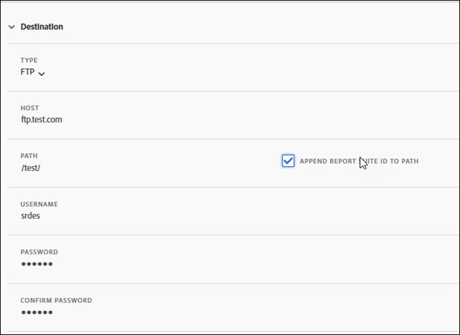
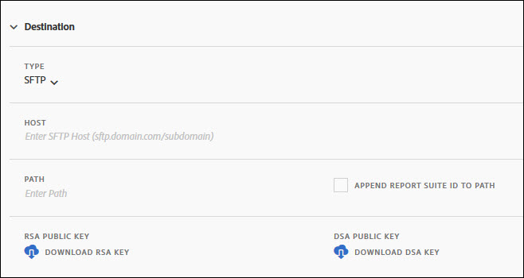
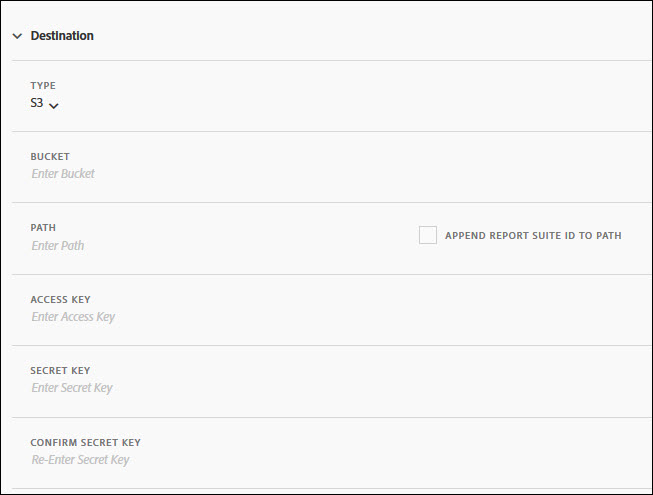
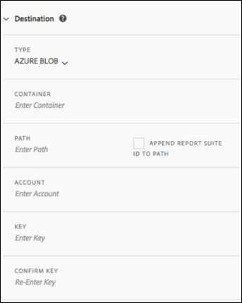

# Create or edit a data feed

When creating a data feed, you provide Adobe with:

* The information about the destination where you want raw data files to be sent

* The data you want to include in each file

This page outlines the individual settings you can customize during the data feed creation process.

>[!NOTE]
>
>Before you create a data feed, it's important to have a basic understanding of data feeds and to ensure that you meet the prerequisites outlined in [Data feeds overview](data-feed-overview.md).


## Feed Information fields

* **Name**: The name of the data feed. Must be unique within the selected report suite, and can be up to 255 characters in length.
* **Report suite:** The report suite the data feed is based on. If multiple data feeds are created for the same report suite, they must have different column definitions. Only source report suites support data feeds; virtual report suites are not supported.
* **Email when complete**: The email address to be notified when a feed finishes processing. The email address must be properly formatted.
* **Feed interval**: Hourly feeds contain a single hour's worth of data. Daily feeds contain a full day's worth of data; they include data from midnight to midnight in the report suite's time zone.
* **Delay processing**: Wait a given amount of time before processing a data feed file. A delay can be useful to give mobile implementations an opportunity for offline devices to come online and send data. It can also be used to accommodate your organization's server-side processes in managing previously processed files. In most cases, no delay is needed. A feed can be delayed by up to 120 minutes.
* **Start & end dates**: The start date indicates the first date you want a data feed. Set this date in the past to immediately begin processing data feeds for historical data. Feeds continue processing until they reach the end date. The start and end dates are based on the report suite's time zone.
* **Continuous feed**: This checkbox removes the end date, allowing a feed to run indefinitely. When a feed finishes processing historical data, a feed waits for data to finish collecting for a given hour or day. Once the current hour or day concludes, processing begins after the specified delay.

## Destination fields

The fields available under destination fields depends on the destination type.

### Amazon S3

You can send feeds directly to Amazon S3 buckets. This destination type requires only your Amazon S3 account name and the locatoin (bucket) name. 

Adobe Analytics uses cross-account authentication to upload files to the specified location in your Amazon S3 instance.

### Azure RBAC

### Azure SAS

### Google Cloud Platform

You can send feeds directly to Google Cloud Platform (GCP) buckets. This destination type requires only your GCP account name and the locatoin (bucket) name. 

Adobe Analytics uses cross-account authentication to upload files to the specified location in your GCP instance.

### Legacy destinations

#### FTP

Data feed data can be delivered to an Adobe or customer-hosted FTP location. Requires an FTP host, username, and password. Use the path field to place feed files in a folder. Folders must already exist; feeds throw an error if the specified path does not exist.



#### SFTP

SFTP support for data feeds is available. Requires an SFTP host, username, and the destination site to contain a valid RSA or DSA public key. You can download the appropriate public key when creating the feed.



#### S3

You can send feeds directly to Amazon S3 buckets. This destination type requires a Bucket name, an Access Key ID, and a Secret Key. See [Amazon S3 bucket naming requirements](https://docs.aws.amazon.com/awscloudtrail/latest/userguide/cloudtrail-s3-bucket-naming-requirements.html) within the Amazon S3 docs for more information.



The user you provide for uploading data feeds must have the following [permissions](https://docs.aws.amazon.com/AmazonS3/latest/API/API_Operations_Amazon_Simple_Storage_Service.html):

* s3:GetObject
* s3:PutObject
* s3:PutObjectAcl

  >[!NOTE]
  >
  >For each upload to an Amazon S3 bucket, [!DNL Analytics] adds the bucket owner to the BucketOwnerFullControl ACL, whether or not the bucket has a policy that requires it. For more information, see "[What is the BucketOwnerFullControl setting for Amazon S3 data feeds?](df-faq.md#BucketOwnerFullControl)"

The following 16 standard AWS regions are supported (using the appropriate signature algorithm where necessary):

* us-east-2
* us-east-1
* us-west-1
* us-west-2
* ap-south-1
* ap-northeast-2
* ap-southeast-1
* ap-southeast-2
* ap-northeast-1
* ca-central-1
* eu-central-1
* eu-west-1
* eu-west-2
* eu-west-3
* eu-north-1
* sa-east-1

>[!NOTE]
>
>The cn-north-1 region is not supported.

#### Azure Blob

Data feeds support Azure Blob destinations. Requires a container, account, and a key. Amazon automatically encrypts the data at rest. When you download the data, it gets decrypted automatically. See [Create a storage account](https://docs.microsoft.com/en-us/azure/storage/common/storage-quickstart-create-account?tabs=azure-portal#view-and-copy-storage-access-keys) within the Microsoft Azure docs for more information.



>[!NOTE]
>
>You must implement your own process to manage disk space on the feed destination. Adobe does not delete any data from the server.

## Data column definitions

All columns, regardless if they have data, are available. A data feed must include at least one column.

* **Remove escaped characters**: When collecting data, some characters (such as newlines) can cause issues. Check this box if you would like these characters removed from feed files.
* **Compression format**: The type of compression used. Gzip outputs files in `.tar.gz` format. Zip outputs files in `.zip` format.
* **Packaging type**: Single file outputs the `hit_data.tsv` file in a single, potentially massive file. Multiple files paginates your data into 2GB chunks (uncompressed). If multiple files is selected and uncompressed data for the reporting window is less than 2GB, one file is sent. Adobe recommends using multiple files for most data feeds.
* **Manifest**: Whether or not Adobe should deliver a [manifest file](c-df-contents/datafeeds-contents.md#feed-manifest) to the destination when no data is collected for a feed interval. If you select Manifest File, you'll receive a manifest file similar to the following when no data is collected:

```text
   Datafeed-Manifest-Version: 1.0
    Lookup-Files: 0
    Data-Files: 0
    Total-Records: 0
```

* **Column templates**: When creating many data feeds, Adobe recommends creating a column template. Selecting a column template automatically includes the specified columns in the template. Adobe also provides several templates by default.
* **Available columns**: All available data columns in Adobe Analytics. Click [!UICONTROL Add all] to include all columns in a data feed.
* **Included columns**: The columns to include in a data feed. Click [!UICONTROL Remove all] to remove all columns from a data feed.
* **Download CSV**: Downloads a CSV file containing all included columns.
