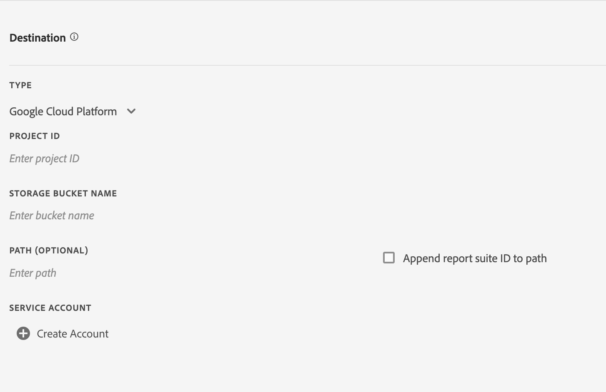
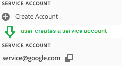
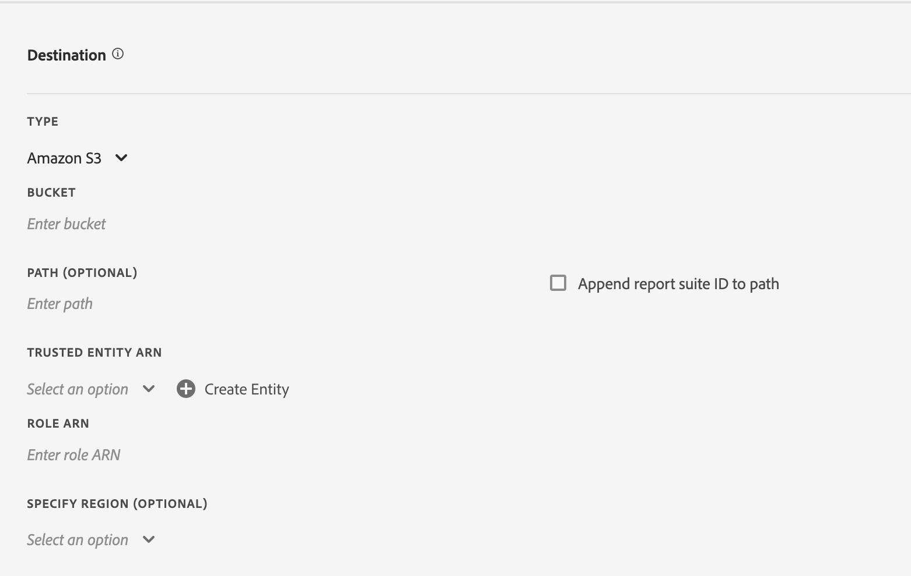
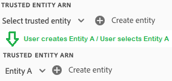
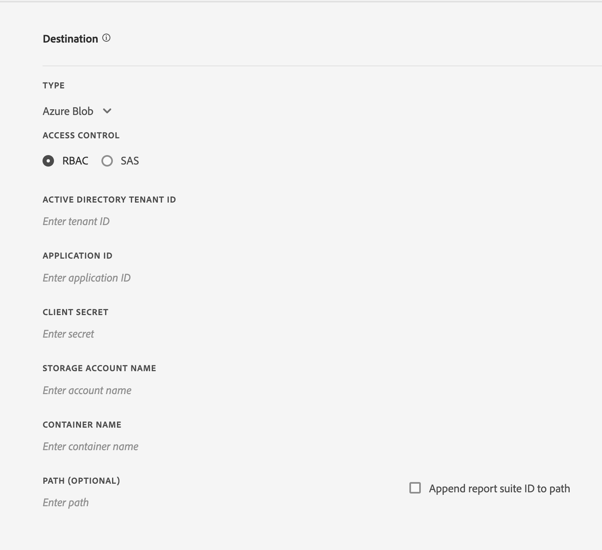
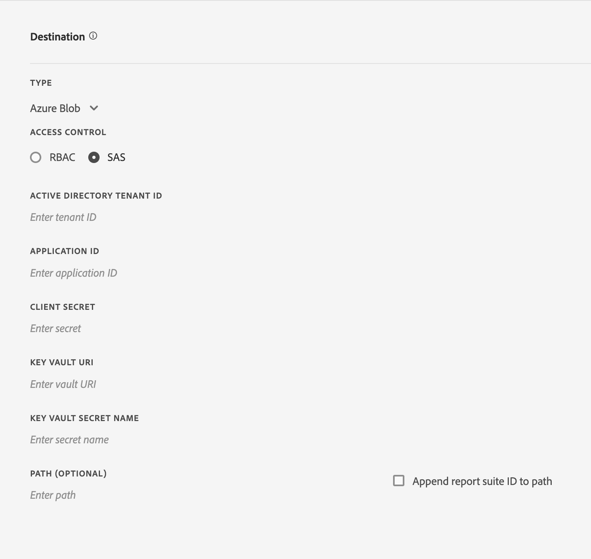

# Create or edit a data feed

Creating a data feed allows Adobe to know where to send raw data files, and what you would like to include in each file. This page lists individual settings you can customize when creating a data feed.

Basic knowledge of data feeds is recommended before reading this page. See [Data feeds overview](data-feed-overview.md) to make sure you meet the requirements to create a data feed.

## Feed Information fields

* **Name**: The name of the data feed. Must be unique within the selected report suite, and can be up to 255 characters in length.
* **Report suite:** The report suite the data feed is based on. If multiple data feeds are created for the same report suite, they must have different column definitions. Only source report suites support data feeds; virtual report suites are not supported.
* **Email when complete**: The email address to be notified when a feed finishes processing. The email address must be properly formatted.
* **Feed interval**: Hourly feeds contain a single hour's worth of data. Daily feeds contain a full day's worth of data; they include data from midnight to midnight in the report suite's time zone.
* **Delay processing**: Wait a given amount of time before processing a data feed file. A delay can be useful to give mobile implementations an opportunity for offline devices to come online and send data. It can also be used to accommodate your organization's server-side processes in managing previously processed files. In most cases, no delay is needed. A feed can be delayed by up to 120 minutes.
* **Start & end dates**: The start date indicates the first date you want a data feed. Set this date in the past to immediately begin processing data feeds for historical data. Feeds continue processing until they reach the end date. The start and end dates are based on the report suite's time zone.
* **Continuous feed**: This checkbox removes the end date, allowing a feed to run indefinitely. When a feed finishes processing historical data, a feed waits for data to finish collecting for a given hour or day. Once the current hour or day concludes, processing begins after the specified delay.


## Destination Field
The fields available under destination fields depends on the destination type.

### Google Cloud Platform
Access GCP storage buckets as a secure destination

**Fields**
* *Type:* Destination Type of Google Cloud Platform
* *Project ID:* GCP project ID where the storage bucket exists
* *Storage Bucket Name:* Bucket names without dots are limited to 3-63 characters. Names containing dots can contain up to 222 chars but each dot-separated component can be no longer than 63 characters.
* *Path (Optional):* & *Append Report Suite ID to Path:* Location of resources to retrieve or store



**Service Account Creation Process**
The user will be required to create a service account for the Google Cloud Platform destination is selected.

    Only one GCP service account will be allowed per analytics organization. Once the service account has been created for the datafeed, all additional datafeeds within the organization will be prepopulated with the service account.

    


### Amazon S3
Amazon S3 bucket storage accessed via IAM Role within a Trusted Entity.

**Fields**
* *Type:* Destination Type of Amazon S3
* *Bucket:* S3 bucket name
* *Trusted Entity ARN:* AWS IAM Entity ARN `arn:aws:iam::<12 digit account number>:user/<username>`
* *Role ARN:* AWS IAM Role ARN `arn:aws:iam::<12 digit account number>:role/<role name>`
* *Path (Optional):* & *Append Report Suite ID to Path:* Location of resources to retrieve or store
* *Specify Region (Optional):* Dropdown of all available AWS regions, including CN regions




**Creating & Selecting Trusted Entity**
The user can select a trusted entity from any options listed in the dropdown or create and retrieve a new one by clicking the `Create Entity` button.

After click of the `Create Entity` button, the user will be redirected to an authentication process. Once the user authenticates, the trusted entity is created and added to the options in the dropdown.

The dropdown lists all trusted entities that were created in the organization by this user.



You can send feeds directly to Amazon S3 buckets via the legacy method. See [Amazon S3 bucket naming requirements](https://docs.aws.amazon.com/awscloudtrail/latest/userguide/cloudtrail-s3-bucket-naming-requirements.html) within the Amazon S3 docs for more information.

**Fields - Deprecated**
* *Type:* Destination type of deprecated S3 method
* *Bucket:* Amazon S3 Bucket name
* *Path (Optional):* & *Append Report Suite ID to Path:* Location of resources to retrieve or store
* *Access Key:* Access Key ID of AWS user
* *Secret Key:* Secret Key of AWS user
* *Confirm Secret Key:* Re-enter Secret Key of AWS user


The user you provide for uploading data feeds must have the following [permissions](https://docs.aws.amazon.com/AmazonS3/latest/API/API_Operations_Amazon_Simple_Storage_Service.html):

* s3:GetObject
* s3:PutObject
* s3:PutObjectAcl

  >For each upload to an Amazon S3 bucket, [!DNL Analytics] adds the bucket owner to the BucketOwnerFullControl ACL, whether or not the bucket has a policy that requires it. For more information, see “[What is the BucketOwnerFullControl setting for Amazon S3 data feeds?](df-faq.md#BucketOwnerFullControl)”

**Supported AWS Regions**:
* us-east-2
* us-east-1
* us-west-1
* us-west-2
* ap-south-1
* ap-northeast-2
* ap-southeast-1
* ap-southeast-2
* ap-northeast-1
* ca-central-1
* eu-central-1
* eu-west-1
* eu-west-2
* eu-west-3
* eu-north-1
* sa-east-1
* cn-north-1
* cn-northwest-1


### Azure Blob
Azure Blob secure destination using Role-Based Access Control (RBAC) or Shared Access Signature (SAS). Upon picking the access control, the content of the panel will be updated to reflect the corresponding fields.

**Fields - RBAC**
* *Type:* Destination Type of Azure Blob
* *Access Control:* Option to use RBAC or SAS
* *Active Directory Tenant ID:* Organization ID of Azure account
* *Application ID:* Application ID from Active Directory Adapter
* *Client Secret:* Azure Client Secret
* *Storage Account Name:* Name of account that contains data objects
* *Container Name:* Container belonging to a given storage account.
* *Path (Optional):* & *Append Report Suite ID to Path:* Location of resources to retrieve or store



**Fields - SAS**
* *Type:* Destination Type of Azure Blob
* *Access Control:* Option to use RBAC or SAS
* *Active Directory Tenant ID:* ID of Azure Active Directory instance
* *Application ID:* Application ID from Active Directory Adapter
* *Client Secret:* Azure Client Secret
* *Key Vault URI:* Location of Azure Key Vault
* *Key Vault Secret Name:* Secret Name to access secure Key Vault
* *Path (Optional):* & *Append Report Suite ID to Path:* Location of resources to retrieve or store



**Fields - Deprecated**
* *Type:* Destination Type of Azure Blob
* *Container:* Name of the Azure container
* *Path (Optional):* & *Append Report Suite ID to Path:* Location of resources to retrieve or store
* *Account:* Azure account Secret
* *Key Vault URI:* Location of Azure Key Vault
* *Key Vault Secret Name:* Secret Name to access secure Key Vault

You must implement your own process to manage disk space on the feed destination. Adobe does not delete any data from the server.
See [Create a storage account](https://docs.microsoft.com/en-us/azure/storage/common/storage-quickstart-create-account?tabs=azure-portal#view-and-copy-storage-access-keys) within the Microsoft Azure docs for more information.


>[!NOTE]
>
>You must implement your own process to manage disk space on the feed destination. Adobe does not delete any data from the server.

### FTP - Deprecated

**Fields**
* *Type:* Destination Type of FTP
* *Host:* Endpoint to access host
* *Path (Optional):* & *Append Report Suite ID to Path:* Location of resources to retrieve or store
* *Username:* Username for host
* *Password:* Password for host
* *Confirm Password:* Re-enter & verify password for host


### SFTP - Deprecated

SFTP support for data feeds is available. Requires an SFTP host, username, and the destination site to contain a valid RSA or DSA public key. You can download the appropriate public key when creating the feed.

**Fields**
* *Type:* Destination Type of SFTP
* *Host:* Endpoint to access host
* *Path (Optional):* & *Append Report Suite ID to Path:* Location of resources to retrieve or store
* *RSA Public Key:* or *DSA Public Key:* Public key to access host


## Data column definitions

All columns, regardless if they have data, are available. A data feed must include at least one column.

* **Remove escaped characters**: When collecting data, some characters (such as newlines) can cause issues. Check this box if you would like these characters removed from feed files.
* **Compression format**: The type of compression used. Gzip outputs files in `.tar.gz` format. Zip outputs files in `.zip` format.
* **Packaging type**: Single file outputs the `hit_data.tsv` file in a single, potentially massive file. Multiple files paginates your data into 2GB chunks (uncompressed). If multiple files is selected and uncompressed data for the reporting window is less than 2GB, one file is sent. Adobe recommends using multiple files for most data feeds.
* **Manifest**: Whether or not Adobe should deliver a [manifest file](c-df-contents/datafeeds-contents.md#feed-manifest) to the destination when no data is collected for a feed interval. If you select Manifest File, you'll receive a manifest file similar to the following when no data is collected:

```text
   Datafeed-Manifest-Version: 1.0
    Lookup-Files: 0
    Data-Files: 0
    Total-Records: 0
```

* **Column templates**: When creating many data feeds, Adobe recommends creating a column template. Selecting a column template automatically includes the specified columns in the template. Adobe also provides several templates by default.
* **Available columns**: All available data columns in Adobe Analytics. Click [!UICONTROL Add all] to include all columns in a data feed.
* **Included columns**: The columns to include in a data feed. Click [!UICONTROL Remove all] to remove all columns from a data feed.
* **Download CSV**: Downloads a CSV file containing all included columns.
