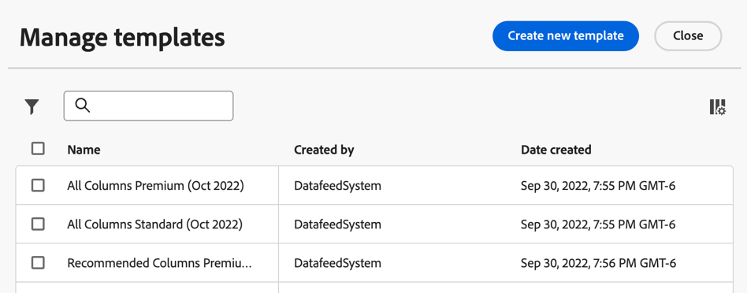
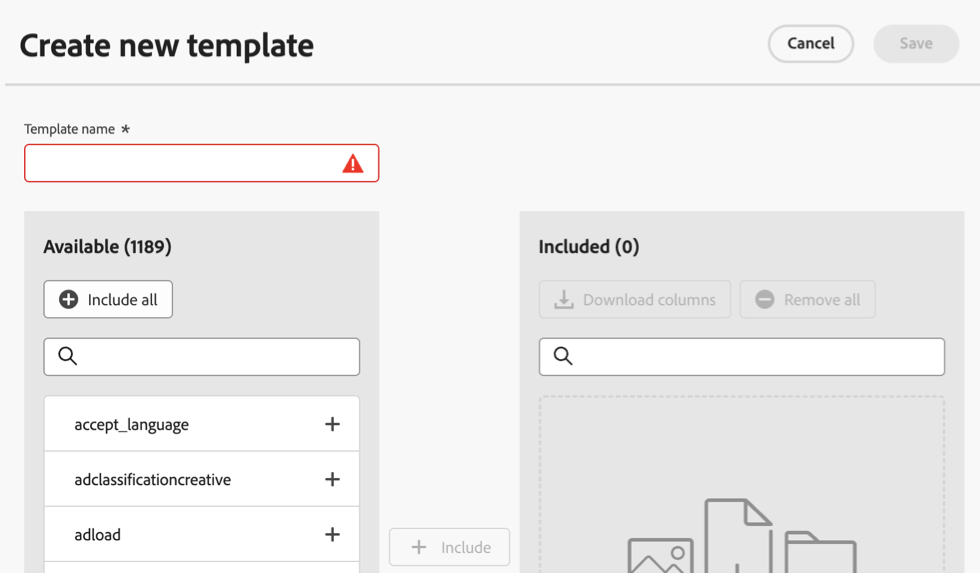

# Create a data feed

When creating a data feed, you provide Adobe with:

* The information about the destination where you want raw data files to be sent
* The data you want to include in each file

Before you create a data feed, it's important to have a basic understanding of data feeds and to ensure that you meet all prerequisites. For more information, see [Data feeds overview](data-feed-overview.md).

## Create and configure a data feed {#create-and-configure-data-feed}

<!-- markdownlint-disable MD034 -->

>[!CONTEXTUALHELP]
>id="aa_datafeed_os_strings"
>title="Replace operating system strings"
>abstract="This option cleans up the data output by detecting the following string sequences embedded in customer data and replacing them with a space:  Windows: CRLF, CR, or TAB Mac and Linux: \n, \r, or \t"

<!-- markdownlint-enable MD034 -->

<!-- markdownlint-disable MD034 -->

>[!CONTEXTUALHELP]
>id="aa_datafeed_export_file"
>title="Manifest"
>abstract="Choose whether to include a manifest file with each data feed delivery. Manifest files contain information for each included file in the data feed. When sending data feed data in a single package, you can also choose to include a finish file, but manifest files are recommended. "

<!-- markdownlint-enable MD034 -->

<!-- added help for Dynamic lookups to this page: help/export/analytics-data-feed/c-df-contents/dynamic-lookups.md -->

1. Log in to [experiencecloud.adobe.com](https://experiencecloud.adobe.com) using your Adobe ID credentials.

1. Select the 9-square icon in the upper-right, then select [!UICONTROL **Analytics**].

1. In the top navigation bar, go to [!UICONTROL **Admin**] > [!UICONTROL **Data feeds**].

1. Select [!UICONTROL **Create data feed**]. 

    <!-- add screenshot -->

    A page displays with the following categories: [!UICONTROL **Details**], [!UICONTROL **Data formatting**], [!UICONTROL **Data structure**], [!UICONTROL **Schedule**], and [!UICONTROL **Destination**].

1. In the [!UICONTROL **Details**] section, complete the following fields:
   
   | Field | Function | 
   |---------|----------|
   | [!UICONTROL **Name**] | The name of the data feed. Must be unique within the selected report suite, and can be up to 255 characters in length. [Learn more](/help/export/analytics-data-feed/df-faq.md#must-feed-names-be-unique) | 
   | [!UICONTROL **Tags**] | Apply any tags to the data feed for easier categorization.  |
   | [!UICONTROL **Description**] | Specify a description for the data feed. |

1. In the [!UICONTROL **Data formatting**] section, specify the following information:
   
   | Field | Function | 
   |---------|----------|
   | [!UICONTROL **Compression format**] | The type of compression used. **Gzip** outputs files in `.tar.gz` format. **Zip** outputs files in `.zip` format. | 
   | [!UICONTROL **Packaging type**] | Select [!UICONTROL **Multiple files**] for most data feeds. This option paginates your data into uncompressed 2GB chunks. (If the [!UICONTROL **Multiple files**] option is selected and uncompressed data for the reporting window is less than 2GB, one file is sent.) Selecting **Single file** outputs the `hit_data.tsv` file in a single, potentially massive file.  |
   | [!UICONTROL **Manifest**] | Choose whether to include a manifest file with each data feed delivery. 
You can choose from the following options:
<ul><li>**[!UICONTROL Manifest file]**: Contains information for each included file in the data feed.</li><li>**[!UICONTROL Finish file (Legacy)]**: Indicates that the data feed completed successfully. No other information is included. This option is suitable for existing feeds that originally used this option that need to be reprocessed. It is available only when sending data feed data in a single package. </li><li>**[!UICONTROL None]**: No file is included</li></ul> |
   | [!UICONTROL **Send manifest file even when no data exists**] | Determines whether Adobe should deliver a [manifest file](/help/export/analytics-data-feed/c-df-contents/datafeeds-contents.md#feed-manifest) to the destination when no data is collected for a feed interval. If you select **Manifest file**, you receive a manifest file similar to the following when no data is collected:
`text`

`Datafeed-Manifest-Version: 1.0`

`Lookup-Files: 0`

`Data-Files: 0`

 `Total-Records: 0`
  |
   | [!UICONTROL **Replace operating system strings**] | When collecting data, some characters (such as newlines) can cause issues. Select this option to have these characters removed from feed files.
This option detects the following string sequences embedded in customer data and replaces them with a space:
 <ul><li>**Windows:** CRLF, CR, or TAB</li><li>**Mac and Linux:** \n, \r, or \t</li></ul>  | 
   | [!UICONTROL **Enable dynamic lookups**] | Dynamic lookups allow you to receive additional lookup files in your data feed otherwise not available. This setting enables the following lookup tables to be sent with each data feed file:<ul><li> **Carrier name**</li><li>**Mobile attributes**</li><li>**Operating system type**</li></ul>
For more information, see [Dynamic lookups](/help/export/analytics-data-feed/c-df-contents/dynamic-lookups.md).
 | 

1. In the [!UICONTROL **Data structure**] section, in the **[!UICONTROL Report suite]** field, select the source report suite that contains the data that you want to export. 
Consider the following when selecting a report suite:
 <ul><li>If multiple data feeds are created for the same report suite, each data feed must have different column definitions.</li><li>Only source report suites support data feeds; virtual report suites are not supported.</li><li>column lists are company-specific. If you choose a report suite that is owned by Company A and you're already in Company B, then the list will change. </li></ul>

1. Use either or both of the following methods to determine which data columns to include in the feed:

   * **Add columns individually:** In the **[!UICONTROL Available]** section on the left, select any columns that you want to include, then select **[!UICONTROL Include]**. All available data columns in Adobe Analytics are available. You can select multiple columns by holding **[!UICONTROL Shift]**, or by holding **[!UICONTROL Command]** (on macOS) or **[!UICONTROL Ctrl]** (on Windows). Click **[!UICONTROL Add all]** to include all columns in a data feed.

     Columns you add appear in the **[!UICONTROL Included]** section on the right.

   * **Add a column template:** In the **[!UICONTROL Column templates]** field, select a column template to add. A column template is a predefined group of columns, and Adobe provides several by default. 
  
     All columns included in the template appear in the **[!UICONTROL Included]** section on the right.

1. (Optional) If you plan to create additional data feeds that include these same columns, you can create a column template that is based on this data feed. To create a column template, select **[!UICONTROL Save as template]**, specify a name for the template, then select **[!UICONTROL Save]**.

    

1. (Optional) To download a list of included columns in .csv format, select **[!UICONTROL Download columns]**. This can be especially helpful for data feeds with a large number of columns. 

1. In the [!UICONTROL **Schedule**] section, specify the following information:
   
   | Field | Function | 
   |---------|----------|
   | [!UICONTROL **Frequency**] | Select how often the data feed should be sent. The following options are available:<ul><li>**Daily**: Feeds contain a full day's worth of data, from midnight to midnight in the report suite's time zone. Use this option for backfill or historical data, or for continuing feeds.</li><li>**Hourly**: Feeds contain a single hour's worth of data. Use this option for continuing feeds.</li><li>**Every 15 minutes**: Feeds contain 15 minute's worth of data. Use this option for continuing feeds.</li></ul>  | 
   | [!UICONTROL **Processing delay**] | Wait a given amount of time before processing a data feed file. A delay can be useful to give mobile implementations an opportunity for offline devices to come online and send data. It can also be used to accommodate your organization's server-side processes in managing previously processed files. In most cases, no delay is needed. A feed can be delayed by up to 120 minutes. |
   | [!UICONTROL **Continuous feed**] | This checkbox removes the end date, allowing a feed to run indefinitely. When a feed finishes processing historical data, a feed waits for data to finish collecting for a given hour or day. Once the current hour or day concludes, processing begins after the specified delay. |
   | [!UICONTROL **Start date**] | The start date indicates the date when you want the data feed to begin. To immediately begin processing data feeds for historical data, set this date to any date in the past when data is being collected. The start date is based on the report suite's time zone. |
   | [!UICONTROL **End date**] | The end date indicates the date when you want the data feed to end. The end date is based on the report suite's time zone. | 

1. In the [!UICONTROL **Destination**] section, configure the destination where you want the data to be sent.  

   >[!NOTE]
   >
   >Consider the following when configuring a report destination:
   >
   >* We recommend using a cloud account for your report destination. [Legacy FTP and SFTP accounts](#legacy-destinations) are available, but are not recommended.
   >* Any cloud accounts that you previously configured are available to use for Data Feeds. You can configure cloud accounts in any of the following ways:
   >
   >   * When configuring cloud accounts for [Data Warehouse](/help/export/data-warehouse/create-request/dw-request-report-destinations.md) 
   >   
   >   * When [importing Adobe Analytics classification data](/help/components/locations/locations-manager.md) (Any locations that are configured for importing classification data cannot be used.)
   >   
   >   * From the Locations manager, in [Components > Locations](/help/components/locations/configure-import-accounts.md) 
   >
   >* Cloud accounts are associated with your Adobe Analytics user account. Other users cannot use or view cloud accounts that you configure.
   >
   >* You can edit any locations that you create from the Locations manager in [Components > Locations](/help/components/locations/configure-import-accounts.md)

   Complete the following fields:
   
   | Field | Function | 
   |---------|----------|
   | [!UICONTROL **Account**] | Do either of the following:<ul><li>**Use an existing account:** Select the drop-down menu next to the **[!UICONTROL Account]** field. Or, begin typing the account name, then select it from the drop-down menu. 
Accounts are available to you only if you configured them or if they were shared with an organization you are a part of.
</li><li>**Create a new account:** Select **[!UICONTROL Add new]** beneath the **[!UICONTROL Account]** field. For information about how to configure the account, see [Configure a location account](/help/components/locations/configure-import-accounts.md#configure-a-location-account) in [Configure cloud import and export accounts](/help/components/locations/configure-import-accounts.md).</li></ul> | 
   | [!UICONTROL **Location**] | Do either of the following:<ul><li>**Use an existing location:** Select the drop-down menu next to the **[!UICONTROL Location]** field. Or, begin typing the location name, then select it from the drop-down menu.</li><li>**Create a new location:** Select **[!UICONTROL Add new]** beneath the **[!UICONTROL Location]** field. For informatino about how to configure the location, see [Configure a location](/help/components/locations/configure-import-locations.md#configure-a-location) in [Configure cloud import and export locations](/help/components/locations/configure-import-locations.md).|
   | [!UICONTROL **Notify when complete**] | Specify one or more email addresses where a notification should be sent after the data feed is sent. Separate multiple email addresses using a comma.  |
       
1. Select **[!UICONTROL Save]**.    

## Manage column templates

Templates allow you to reuse the same columns for future data feeds that you create. 

When managing templates, you can create new templates, use templates that are already created, copy templates, edit templates, and delete templates.

[!UICONTROL **Admin**] > [!UICONTROL **Data feeds**] > **[!UICONTROL Manage templates]**

### Create a column template

When creating multiple data feeds, Adobe recommends that you [create column templates](#create-column-templates). 

To create a column template:

1. In Adobe Analytics, go to [!UICONTROL **Admin**] > [!UICONTROL **Data feeds**] > **[!UICONTROL Manage templates]**.

1. Select **[!UICONTROL Create new template]** to create a new column template. 

   

1. In the **[!UICONTROL Template name]** field, specify a name for the template. 

1. In the **[!UICONTROL Available]** section on the left, select any columns that you want to include, then select **[!UICONTROL Include]**. All available data columns in Adobe Analytics are available. You can select multiple columns by holding **[!UICONTROL Shift]**, or by holding **[!UICONTROL Command]** (on macOS) or **[!UICONTROL Ctrl]** (on Windows). Click **[!UICONTROL Add all]** to include all columns in a data feed.

     Columns you add appear in the **[!UICONTROL Included]** section on the right.

1. Select **[!UICONTROL Save]**.

### Edit a column template

1. In Adobe Analytics, go to [!UICONTROL **Admin**] > [!UICONTROL **Data feeds**] > **[!UICONTROL Manage templates]**.

1. Select the template you want to edit, then select **[!UICONTROL Edit]**.

1. Make any edits, then select **[!UICONTROL Save]**.

### Copy a column template

1. In Adobe Analytics, go to [!UICONTROL **Admin**] > [!UICONTROL **Data feeds**] > **[!UICONTROL Manage templates]**.

1. Select the template you want to copy, then select **[!UICONTROL Copy]**.

1. In the **[!UICONTROL Template name]** field, specify a name for the template. 

1. Make any additional changes, then select **[!UICONTROL Save]**.

### Delete column templates

1. In Adobe Analytics, go to [!UICONTROL **Admin**] > [!UICONTROL **Data feeds**] > **[!UICONTROL Manage templates]**.

1. Select one or more templates that you want to delete, then select **[!UICONTROL Delete]**.

<!-- why would you want to do this? -->

<!-- I don't think we need anything after this, but saving here just in case:

1. In the [!UICONTROL **Feed Information**] section, complete the following fields:
   
   | Field | Function | 
   |---------|----------|
   | [!UICONTROL **Name**] | The name of the data feed. Must be unique within the selected report suite, and can be up to 255 characters in length. [Learn more](/help/export/analytics-data-feed/df-faq.md#must-feed-names-be-unique) | 
   | [!UICONTROL **Report suite**] | The report suite that the data feed is based on. If multiple data feeds are created for the same report suite, they must have different column definitions. Only source report suites support data feeds; virtual report suites are not supported. |
   | [!UICONTROL **Email when complete**] | The email address to be notified when a feed finishes processing. The email address must be properly formatted. |
   | [!UICONTROL **Feed interval**] | Select **Daily** for backfill or historical data. Daily feeds contain a full day's worth of data, from midnight to midnight in the report suite's time zone. Select **Hourly** for continuing data (Daily is also available for continuing feeds if you prefer). Hourly feeds contain a single hour's worth of data. |
   | [!UICONTROL **Delay processing**] | Wait a given amount of time before processing a data feed file. A delay can be useful to give mobile implementations an opportunity for offline devices to come online and send data. It can also be used to accommodate your organization's server-side processes in managing previously processed files. In most cases, no delay is needed. A feed can be delayed by up to 120 minutes. |
   | [!UICONTROL **Start & end dates**] | The start date indicates the date when you want the data feed to begin. To immediately begin processing data feeds for historical data, set this date to any date in the past when data is being collected. The start and end dates are based on the report suite's time zone. |
   | [!UICONTROL **Continuous feed**] | This checkbox removes the end date, allowing a feed to run indefinitely. When a feed finishes processing historical data, a feed waits for data to finish collecting for a given hour or day. Once the current hour or day concludes, processing begins after the specified delay. |
   
1. In the [!UICONTROL **Destination**] section, in the [!UICONTROL **Type**] drop-down menu, select the destination where you want the data to be sent. 

   >[!NOTE]
   >
   >Consider the following when configuring a report destination:
   >
   >* We recommend using a cloud account for your report destination. [Legacy FTP and SFTP accounts](#legacy-destinations) are available, but are not recommended.
   >* Any cloud accounts that you previously configured are available to use for Data Feeds. You can configure cloud accounts in any of the following ways:
   >
   >   * When configuring cloud accounts for [Data Warehouse](/help/export/data-warehouse/create-request/dw-request-report-destinations.md) 
   >   
   >   * When [importing Adobe Analytics classification data](/help/components/locations/locations-manager.md) (Any locations that are configured for importing classification data cannot be used.)
   >   
   >   * From the Locations manager, in [Components > Locations](/help/components/locations/configure-import-accounts.md) 
   >
   >* Cloud accounts are associated with your Adobe Analytics user account. Other users cannot use or view cloud accounts that you configure.
   >
   >* You can edit any locations that you create from the Locations manager in [Components > Locations](/help/components/locations/configure-import-accounts.md)

   

   Use any of the following destination types when creating a data feed. For configuration instructions, expand the destination type. (Additional [legacy destinations](#legacy-destinations) are also available, but are not recommended.)

   +++Amazon S3

   You can send feeds directly to Amazon S3 buckets. This destination type requires only your Amazon S3 account and the location (bucket). 

   Adobe Analytics uses cross-account authentication to upload files from Adobe Analytics to the specified location in your Amazon S3 instance.

   When using Amazon S3 with Data Feeds, only SSE-S3 encryption is supported.

   To configure an Amazon S3 bucket as the destination for a data feed:

   1. Begin creating a data feed as described in [Create and configure a data feed](#create-and-configure-a-data-feed).
   
   1. In the [!UICONTROL **Destination**] section, in the [!UICONTROL **Type**] drop-down menu, select [!UICONTROL **Amazon S3**].

      

   1. Select [!UICONTROL **Select location**].

      The Amazon S3 Export Locations page is displayed.

   1. (Conditional) If an Amazon S3 account (and a location on that account) has already been configured in Adobe Analytics, you can use it as your data feed destination: 

      >[!NOTE]
      >
      >Accounts are available to you only if you configured them or if they were shared with an organization you are a part of.
   
      1. Select the account from the [!UICONTROL **Select account**] drop-down menu.

         Any cloud accounts that were configured in any of the following areas of Adobe Analytics are available to use:
      
         * When importing Adobe Analytics classification data, as described in [Schema](/help/components/classifications/sets/manage/schema.md).
      
           However, any locations that are configured for importing classification data cannot be used. Instead, add a new destination as described below.

         * When configuring accounts and locations in the Locations area, as described in [Configure cloud import and export accounts](/help/components/locations/configure-import-accounts.md) and [Configure cloud import and export locations](/help/components/locations/configure-import-locations.md).
   
      1. Select the location from the [!UICONTROL **Select location**] drop-down menu.

      1. Select [!UICONTROL **Save**] > [!UICONTROL **Save**].

      The destination is now configured to send data to the Amazon S3 location that you specified.
   
   1. (Conditional) If you have not previously added an Amazon S3 account:

      1. Select [!UICONTROL **Add account**], then specify the following information:
   
         |Field | Function |
         |---------|----------|
         | [!UICONTROL **Account name**] | A name for the account. This can be any name you choose. | 
         | [!UICONTROL **Account description**] | A description for the account. | 
         | [!UICONTROL **Role ARN**] | You must provide a Role ARN (Amazon Resource Name) that Adobe can use to gain access to the Amazon S3 account. To do this, you create an IAM permission policy for the source account, attach the policy to a user, and then create a role for the destination account. For specific information, see [this AWS documentation](https://aws.amazon.com/premiumsupport/knowledge-center/cross-account-access-iam/). | 
         | [!UICONTROL **User ARN**] | The User ARN (Amazon Resource Name) is provided by Adobe. You must attach this user to the policy you created. | 

         {style="table-layout:auto"}

      1. Select [!UICONTROL **Add location**], then specify the following information:
   
         |Field | Function |
         |---------|----------|
         | [!UICONTROL **Name**] | A name for the account.  | 
         | [!UICONTROL **Description**] | A description for the account. | 
         | [!UICONTROL **Bucket**] | The bucket within your Amazon S3 account where you want Adobe Analytics data to be sent. 
Ensure that the User ARN that was provided by Adobe has the `S3:PutObject` permission in order to upload files to this bucket. This permission allows the User ARN to upload initial files and overwrite files for subsequent uploads.

Bucket names must meet specific naming rules. For example, they must be between 3 to 63 characters long, can consist only of lowercase letters, numbers, dots (.), and hyphens (-), and must begin and end with a letter or number. [A complete list of naming rules are available in the AWS documentation](https://docs.aws.amazon.com/AmazonS3/latest/userguide/bucketnamingrules.html). 
 | 
         | [!UICONTROL **Prefix**] | The folder within the bucket where you want to put the data. Specify a folder name, then add a backslash after the name to create the folder. For example, `folder_name/` |

         {style="table-layout:auto"}

      1. Select [!UICONTROL **Create**] > [!UICONTROL **Save**].

         The destination is now configured to send data to the Amazon S3 location that you specified.

      1. (Conditional) If you need to manage the destination (account and location) that you just created, it is available in the [Locations manager](/help/components/locations/locations-manager.md).
   
   +++

   +++Azure RBAC

   You can send feeds directly to an Azure container by using RBAC authentication. This destination type requires an Application ID, Tenant ID, and Secret. 

   To configure an Azure RBAC account as the destination for a data feed:

   1. If you haven't already, create an Azure application that Adobe Analytics can use for authentication, then grant access permissions in access control (IAM). 
   
      For information, refer to the [Microsoft Azure documentation about how to create an Azure Active Directory application](https://learn.microsoft.com/en-us/azure/active-directory/develop/howto-create-service-principal-portal). 
   
   1. In the Adobe Analytics admin console, in the [!UICONTROL **Destination**] section, in the [!UICONTROL **Type**] drop-down menu, select [!UICONTROL **Azure RBAC**].

      

   1. Select [!UICONTROL **Select location**].

      The Azure RBAC Export Locations page is displayed.

   1. (Conditional) If an Azure RBAC account (and a location on that account) has already been configured in Adobe Analytics, you can use it as your data feed destination: 

      >[!NOTE]
      >
      >Accounts are available to you only if you configured them or if they were shared with an organization you are a part of.
   
      1. Select the account from the [!UICONTROL **Select account**] drop-down menu.

      Any cloud accounts that you configured in any of the following areas of Adobe Analytics are available to use:
      
         * When importing Adobe Analytics classification data, as described in [Schema](/help/components/classifications/sets/manage/schema.md).
      
           However, any locations that are configured for importing classification data cannot be used. Instead, add a new destination as described below.

         * When configuring accounts and locations in the Locations area, as described in [Configure cloud import and export accounts](/help/components/locations/configure-import-accounts.md) and [Configure cloud import and export locations](/help/components/locations/configure-import-locations.md).

      1. Select the location from the [!UICONTROL **Select location**] drop-down menu.

      1. Select [!UICONTROL **Save**] > [!UICONTROL **Save**].

         The destination is now configured to send data to the Azure RBAC location that you specified.

   1. (Conditional) If you have not previously added an Azure RBAC account:

      1. Select [!UICONTROL **Add account**], then specify the following information:
   
         |Field | Function |
         |---------|----------|
         | [!UICONTROL **Account name**] | A name for the Azure RBAC account. This name displays in the [!UICONTROL **Select account**] drop-down field and can be any name you choose. | 
         | [!UICONTROL **Account description**] | A description for the Azure RBAC account. This description displays in the [!UICONTROL **Select account**] drop-down field and can be any name you choose.  | 
         | [!UICONTROL **Application ID**] | Copy this ID from the Azure application that you created. In Microsoft Azure, this information is located on the **Overview** tab within your application. For more information, see the [Microsoft Azure documentation about how to register an application with the Microsoft identity platform](https://learn.microsoft.com/en-us/azure/active-directory/develop/quickstart-register-app). | 
         | [!UICONTROL **Tenant ID**] | Copy this ID from the Azure application that you created. In Microsoft Azure, this information is located on the **Overview** tab within your application. For more information, see the [Microsoft Azure documentation about how to register an application with the Microsoft identity platform](https://learn.microsoft.com/en-us/azure/active-directory/develop/quickstart-register-app). | 
         | [!UICONTROL **Secret**] | Copy the secret from the Azure application that you created. In Microsoft Azure, this information is located on the **Certificates & secrets** tab within your application. For more information, see the [Microsoft Azure documentation about how to register an application with the Microsoft identity platform](https://learn.microsoft.com/en-us/azure/active-directory/develop/quickstart-register-app). |

         {style="table-layout:auto"}

      1. Select [!UICONTROL **Add location**], then specify the following information: 
   
         |Field | Function |
         |---------|----------|
         | [!UICONTROL **Name**] | A name for the location. This name displays in the [!UICONTROL **Select location**] drop-down field and can be any name you choose. | 
         | [!UICONTROL **Description**] | A description for the location. This description displays in the [!UICONTROL **Select location**] drop-down field and can be any name you choose. | 
         | [!UICONTROL **Account**] | The Azure storage account. | 
         | [!UICONTROL **Container**] | The container within the account you specified where you want Adobe Analytics data to be sent. Ensure that you grant permissions to upload files to the Azure application that you created earlier. | 
         | [!UICONTROL **Prefix**] | The folder within the container where you want to put the data. Specify a folder name, then add a backslash after the name to create the folder. For example, `folder_name/`
Make sure the Application ID that you specified when configuring the Azure RBAC account has been granted the `Storage Blob Data Contributor` role in order to access the container (folder).
 
For more information, see [Azure built-in roles](https://learn.microsoft.com/en-us/azure/role-based-access-control/built-in-roles).
 |

         {style="table-layout:auto"}

      1. Select [!UICONTROL **Create**] > [!UICONTROL **Save**].

         The destination is now configured to send data to the Azure RBAC location that you specified.

      1. (Conditional) If you need to manage the destination (account and location) that you just created, it is available in the [Locations manager](/help/components/locations/locations-manager.md).
   
   +++

   +++Azure SAS

   You can send feeds directly to an Azure container by using SAS authentication. This destination type requires an Application ID, Tenant ID, Key vault URI, Key vault secret name, and secret. 

   To configure Azure SAS as the destination for a data feed:

   1. If you haven't already, create an Azure application that Adobe Analytics can use for authentication. 
   
      For information, refer to the [Microsoft Azure documentation about how to create an Azure Active Directory application](https://learn.microsoft.com/en-us/azure/active-directory/develop/howto-create-service-principal-portal). 
   
   1. In the Adobe Analytics admin console, in the [!UICONTROL **Destination**] section, select [!UICONTROL **Azure SAS**].

      

   1. Select [!UICONTROL **Select location**].

      The Azure SAS Export Locations page is displayed.

   1. (Conditional) If an Azure SAS account (and a location on that account) has already been configured in Adobe Analytics, you can use it as your data feed destination: 

      >[!NOTE]
      >
      >Accounts are available to you only if you configured them or if they were shared with an organization you are a part of.
   
      1. Select the account from the [!UICONTROL **Select account**] drop-down menu.

         Any cloud accounts that you configured in any of the following areas of Adobe Analytics are available to use:
      
         * When importing Adobe Analytics classification data, as described in [Schema](/help/components/classifications/sets/manage/schema.md).
      
           However, any locations that are configured for importing classification data cannot be used. Instead, add a new destination as described below.

         * When configuring accounts and locations in the Locations area, as described in [Configure cloud import and export accounts](/help/components/locations/configure-import-accounts.md) and [Configure cloud import and export locations](/help/components/locations/configure-import-locations.md).

      1. Select the location from the [!UICONTROL **Select location**] drop-down menu.

      1. Select [!UICONTROL **Save**] > [!UICONTROL **Save**].

         The destination is now configured to send data to the Azure SAS location that you specified.
   
   1. (Conditional) If you have not previously added an Azure SAS account:

      1. Select [!UICONTROL **Add account**], then specify the following information:
   
         |Field | Function |
         |---------|----------|
         | [!UICONTROL **Account name**] | A name for the Azure SAS account. This name displays in the [!UICONTROL **Select account**] drop-down field and can be any name you choose. | 
         | [!UICONTROL **Account description**] | A description for the Azure SAS account. This description displays in the [!UICONTROL **Select account**] drop-down field and can be any name you choose. | 
         | [!UICONTROL **Application ID**] | Copy this ID from the Azure application that you created. In Microsoft Azure, this information is located on the **Overview** tab within your application. For more information, see the [Microsoft Azure documentation about how to register an application with the Microsoft identity platform](https://learn.microsoft.com/en-us/azure/active-directory/develop/quickstart-register-app). | 
         | [!UICONTROL **Tenant ID**] | Copy this ID from the Azure application that you created. In Microsoft Azure, this information is located on the **Overview** tab within your application. For more information, see the [Microsoft Azure documentation about how to register an application with the Microsoft identity platform](https://learn.microsoft.com/en-us/azure/active-directory/develop/quickstart-register-app). |
         | [!UICONTROL **Key vault URI**] | 
The path to the SAS URI in Azure Key Vault. To configure Azure SAS, you need to store an SAS URI as a secret using Azure Key Vault. For information, see the [Microsoft Azure documentation about how to set and retrieve a secret from Azure Key Vault](https://learn.microsoft.com/en-us/azure/key-vault/secrets/quick-create-portal?source=recommendations).

After the key vault URI is created:<ul><li>Add an access policy on the Key Vault in order to grant permission to the Azure application that you created.
For information, see the [Microsoft Azure documentation about how to assign a Key Vault access policy](https://learn.microsoft.com/en-us/azure/key-vault/general/assign-access-policy?tabs=azure-portal).

Or

If you want to grant an access role directly without creating an access policy, see the [Microsoft Azure documentation about how to assign Azure roles using Azure portal](https://learn.microsoft.com/en-us/azure/role-based-access-control/role-assignments-portal). This adds the role assignment for the application ID to access the key vault URI. 
</li><li>Make sure the Application ID has been granted the `Key Vault Certificate User` built-in role in order to access the key vault URI. 
For more information, see [Azure built-in roles](https://learn.microsoft.com/en-us/azure/role-based-access-control/built-in-roles).
</li></ul> | 
         | [!UICONTROL **Key vault secret name**] | The secret name you created when adding the secret to Azure Key Vault. In Microsoft Azure, this information is located in the Key Vault you created, on the **Key Vault** settings pages. For information, see the [Microsoft Azure documentation about how to set and retrieve a secret from Azure Key Vault](https://learn.microsoft.com/en-us/azure/key-vault/secrets/quick-create-portal?source=recommendations). |
         | [!UICONTROL **Secret**] | Copy the secret from the Azure application that you created. In Microsoft Azure, this information is located on the **Certificates & secrets** tab within your application. For more information, see the [Microsoft Azure documentation about how to register an application with the Microsoft identity platform](https://learn.microsoft.com/en-us/azure/active-directory/develop/quickstart-register-app). |

         {style="table-layout:auto"}

      1. Select [!UICONTROL **Add location**], then specify the following information: 
   
         |Field | Function |
         |---------|----------|
         | [!UICONTROL **Name**] | A name for the location. This name displays in the [!UICONTROL **Select location**] drop-down field and can be any name you choose. | 
         | [!UICONTROL **Description**] | A description for the location. This description displays in the [!UICONTROL **Select location**] drop-down field and can be any name you choose. | 
         | [!UICONTROL **Container**] | The container within the account you specified where you want Adobe Analytics data to be sent. | 
         | [!UICONTROL **Prefix**] | The folder within the container where you want to put the data. Specify a folder name, then add a backslash after the name to create the folder. For example, `folder_name/`
Make sure that the SAS URI store that you specified in the Key Vault secret name field when configuring the Azure SAS account has the `Write` permission. This allows the SAS URI to create files in your Azure container. 
If you want the SAS URI to also overwrite files, make sure that the SAS URI store has the `Delete` permission.

For more information, see [Blob storage resources](https://learn.microsoft.com/en-us/azure/storage/blobs/storage-blobs-introduction#blob-storage-resources) in the Azure Blob Storage documentation.
 |

         {style="table-layout:auto"}

      1. Select [!UICONTROL **Create**] > [!UICONTROL **Save**].

         The destination is now configured to send data to the Azure SAS location that you specified.

      1. (Conditional) If you need to manage the destination (account and location) that you just created, it is available in the [Locations manager](/help/components/locations/locations-manager.md).
   
   +++

   +++Google Cloud Platform

   You can send feeds directly to Google Cloud Platform (GCP) buckets. This destination type requires only your GCP account name and the location (bucket) name. 
   
   Adobe Analytics uses cross-account authentication to upload files from Adobe Analytics to the specified location in your GCP instance.

   To configure a GCP bucket as the destination for a data feed:

   1. In the Adobe Analytics admin console, in the [!UICONTROL **Destination**] section, select [!UICONTROL **Google Cloud Platform**].

      

   1. Select [!UICONTROL **Select location**].

      The GCP Export Locations page is displayed.

   1. (Conditional) If a Google Cloud Platform account (and a location on that account) has already been configured in Adobe Analytics, you can use it as your data feed destination: 

      >[!NOTE]
      >
      >Accounts are available to you only if you configured them or if they were shared with an organization you are a part of.
   
      1. Select the account from the [!UICONTROL **Select account**] drop-down menu.

         Any cloud accounts that you configured in any of the following areas of Adobe Analytics are available to use:
      
         * When importing Adobe Analytics classification data, as described in [Schema](/help/components/classifications/sets/manage/schema.md).
      
           However, any locations that are configured for importing classification data cannot be used. Instead, add a new destination as described below.

         * When configuring accounts and locations in the Locations area, as described in [Configure cloud import and export accounts](/help/components/locations/configure-import-accounts.md) and [Configure cloud import and export locations](/help/components/locations/configure-import-locations.md).

      1. Select the location from the [!UICONTROL **Select location**] drop-down menu.

      1. Select [!UICONTROL **Save**] > [!UICONTROL **Save**].

         The destination is now configured to send data to the Google Cloud Platform location that you specified.
   
   1. (Conditional) If you have not previously added a GCP account:

      1. Select [!UICONTROL **Add account**], then specify the following information:
   
         |Field | Function |
         |---------|----------|
         | [!UICONTROL **Account name**] | A name for the account. This can be any name you choose. | 
         | [!UICONTROL **Account description**] | A description for the account. | 
         | [!UICONTROL **Project ID**] | Your Google Cloud project ID. See the [Google Cloud documentation about getting a project ID](https://cloud.google.com/resource-manager/docs/creating-managing-projects#identifying_projects). |

         {style="table-layout:auto"}

      1. Select [!UICONTROL **Add location**], then specify the following information:
   
         |Field | Function |
         |---------|----------|
         | [!UICONTROL **Principal**] | The Principal is provided by Adobe. You must grant permission to receive feeds to this principal. | 
         | [!UICONTROL **Name**] | A name for the account.  | 
         | [!UICONTROL **Description**] | A description for the account. | 
         | [!UICONTROL **Bucket**] | The bucket within your GCP account where you want Adobe Analytics data to be sent. 
Ensure that you have granted either of the following permissions to the Principal provided by Adobe: (For information about granting permissions, see [Add a principal to a bucket-level policy](https://cloud.google.com/storage/docs/access-control/using-iam-permissions#bucket-add) in the Google Cloud documentation.)<ul><li>`roles/storage.objectCreator`: Use this permission if you  want to limit the Principal to only create files in your GCP account.  **Important:** If you use this permission with scheduled reporting, you must use a unique file name for each new scheduled export. Otherwise, the report generation will fail because the Principal does not have access to overwrite existing files.</li><li>(Recommended) `roles/storage.objectUser`: Use this permission if you want the Principal to have access to view, list, update, and delete files in your GCP account. This permission allows the Principal to overwrite existing files for subsequent uploads, without the need to auto-generate unique file names for each new scheduled export.</li></ul>
If your organization is using [Organization policy constraints](https://cloud.google.com/storage/docs/org-policy-constraints) to allow only the Google Cloud Platform account in your allow list, you need the following Adobe-owned Google Cloud Platform organization ID: <ul><li>`DISPLAY_NAME`: `adobe.com`</li><li>`ID`: `178012854243`</li><li>`DIRECTORY_CUSTOMER_ID`: `C02jo8puj`</li></ul> 
 | 
         | [!UICONTROL **Prefix**] | The folder within the bucket where you want to put the data. Specify a folder name, then add a backslash after the name to create the folder. For example, `folder_name/` |

         {style="table-layout:auto"}

      1. Select [!UICONTROL **Create**] > [!UICONTROL **Save**].

         The destination is now configured to send data to the GCP location that you specified.

      1. (Conditional) If you need to manage the destination (account and location) that you just created, it is available in the [Locations manager](/help/components/locations/locations-manager.md).
   
   +++

1. In the  [!UICONTROL **Data Column Definitions**] section, select the latest [!UICONTROL **All Adobe Columns**] template in the drop-down menu, then complete the following fields:
   
   |Field | Function | 
   |---------|----------|
   | [!UICONTROL **Remove escaped characters**] | When collecting data, some characters (such as newlines) can cause issues. Check this box if you would like these characters removed from feed files. |
   | [!UICONTROL **Compression format**] | The type of compression used. **Gzip** outputs files in `.tar.gz` format. **Zip** outputs files in `.zip` format. | 
   | [!UICONTROL **Packaging type**] | Select [!UICONTROL **Multiple files**] for most data feeds. This option paginates your data into uncompressed 2GB chunks. (If the [!UICONTROL **Multiple files**] option is selected and uncompressed data for the reporting window is less than 2GB, one file is sent.) Selecting **Single file** outputs the `hit_data.tsv` file in a single, potentially massive file. |
   | [!UICONTROL **Manifest**] | Determines whether Adobe should deliver a [manifest file](c-df-contents/datafeeds-contents.md#feed-manifest) to the destination when no data is collected for a feed interval. If you select **Manifest File**, you receive a manifest file similar to the following when no data is collected:
`text`

`Datafeed-Manifest-Version: 1.0`

`Lookup-Files: 0`

`Data-Files: 0`

 `Total-Records: 0`
 | 
   | [!UICONTROL **Column templates**] | When creating many data feeds, Adobe recommends creating a column template. Selecting a column template automatically includes the specified columns in the template. Adobe also provides several templates by default. |
   | [!UICONTROL **Available columns**] | All available data columns in Adobe Analytics. Click [!UICONTROL Add all] to include all columns in a data feed. |
   | [!UICONTROL **Included columns**] | The columns to include in a data feed. Click [!UICONTROL Remove all] to remove all columns from a data feed. |
   | [!UICONTROL **Download CSV**] | Downloads a CSV file containing all included columns. |

1. Select [!UICONTROL **Save**] in the top-right.

    Historical data processing begins immediately. When data finishes processing for a day, the file is sent to the destination that you configured.

    For information about how to access the data feed and to get a better understanding of its contents, see [Data feed contents - overview](/help/export/analytics-data-feed/c-df-contents/datafeeds-contents.md).

## Legacy destinations

>[!IMPORTANT]
>
>The destinations described in this section are legacy, and are not recommended. Instead, use one of the following destinations when creating a data feed: Amazon S3, Google Cloud Platform, Azure RBAC, or Azure SAS. See [Create and configure a data feed](#create-and-configure-a-data-feed) for detailed information about each of these recommended destinations. 

The following information provides configuration information for each of the legacy destinations:

### FTP

Data feed data can be delivered to an Adobe or customer-hosted FTP location. Requires an FTP host, username, and password. Use the path field to place feed files in a folder. Folders must already exist; feeds throw an error if the specified path does not exist.

Use the following information when completing the available fields:

* [!UICONTROL **Host**]: Enter the desired FTP destination URL. For example, `ftp://ftp.omniture.com`.
* [!UICONTROL **Path**]: Can be left blank
* [!UICONTROL **Username**]: Enter the username to log in to the FTP site.
* [!UICONTROL **Password and confirm password**]: Enter the password to log in to the FTP site.

### SFTP

SFTP support for data feeds is available. Requires an SFTP host, username, and the destination site to contain a valid RSA or DSA public key. You can download the appropriate public key when creating the feed.

### S3

You can send feeds directly to Amazon S3 buckets. This destination type requires a Bucket name, an Access Key ID, and a Secret Key. See [Amazon S3 bucket naming requirements](https://docs.aws.amazon.com/awscloudtrail/latest/userguide/cloudtrail-s3-bucket-naming-requirements.html) within the Amazon S3 docs for more information.

The user you provide for uploading data feeds must have the following [permissions](https://docs.aws.amazon.com/AmazonS3/latest/API/API_Operations_Amazon_Simple_Storage_Service.html):

* s3:GetObject
* s3:PutObject
* s3:PutObjectAcl

  >[!NOTE]
  >
  >For each upload to an Amazon S3 bucket, [!DNL Analytics] adds the bucket owner to the BucketOwnerFullControl ACL, regardless of whether the bucket has a policy that requires it. For more information, see "[What is the BucketOwnerFullControl setting for Amazon S3 data feeds?](df-faq.md#BucketOwnerFullControl)"

The following 16 standard AWS regions are supported (using the appropriate signature algorithm where necessary):

* us-east-2
* us-east-1
* us-west-1
* us-west-2
* ap-south-1
* ap-northeast-2
* ap-southeast-1
* ap-southeast-2
* ap-northeast-1
* ca-central-1
* eu-central-1
* eu-west-1
* eu-west-2
* eu-west-3
* eu-north-1
* sa-east-1

>[!NOTE]
>
>The cn-north-1 region is not supported.

### Azure Blob

Data feeds support Azure Blob destinations. Requires a container, account, and a key. Amazon automatically encrypts the data at rest. When you download the data, it gets decrypted automatically. See [Create a storage account](https://docs.microsoft.com/en-us/azure/storage/common/storage-quickstart-create-account?tabs=azure-portal#view-and-copy-storage-access-keys) within the Microsoft Azure docs for more information.

>[!NOTE]
>
>You must implement your own process to manage disk space on the feed destination. Adobe does not delete any data from the server.

-->
