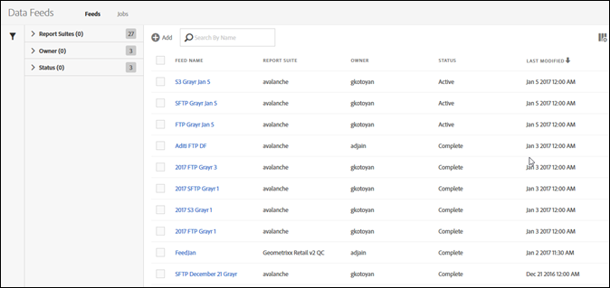
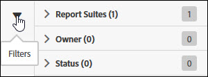
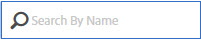
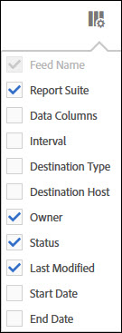

# Manage data feeds

The data feed manager lets you create, edit, and delete data feeds for your organization. If you have permissions to access the data feed manager, you can manage data feeds for all report suites visible to you.

Here is a video on the Data Feeds Management UI:

>[!VIDEO](https://video.tv.adobe.com/v/25452/?quality=12)

Access Data feed management by following these steps:

1. Log in to [experiencecloud.adobe.com](https://experiencecloud.adobe.com).
2. Click on the 9-grid menu in the top right, then click [!UICONTROL Analytics].
3. In the top menu, click [!UICONTROL Admin] > [!UICONTROL Data Feeds].

## Navigating the interface

When arriving to the data feed manager page, the interface looks similar to the following:

If no feeds have been set up, the page shows a [!UICONTROL Create New Data Feed] button.

### Filters and search

Use filters and search to locate the exact feed you're looking for.

On the far left, click the filter icon to show or hide filtering options. Filters are organized by category. Click the chevron to collapse or expand filtering categories. Click the checkbox to apply that filter.

Use search to locate a feed by name.

### Feeds and Jobs

Click the Jobs tab to see individual jobs that each of your feeds create. See [Manage data feed jobs](df-manage-jobs.md).

### Add

Near the feeds and jobs tabs, click the + [!UICONTROL Add] button to create a new feed. See [Create a data feed](create-feed.md) for more information.

### Columns

Each created feed shows several columns providing information about it. Click a column header to sort it in ascending order. Click a column header again to sort it in descending order. If you cannot see a specific column, click the column icon in the top right.

* **Feed Name**: Required column. Displays the feed name.
* **Feed ID**: Displays the Feed ID, a unique identifier.
* **Report Suite**: The report suite the feed references data from.
* **Report Suite ID**: The report suite's unique identifier.
* **Data Columns**: Which data columns are active for the feed. In most cases, there are too many columns to display in this format.
* **Interval**: Indicator whether the feed is hourly or daily.
* **Destination Type**: The destination type for the feed. For example, FTP, Amazon S3, or Azure.
* **Destination Host**: The location the file is placed. For example, `ftp.example.com`.
* **Owner**: The user account that created the feed.
* **Status**: The status of the feed.
  * Active: The feed is operational.
  * Approval Pending: In some circumstances, a feed requires approval by Adobe before it can start generating jobs.
  * Deleted: The feed is deleted.
  * Complete: The feed finished processing. A completed feed can be edited, put on hold, or cancelled.
  * Pending: The feed is created but not yet active. Feeds remain in this state for a short transitional time.
  * Inactive: Equivalent to a 'paused' or 'on hold' state. When the feed is reactivated, it resumes delivering jobs from when it stopped.
* **Last Modified**: The date the feed was last modified. Date and time is shown in the report suite's time zone with GMT offset.
* **Start Date**: The date of the first job for this feed. Date and time is shown in the report suite's time zone with GMT offset.
* **End Date**: The date of the last job for this feed. Ongoing data feeds do not have an end date.

## Data feed actions

Click the checkbox next to a data feed to reveal available actions.

* **Job history**: View all jobs tied to this data feeds. Automatically takes you to the [manage jobs interface](df-manage-jobs.md).
* **Delete**: Deletes the data feed, setting its status to [!UICONTROL Deleted].
* **Copy**: Takes you to [create a new feed](create-feed.md) with all settings of the current feed. You cannot copy a data feed if more than one is selected.
* **Pause**: Stops processing for the feed, setting its status to [!UICONTROL Inactive].
* **Activate**: Only available for inactive feeds. Picks up processing data right where it left off, backfilling any dates if necessary.
