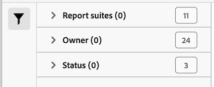

# Manage data feeds

The data feed manager lets you create, edit, and delete data feeds for your organization. If you have permissions to access the data feed manager, you can manage data feeds for all report suites visible to you.

>[!BEGINSHADEBOX]

See  [Data feed management](https://video.tv.adobe.com/v/25452?quality=12&learn=on){target="_blank"} for a demo video.

>[!ENDSHADEBOX]

## View data feeds

1. Log in to [experiencecloud.adobe.com](https://experiencecloud.adobe.com) using your Adobe ID credentials.
1. Select the 9-square icon in the upper-right, then select [!UICONTROL **Analytics**].
1. In the top navigation bar, go to [!UICONTROL **Admin**] > [!UICONTROL **Data feeds**].

   Data feeds for all report suites that you have access to are displayed. Or, if no feeds have been configured, the page shows a [!UICONTROL Create New Data Feed] button.

   

## Create a data feed

The [!UICONTROL Add] button allows you to create a new feed. See [Create a data feed](create-feed.md) for more information.

## Edit a data feed

1. In Adobe Analytics, select [!UICONTROL **Admin**] > [!UICONTROL **Data feeds**].

1. Locate the data feed that you want to edit. To locate a data feed, you can [filter and search the list of data feeds](#filter-and-search-the-list-of-data-feeds).

1. Select the data feed in the [!UICONTROL **Feed name**] column.

1. Make any desired changes to the data feed.

   When updating the [!UICONTROL **Destination**] section for a data feed that you are editing, you can choose a different account and location to use for the new data feed in the [!UICONTROL **Account**] and [!UICONTROL **Location**] drop-down fields. 

   Accounts and locations can be edited as described in [Configure cloud import and export accounts](/help/components/locations/configure-import-accounts.md) and [Configure cloud import and export locations](/help/components/locations/configure-import-locations.md). Editing an account or location affects all items associated with that account or location.
   
   Earlier versions of the data feeds manager allowed you to create FTP, SFTP, S3, and Azure blob destinations. Destinations that were created in these earlier versions of the data feeds manager cannot be edited or copied.

1. Select [!UICONTROL **Save**].

## Filter and search the list of data feeds

1. In Adobe Analytics, select [!UICONTROL **Admin**] > [!UICONTROL **Data feeds**].

1. Use search or filters to locate a specific feed.

   * In the search field, begin typing the name of a feed. Only those feeds that match are shown in the list of available feeds.

   * On the far left, select the filter icon to show or hide filtering options. Filters are organized by category, including **[!UICONTROL Report suites]**, **[!UICONTROL Owner]**, **[!UICONTROL Status]**, and **[!UICONTROL Tags]**. You can collapse or expand filtering categories. Select the checkbox next to any filter that you want to apply.

     

## View data feed jobs

1. In Adobe Analytics, select [!UICONTROL **Admin**] > [!UICONTROL **Data feeds**].

1. Select the [!UICONTROL **Jobs**] tab to view individual jobs that each of your feeds create. 

   Or

   To view jobs for specific data feeds, select the checkbox next to one or more data feeds, then select [!UICONTROL **Job history**].

   For more information, see [Manage data feed jobs](df-manage-jobs.md).

## Copy a data feed

1. In Adobe Analytics, select [!UICONTROL **Admin**] > [!UICONTROL **Data feeds**].

1. Select the checkbox next to the data feed that you want to copy, then select [!UICONTROL **Copy**].

   This takes you to [create a new feed](create-feed.md) with all settings of the current feed. This option is not visible if more than one data feed is selected.

   When updating the [!UICONTROL **Destination**] section for a data feed that you are copying, you can choose a different account and location to use for the new data feed in the [!UICONTROL **Account**] and [!UICONTROL **Location**] drop-down fields. 
   
   Accounts and locations can be edited as described in [Configure cloud import and export accounts](/help/components/locations/configure-import-accounts.md) and [Configure cloud import and export locations](/help/components/locations/configure-import-locations.md). Editing an account or location affects all items associated with that account or location.
   
   Earlier versions of the data feeds manager allowed you to create FTP, SFTP, S3, and Azure blob destinations. Destinations that were created in these earlier versions of the data feeds manager cannot be edited or copied.

## Pause a data feed

When you pause a data feed, it stops processing the feed, setting its status to [!UICONTROL Inactive]. 

When you reactivate the feed after pausing it, the data during the time the feed was paused is processed for backfill feeds but not for live feeds. For more information, see [Activate a data feed](#activate-a-data-feed). 

To pause a data feed:

1. In Adobe Analytics, select [!UICONTROL **Admin**] > [!UICONTROL **Data feeds**].

1. Select the checkbox next to the data feed that you want to pause, then select [!UICONTROL **Pause**].

## Activate a data feed

You can activate feeds that are inactive. 

When a feed is reactivated, data might not be automatically processed for the time that the feed was inactive. Whether the data is processed depends on whether it is a backfill feed or a live feed: 

* **Backfill feeds** (feeds that process only historical data) resume processing data from where they stopped, backfilling any dates if necessary. 

* **Live feeds** resume processing data from the time they are activated. This means that data is not processed during the time the feed was paused to the time it was activated. If you need the data during this period of time, you must set up a backfill.

To activate a data feed:

1. In Adobe Analytics, select [!UICONTROL **Admin**] > [!UICONTROL **Data feeds**].

1. Select the checkbox next to the inactive data feed that you want to activate, then select [!UICONTROL **Activate**].

## Delete a data feed

When you delete a data feed, its status is set to [!UICONTROL Deleted]. Data feeds must have a status of Active before they can be deleted.

To delete a data feed:

1. In Adobe Analytics, select [!UICONTROL **Admin**] > [!UICONTROL **Data feeds**].

1. Select the checkbox next to the data feed that you want to delete, then select [!UICONTROL **Delete**].

## Configure columns in the data feed manager

Each created feed shows several columns providing information about it. Select a column header to sort it in ascending order. Select a column header again to sort it in descending order. If you cannot see a specific column, click the column icon in the top-right.

The following columns are available:

* **Feed name**: Required column. Displays the feed name.
* **Feed ID**: Displays the Feed ID, a unique identifier.
* **Report suite**: The report suite the feed references data from.
* **Report suite ID**: The report suite's unique identifier.
* **Data Columns**: Which data columns are active for the feed. In most cases, there are too many columns to display in this format.
* **Interval**: Indicator whether the feed is hourly or daily.
* **Destination Type**: The destination type for the feed. For example, Amazon S3, GCP, or Azure.
* **Destination Host**: The location the file is placed.
* **Owner**: The user account that created the feed.
* **Status**: The status of the feed.
  * Active: The feed is operational.
  * Approval Pending: In some circumstances, a feed requires approval by Adobe before it can start generating jobs.
  * Deleted: The feed is deleted.
  * Complete: The feed finished processing. A completed feed can be edited, put on hold, or canceled.
  * Pending: The feed is created but not yet active. Feeds remain in this state for a short transitional time.
  * Inactive: Equivalent to a 'paused' or 'on hold' state. For information about what happens with backfill feeds and live feeds when an inactive feed is reactivated, see [Activate a data feed](#activate-a-data-feed).
* **Last Modified**: The date the feed was last modified. Date and time are shown in the report suite's time zone with GMT offset.
* **Start Date**: The date of the first job for this feed. Date and time are shown in the report suite's time zone with GMT offset.
* **End Date**: The date of the last job for this feed. Ongoing data feeds do not have an end date.

