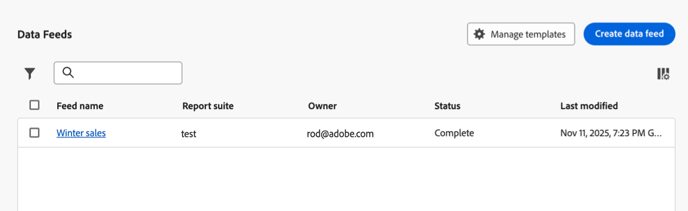
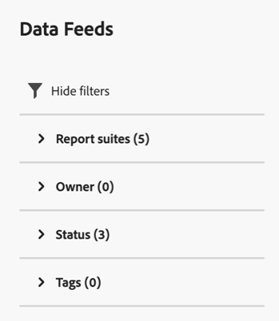
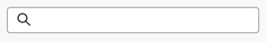
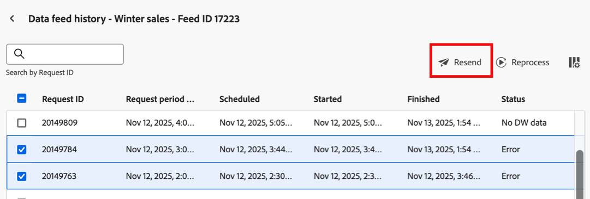
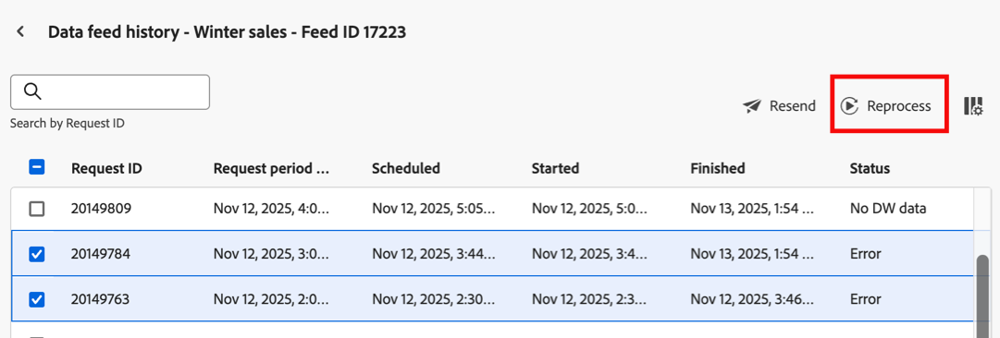

# Manage data feed jobs

Jobs are individual tasks that outputs a compressed file. They are created and governed by feeds.

To manage data feed jobs:

1. Log in to [experiencecloud.adobe.com](https://experiencecloud.adobe.com) using your Adobe ID credentials.

1. Select the 9-square icon in the upper-right, then select [!UICONTROL **Analytics**].

1. In the top navigation bar, go to [!UICONTROL **Admin**] > [!UICONTROL **Data feeds**].

   Data feeds for all report suites that you have access to are displayed. Or, if no feeds have been configured, the page shows a [!UICONTROL Create New Data Feed] button.

   

1. (Optional) Select the checkbox next to the data feed that contains the jobs that you want to view, then select [!UICONTROL **Job history**]. 

   For more information, see [View job history for a data feed](#view-job-history-for-a-data-feed).

## Filter and search

You can filter and search to locate the exact job you're looking for.

On the far left, click the filter icon to show or hide filtering options. Filters are organized by category. Click the chevron to collapse or expand filtering categories. Click the checkbox to apply a filter.

Use search to locate a job by name.

## Sort and customize columns

Each job shows several columns providing information about the job. You can sort information in each column and customize the columns that are displayed.

### Sort columns

Select a column header to sort it in ascending order. Select a column header again to sort it in descending order. 

### Customize columns

To adjust the visible columns in the table:

1. Select the column icon  in the top-right.

1. In the Customize table dialog, select each column you want to view and deselect each column you want to hide. 

   The following columns are available:

  * **Feed name**: Required column. Displays the feed name. Jobs created by the same feed have the same feed name.
  * **Feed ID**: Displays the Feed ID, a unique identifier. Jobs created by the same feed have the same Feed ID.
  * **Report suite**: The report suite the job references data from.
  * **Report suite ID**: The report suite's unique identifier.
  * **Interval**: The interval of the feed.
  * **Destination type**: The destination type of the feed.
  * **Destination**: The destination of the feed.
  * **Owner**: The owner of the feed.
  * **Status**: The status of the feed.
    * Waiting for data: The job is operational and data for the reporting window is being collected.
    * Processing: The job is creating the data files and preparing to send them.
    * Completed: The job completed without any issues.
    * Failed: The job did not complete. See [Troubleshoot data feeds](troubleshooting.md) to help determine the cause of failure.
    * Waiting for Export: The data for the reporting window has not yet been fully processed.
    * No data: There is no data in the report suite for the requested reporting window.
  * **Last modified**: The time the feed was last modified.
  * **Start date**: The time the job started. Date and time is shown in the report suite's time zone with GMT offset. Daily feeds typically start near midnight in the report suite's time zone.
  * **End date**: The time the job ended. Date and time is shown in the report suite's time zone with GMT offset.

## View job history for a data feed

You can view a list of past data feed jobs for a given data feed, along with information about each job.

To view job history for a data feed:

1. In Adobe Analytics, select [!UICONTROL **Admin**] > [!UICONTROL **Data feeds**].

   

1. Select the checkbox next to the data feed whose job history you want to view, then select [!UICONTROL **Job history**].

   Data feed job history is shown, with the following information available about each job (select the column icon to add columns that aren't visible by default):

   * **[!UICONTROL Request period begin]**

   * **[!UICONTROL Request period end]**

   * **[!UICONTROL Scheduled]**

   * **[!UICONTROL Started]**

   * **[!UICONTROL Finished]**

   * **[!UICONTROL Run #]**

   * **[!UICONTROL Status]**

   * **[!UICONTROL Error code]**

   * **[!UICONTROL Error message]**

## Resend data feed jobs

You can resend a data feed job if you want to send the data feed file again with the exact same data and processing as when it was originally sent. Alternatively, you can [reprocess a data feed job](#reprocess-data-feed-jobs).

To resend one or more data feed jobs:

1. In Adobe Analytics, select [!UICONTROL **Admin**] > [!UICONTROL **Data feeds**].

1. Select the checkbox next to the data feed that contains the jobs that you want to resend, then select [!UICONTROL **Job history**].

1. Select the checkbox next to one or more data feed jobs, then select **[!UICONTROL Resend]**. <!-- What does the status need to be? Error, ... -->

   

## Reprocess data feed jobs

You can reprocess the source data of a data feed job and send it again with the reprocessed data. Alternatively, you can [resend a data feed job](#resend-data-feed-jobs).

To reprocess one or more data feed jobs:

1. In Adobe Analytics, select [!UICONTROL **Admin**] > [!UICONTROL **Data feeds**].

1. Select the checkbox next to the data feed that contains the jobs that you want to reprocess, then select [!UICONTROL **Job history**].

1. Select the checkbox next to one or more data feed jobs, then select **[!UICONTROL Reprocess]**. <!-- What does the status need to be? Error, ... -->

   
