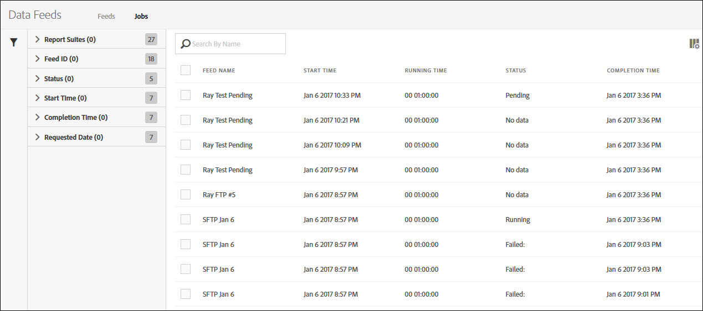
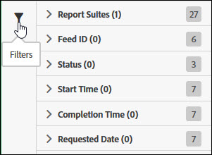
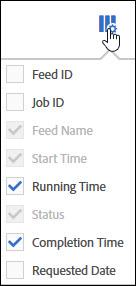

# Manage data feed jobs

Jobs are individual tasks that outputs a compressed file. They are created and governed by feeds.

Access Data feed job management by following these steps:

1. Log in to [experiencecloud.adobe.com](https://experiencecloud.adobe.com).
2. Click on the 9-grid menu in the top right, then click [!UICONTROL Analytics].
3. In the top menu, click [!UICONTROL Admin] > [!UICONTROL Data Feeds].
4. Click the Jobs tab near the top.

## Navigating the interface

A data feed job is a single instance where Adobe processes and outputs a compressed file for a given reporting window. The job manager provides a refined view to see the status of individual jobs.

### Filters and Search

Use filters and search to locate the exact job you're looking for.

On the far left, click the filter icon to show or hide filtering options. Filters are organized by category. Click the chevron to collapse or expand filtering categories. Click the checkbox to apply that filter.

Use search to locate a job by name.

### Feeds and Jobs

Click the Feeds tab to see overarching feeds that create these jobs. See [Manage data feeds](df-manage-feeds.md).

### Columns

Each job shows several columns providing information about it. Click a column header to sort it in ascending order. Click a column header again to sort it in descending order. If you cannot see a specific column, click the column icon in the top right.

* **Feed ID**: Displays the Feed ID, a unique identifier. Jobs created by the same feed have the same Feed ID.
* **Job ID**: A unique identifier for the job. All jobs have a different Job ID.
* **Feed Name**: Required column. Displays the feed name. Jobs created by the same feed have the same Feed Name.
* **Report Suite**: The report suite the job references data from.
* **Report Suite ID**: The report suite's unique identifier.
* **Start Time**: The time the job started. Date and time is shown in the report suite's time zone with GMT offset. Daily feeds typically start near midnight in the report suite's time zone.
* **Status**: The status of the feed.
  * Waiting for data: The job is operational and data for the reporting window is being collected.
  * Processing: The job is creating the data files and preparing to send them.
  * Completed: The job completed without any issues.
  * Failed: The job did not complete. See [Troubleshoot data feeds](troubleshooting.md) to help determine the cause of failure.
  * Waiting for Export: The data for the reporting window has not yet been fully processed.
  * No data: There is no data in the report suite for the requested reporting window.
* **Completion Time**: The time the job finished. Date and time is shown in the report suite's time zone with GMT offset.
* **Requested Date**: The reporting window of the file. Daily feeds typically show 00:00 - 23:59 with a GMT offset, indicating a full day based on the report suite's time zone. Hourly feeds show the individual hour the job is for.
