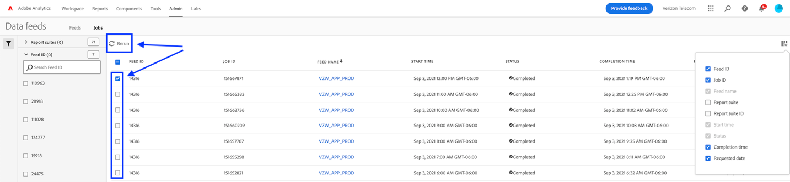

# Troubleshoot Data feeds

Determine potential reasons why a job might fail to process or deliver.

## Troubleshoot an existing data feed

If you have a data feed that successfully operates hourly or daily but recently fails, use the [Adobe Status tool](https://status.adobe.com/en/experience_cloud) to determine if there are any scheduled maintenance windows or availability issues. If there is a known issue at the time, Adobe automatically processes scheduled data feeds once the service is restored.

If there are no known issues, you can resend the data feed.

1. Log in to Adobe Analytics and navigate to **[!UICONTROL Admin]** > **[!UICONTROL Data feeds]**.
2. Locate the desired data feed(s), then click the check box next to each that you want to rerun.
3. Click **[!UICONTROL Rerun]**.

If you still do not receive the data feed files after rerunning them, contact Customer Care.

## Troubleshoot a new data feed

If a new data feed throws an error, troubleshoot the issue by manually uploading a test file to the FTP site. In most cases, you can determine the point of failure using these steps.

1. Log in to your FTP site using File Explorer (Windows) or Finder (Mac). Make sure that you use FTP protocol (`ftp://`). If you are unable to reach the FTP site, you can work with the owner of the FTP site to determine the correct destination.
  
   

2. A popup asking for a username and password appears. Enter your authentication credentials. If the credentials are accepted, the window shows the current contents on the FTP site. If the credentials are not accepted, work with the FTP owner to make sure that the username and password are correct.
3. Upload a file to the FTP site by dragging it into the authenticated window. Any image or text document is adequate. If you get an error attempting to place a file onto the FTP site, work with the FTP owner to verify there is enough disk space and that the username has write permissions to the FTP site.
4. Once you have confirmed that the file is on the FTP site, you can delete the file uploaded in the previous step.

If all of the above steps work and you still get an FTP error, contact Customer Care.
